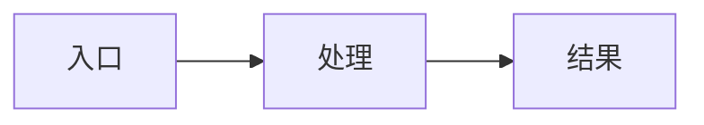

# Spec：design.md 模板

复制到 `packages/<pkg>/specs/REQ-YYYYMMDD-slug/design.md`。

## 方案概述

## 涉及模块 / 文件

-

## API / 行为变更

| 符号或行为 | 变更类型 | 说明 |
|---|---|---|
| | 新增/修改/废弃 | |

## 数据流 / 时序（可选）

## 风险与兼容

## 备选方案（若有）

-
