# AI Extension 工作原理

## 它是什么

AI Extension 是一个浏览器扩展插件。装上它之后，浏览器就变成了一个 **AI Agent 的运行环境**——AI 不仅能"看到"当前网页的内容，还能直接"操作"页面，比如点击按钮、填写表单、调用页面里的业务接口。

举个例子：你打开某个后台管理系统，对 AI 说"帮我批量审批这批待处理的工单"，AI 就能直接调用页面里注册好的工具来完成操作，而不需要笨拙地模拟鼠标点击。

## 它是怎么做到的

AI Extension 的核心思路是：**把网页能力变成 AI 可以调用的工具**。

具体来说有三条路径，由强到弱分别对应不同复杂度的网站：

1. **页面原生工具（WebMCP）**：网页自身通过标准的 `document.modelContext` 接口把业务能力注册成工具。AI 调用工具时直接执行页面里的 JS 函数，速度最快、最可靠。适用于拥有复杂状态、私有 API 或高性能交互要求的单页应用（SPA）。
2. **插件注入工具**：对于你无法修改源码的第三方网站，插件可以在页面加载时自动注入一段脚本，把目标网站的功能"适配"成工具。适合给别人的网站做自动化。
3. **通用页面操作**：即使没有任何工具注册，插件也内置了一套通用的"看"和"操作"网页的能力——解析页面结构、截图、点击、滚动、填充等，覆盖大多数普通网页。

开发者可以按需选择，甚至三者结合使用。

## 核心能力一览

除了"工具化"这条主线，AI Extension 还提供了以下能力来保证体验：

| 能力 | 作用 |
| :--- | :--- |
| **多模态交互** | 通过无障碍树让 AI 理解页面语义，也能通过截图 + 坐标定位让 AI 结合视觉特征（图标、布局、颜色）精准操作 |
| **Skills 技能体系** | 按需加载专业知识，避免一次性塞给大模型太多信息导致 Token 爆炸或产生幻觉；支持在线配置，无需重新发布插件 |
| **标签页感知** | 切换标签页时自动卸载旧页面工具、加载当前页面专属工具，并通过 `page-tools-updated` 机制实时通知 AI 当前可用的工具集 |
| **远程连接** | 通过内置 WebSocket Server，外部 AI 助手（如 Cursor、自定义 AI 平台）可以远程指挥浏览器，像操作本地环境一样 |

## 执行环境与隔离

为了保证性能和安全，AI Extension 利用浏览器的多层沙箱机制，在不同环境中各司其职：

| 环境 | 角色 | 说明 |
| :--- | :--- | :--- |
| **Sidepanel / Background** | 中央处理器 | 维护全局状态，处理与远程 Agent 的通信，管理 Skills 配置 |
| **Isolated World（内容脚本）** | DOM 操作执行器 | 执行通用页面操作。**能绕过页面的 CSP 限制**，确保在安全性极高的网站上也能正常工作 |
| **Main World（页面主世界）** | 原生工具宿主 | 运行 WebMCP 工具和注入脚本。拥有访问页面原生 JS 变量和函数的完整权限 |

简单理解：Background 是"大脑"，负责调度；Isolated World 是"手"，负责安全的 DOM 操作；Main World 是"潜入页面内部的代理人"，能直接调用页面自己的代码。

## 小结

AI Extension 的架构可以概括为一句话：**用三种方式把网页能力工具化，用三层环境保证安全隔离**。理解了这一点，再看后面的开发指南就会顺畅很多。

- 想让自己的网站支持 AI 操作 → 看[MCP工具开发指南](./next-wxt)
- 想给 AI 补充专业知识 → 看 [Skills 技能开发指南](./skills)
- 想知道怎么装、怎么配模型 → 看[快速入门](./install)和[配置大模型](./model-config)
