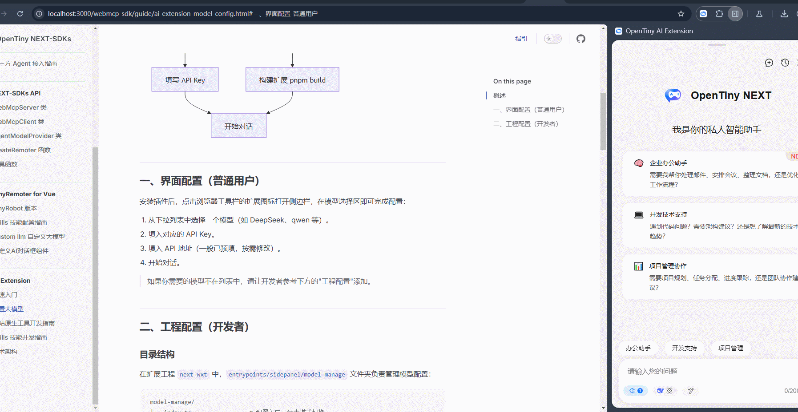

# 配置大模型

## 概述

AI Extension 需要配置一个大模型来驱动对话和工具调用。配置方式分两类：

- **界面配置（普通用户）**：装好插件后，右击扩展图标进入选项页面，在模型配置界面填写模型信息和 API Key 即可使用。
- **工程配置（开发者）**：如果想内置更多模型选项或对接内网模型，需要修改扩展工程代码后重新构建。



## 一、界面配置（普通用户）

安装插件后，右击浏览器工具栏的扩展图标，点击选项，切换到 模型及接口配置：

**添加模型配置步骤：**

1. 点击「添加模型配置」按钮，在弹窗中填写以下信息。
2. **模型 ID**（必填）：唯一标识，如 `my-deepseek`，保存后不可修改。
3. **显示名称**（必填）：侧边栏下拉列表中展示的名称，如 `My DeepSeek`。
4. **Model**（必填）：对应接口的 model 参数，如 `deepseek-chat`。
5. **Provider Type**（必填）：选择协议类型——`OpenAI`、`DeepSeek` 或 `Ollama`，也可输入自定义值。
6. **API Key**（选填）：对应模型的 API 凭证，在 API 提供商后台获取。
7. **Base URL**（选填）：模型对话接口前缀地址，部分 Provider 可留空使用默认值。
8. **GenUI URL**（选填）：生成式 UI 专用接口地址，填写后输入框旁会显示「生成式 UI」开关。
9. **ReAct Mode**（选填）：开关项，大模型不支持工具调用时开启。
10. **设为默认选中**（选填）：开关项，设为侧边栏打开时的默认模型。
11. **图标**（必填）：选择内置图标（DeepSeek、阿里云百炼、Built-in AI）或填写图片 URL。
12. 点击「确认」保存，配置立即在侧边栏生效。



> 如果你需要的模型不在列表中，请让开发者参考下方的"工程配置"添加。

## 二、工程配置（开发者）

### 目录结构

在扩展工程 `next-wxt` 中，`entrypoints/sidepanel/model-manage` 文件夹负责管理模型配置：

```text
model-manage/
├── index.ts                 # 配置入口，负责模式切换
├── intranet-model-config.ts # 内网模式模型配置
└── internet-model-config.ts # 公网模式模型配置
```

- **内网模式**：适用于公司内网环境，编译时自动注入认证 Token。
- **公网模式**：适用于公网环境，无需特殊认证。

### 配置入口

`index.ts` 是配置入口，一般无需修改。它通过环境变量 `VITE_MODEL_CONFIG` 决定使用哪种模式：

```bash
pnpm run build        # 使用公网配置，构建扩展
pnpm run build:inner # 使用内网配置，构建扩展
```

### 添加自定义大模型

#### 步骤 1：准备模型图标

在 `../icons/` 目录下添加模型图标文件（推荐 SVG 格式）：

```typescript
import IconYourModel from '../icons/icon-model-your-model.svg'
```

#### 步骤 2：配置模型参数

每个模型配置包含以下核心字段：

```typescript
{
  id: 'unique-model-id',           // 唯一标识符
  label: '显示名称',               // 界面显示名称
  model: 'actual-model-name',      // 实际模型名称
  apiKey: '',
  baseURL: 'https://api.example.com', // API 基础地址
  providerType: 'deepseek',        // 提供商类型：'deepseek'、'openai' 或 createOllama 等工厂函数
  useReActMode: boolean,           // 大模型不支持工具调用时才需开启 ReAct 模式
  icon: markRaw(IconComponent),    // 模型图标组件
  isDefault?: boolean,             // 是否为默认模型（可选）

  // 可选字段
  genuiUrl?: string,               // 生成式 UI 服务地址。与 baseURL 同时配置时，输入框旁会显示「生成式 UI」开关
  headers?: Record<string, string>, // 自定义请求头
  multimodal?: {                   // 多模态配置
    supportImages: boolean,
    maxFileSize: number,           // 最大文件大小，单位 MB
    supportedMimeTypes: string[]
  },
  llm?: any                        // 自定义 llm（见下方说明）
}
```

> **提示**：如果大模型不兼容 deepseek 或 openai 协议，可设置 `llm` 属性为一个 ai-sdk 的 provider，详见 [ai-sdk provider 文档](https://ai-sdk.dev/providers/ai-sdk-providers)。

### 高级配置示例

#### 多模态支持

为支持图片等输入的模型配置：

```typescript
{
  id: 'multimodal-model',
  // ... 基础配置
  multimodal: {
    supportImages: true,
    maxFileSize: 10, // 最大文件大小 10MB
    supportedMimeTypes: ['image/jpeg', 'image/png', 'image/webp']
  }
}
```

#### 自定义 HTTP 头

添加特定的请求头信息：

```typescript
{
  id: 'custom-model',
  // ... 基础配置
  headers: {
    'X-API-Version': 'v2',
    'X-Organization': 'your-org',
    'Custom-Auth': 'bearer token'
  }
}
```

#### 集成 Chrome 内置 AI

使用 Chrome 内置 AI 引擎可防止数据外流并节省费用。启用条件：

- Chrome 版本 138+
- 满足 Chrome 硬件要求
- 登录 Google 账号，符合地区要求

详见 [AI on Chrome](https://developer.chrome.google.cn/docs/ai/prompt-api?hl=zh-cn) 文档。

```typescript
import { builtInAI } from '@built-in-ai/core'
import IconModelBuiltInAI from './icons/icon-model-built-in-ai.svg'

{
  id: 'built-in-ai',
  label: '内置AI',
  model: 'built-in-ai',
  llm: builtInAI as unknown as any,
  useReActMode: true,
  icon: markRaw(IconModelBuiltInAI as unknown as Component)
}
```

#### 集成本地 Ollama 模型

使用本地 Ollama 模型同样能防止数据外流并节省费用。需先在本机安装 Ollama 并下载模型文件，下面以 `qwen3:8b` 和 `qwen3-vl:8b` 为例：

```typescript
import { createOllama } from 'ai-ollama'
import IconModelDeepseek from './icons/icon-model-deepseek.svg'

// qwen3:8b — 纯文本模型
{
  id: 'qwen3:8b',
  label: 'qwen3:8b',
  model: 'qwen3:8b',
  apiKey: '',
  baseURL: 'http://localhost:11434/api',
  providerType: createOllama,
  useReActMode: false,
  icon: IconModelDeepseek as unknown as Component
},
{
  id: 'qwen3-vl:8b',
  label: 'qwen3-vl:8b',
  model: 'qwen3-vl:8b',
  apiKey: '',
  baseURL: 'http://localhost:11434/api',
  providerType: createOllama,
  useReActMode: false,
  // 多模态能力配置：启用文件上传功能
  multimodal: {
    supportImages: true, // 支持图片上传
    maxFileSize: 10, // 最大文件大小 10MB
    supportedMimeTypes: ['image/'] // 支持的文件类型：所有图片格式
  },
  icon: IconModelDeepseek as unknown as Component
}
```

通过以上配置，你可以灵活地为浏览器扩展添加各种 AI 大模型支持，满足不同部署环境的需求。
