# MCP 工具开发指南

本文档介绍如何在 AI Extension 中为特定域名开发专属的 MCP 工具。

通过原生 `document.modelContext.registerTool` API，开发者可以极低成本地将前端页面的业务能力暴露给 AI 助手，实现"大模型直接操作业务后台"。

有两条互补路径：

| 路径 | 适用 | 说明 |
|---|---|---|
| **页面 MCP 脚本（推荐推广）** | 终端用户 / 快速适配新站 | Options →「页面 MCP 脚本」在线编辑，按 `@match` 匹配站点，保存后即时注入 |
| **源码内置 mcp-servers** | 扩展维护者 / 随包分发 | 在 `packages/next-wxt/mcp-servers/<hostname>/` 编写 TS，构建期打成 IIFE |

二者并行：默认同时生效；用户脚本勾选「覆盖内置」且匹配当前页时，跳过该页内置域名脚本。

## 〇、页面 MCP 脚本（在线编辑）

1. 打开扩展 Options（配置页）→ **页面 MCP 脚本**。
2. 点击「新建脚本」，填写：
   - **名称 / 描述**
   - **@match**：每行一条，例如 `*://*.example.com/*`、`https://www.baidu.com/*`
   - **源码**：纯 JS，在页面 MAIN world 调用 `document.modelContext.registerTool`
   - **启用** / **覆盖内置**（可选）
3. 保存后，匹配的标签页会自动刷新并注入脚本；工具出现在侧栏「浏览器内置工具」中。
4. 支持 JSON 导入/导出备份。

默认模板已包含幂等防护。示例片段：

```javascript
;(function () {
  if (window.__userMcp_demo_registered) return
  var ctx = document.modelContext
  if (!ctx) return
  ctx.registerTool({
    name: 'demo_tool',
    title: '示例',
    description: '示例工具',
    inputSchema: { type: 'object', properties: {} },
    execute: async function () {
      return { content: [{ type: 'text', text: document.title }] }
    }
  })
  window.__userMcp_demo_registered = true
})()
```

实现位于独立模块 `packages/next-wxt/user-mcp-scripts/`，与 Skills、远程 MCP 市场解耦。

## 一、工作原理（源码内置）

开发一个网站原生工具，整体流程是这样的：

1. 插件监听用户访问的 URL（如 `opentiny.design`）。
2. 在 `mcp-servers/` 目录下寻找对应的域名文件夹（例如 `mcp-servers/opentiny.design/`）。
3. 如果存在，插件会将该目录下的 `index.ts` 脚本**直接注入到页面的主世界（Main World）**中。
4. 脚本执行时调用 `document.modelContext.registerTool` 注册工具。
5. 插件通过 Content Script 收集页面注册的工具，并发送 `list_changed` 通知，动态刷新 MCP 工具列表，告知远端或本地 Agent 当前页面可用的专属能力。



## 二、开发步骤（源码内置 mcp-servers）

### 1. 创建域名目录

在 `packages/next-wxt/mcp-servers/` 目录下，创建一个与目标域名完全一致的文件夹。

例如：`packages/next-wxt/mcp-servers/example.com/`

### 2. 编写工具逻辑 (`index.ts`)

在刚创建的目录下新建 `index.ts`。由于代码会被注入到主世界，你可以完全访问 `window`、`document` 以及页面的所有 JS 变量和状态。

```typescript
// packages/next-wxt/mcp-servers/example.com/index.ts

/**
 * 此文件由 content script 经 <script src> 注入到 example.com 的 MAIN world。
 * 拥有完整的页面执行权限。
 */

if ((document as any).modelContext) {
  (document as any).modelContext.registerTool({
    name: 'claim-coupon',
    title: '抢优惠券',
    description: '帮助用户在活动页面一键领取专属优惠券。',
    // 采用标准的 JSON Schema 描述输入参数
    inputSchema: {
      type: 'object',
      properties: {
        amount: { type: 'number', description: '需要领取的面额，如 50 或 100' }
      },
      required: ['amount']
    },
    // execute 回调接受 AI 决定好的参数
    execute: async (args: { amount: number }) => {
      try {
        // 直接调用页面的业务函数（假设页面挂载了全局的 AppAPI）
        const success = await window.AppAPI.claimCoupon(args.amount);
        return {
          content: [{ type: 'text', text: success ? `成功领取 ${args.amount} 元优惠券！` : '领取失败，库存不足' }]
        };
      } catch (error) {
        return {
          content: [{ type: 'text', text: `接口异常: ${error.message}` }]
        };
      }
    }
  });
}
```

### 3. 配置扩展元数据 (`meta.ts`)

域名注入门禁依赖同目录 `meta.ts`（文件夹名须与 `location.hostname` 完全一致）。可选字段示例：

```typescript
// packages/next-wxt/mcp-servers/example.com/meta.ts
export default {
  name: 'example.com',
  description: '示例站点专属工具'
};
```

> **说明**：复杂的 `toolsJumpLinks` 或多页流程代理编排已不再推荐，建议将复杂流程直接下发到对应页面的单一 WebMCP 脚本中解决。远程 SSE 市场条目（`customMarketMcpServers`）与本页注入工具无关。

## 三、调试与验证

1. 在项目根目录运行 `pnpm dev:wxt`。
2. **用户脚本**：Options 保存后刷新匹配页；**内置脚本**：改源码后由构建插件重新产出并刷新目标页。
3. 页面加载完成后打开控制台，或连接远程 Cursor Agent。由于发送了 `notifications/tools/list_changed`，你将立刻看到新注册的工具。
4. 尝试向 Agent 发送对话，观察工具调用与页面状态变更。

## 四、最佳实践与注意事项

1. **优先直接调用业务逻辑**：如果页面基于 React/Vue，你可以在脚本中通过 Fiber 树搜索，或在业务代码中显式挂载 `window.__MyApp` 供扩展调用，避免使用脆弱的 `document.querySelector().click()` 模拟点击。
2. **做好错误处理**：`execute` 函数中必须捕获所有可能抛出的错误，并转换为合法的 `content` 返回给模型，否则会导致模型调用链中断。
3. **参数描述要清晰**：`description` 与 `inputSchema` 是大模型判断是否使用工具以及如何传参的**唯一依据**，务必描述详尽。
4. **宽泛 @match + 覆盖内置**：例如 `*://*/*` 且开启「覆盖内置」会跳过所有内置域名工具，请谨慎使用。
5. **幂等注册**：重复注入时应用全局标记或同名覆盖策略，避免重复注册异常。
6. **严格 CSP 站点**（如京东）：用户脚本经扩展桥 `vendor/user-mcp-exec.js` 执行，勿依赖页面内 `eval`；保存后请刷新目标页再查看「浏览器内置工具」。
