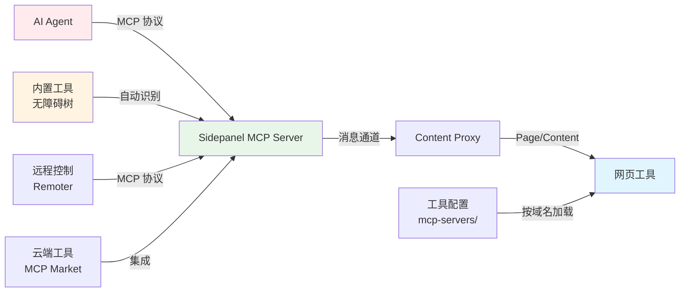
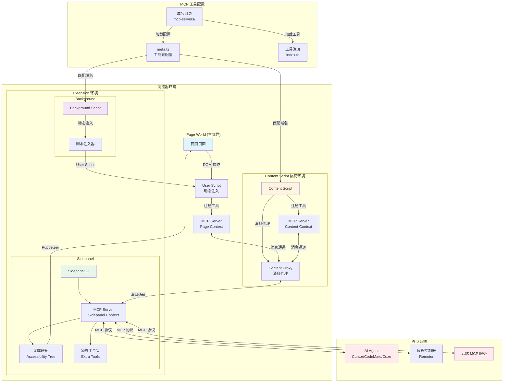
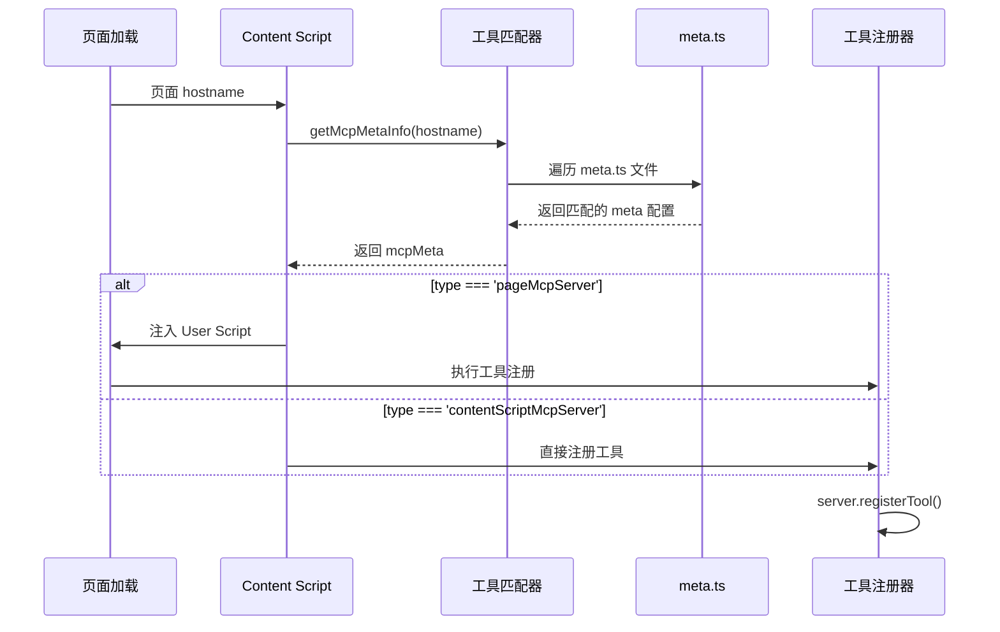
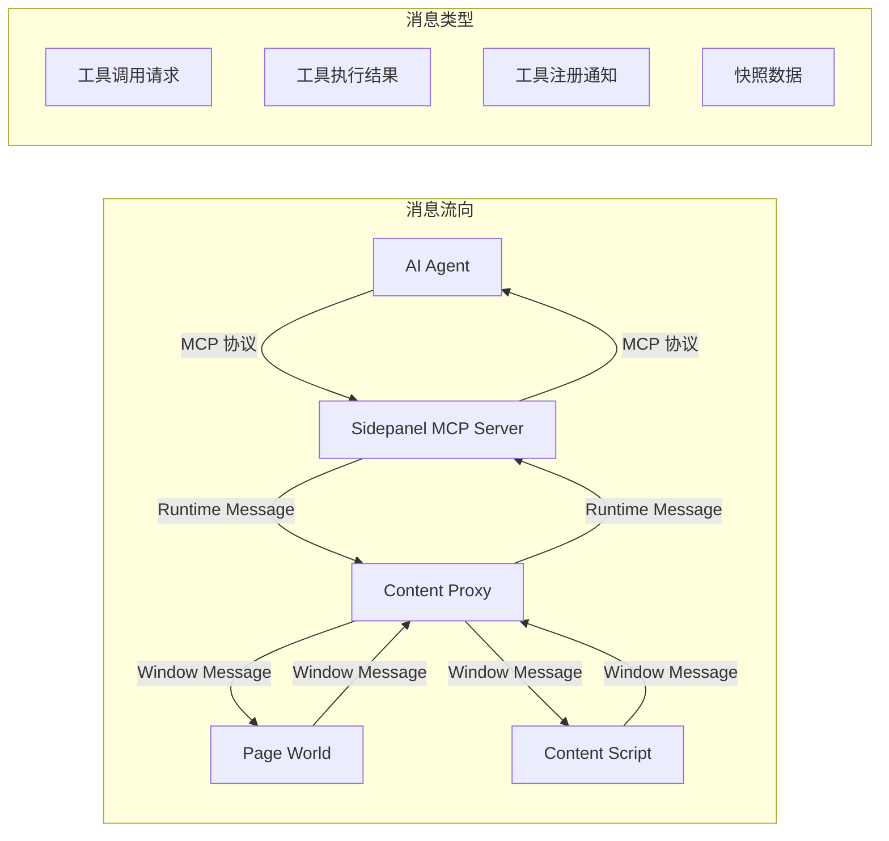
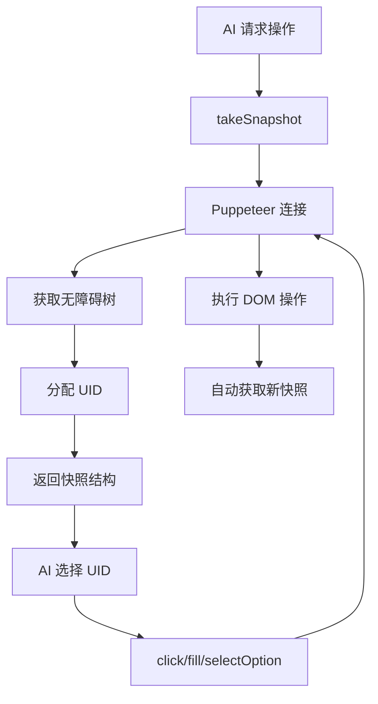
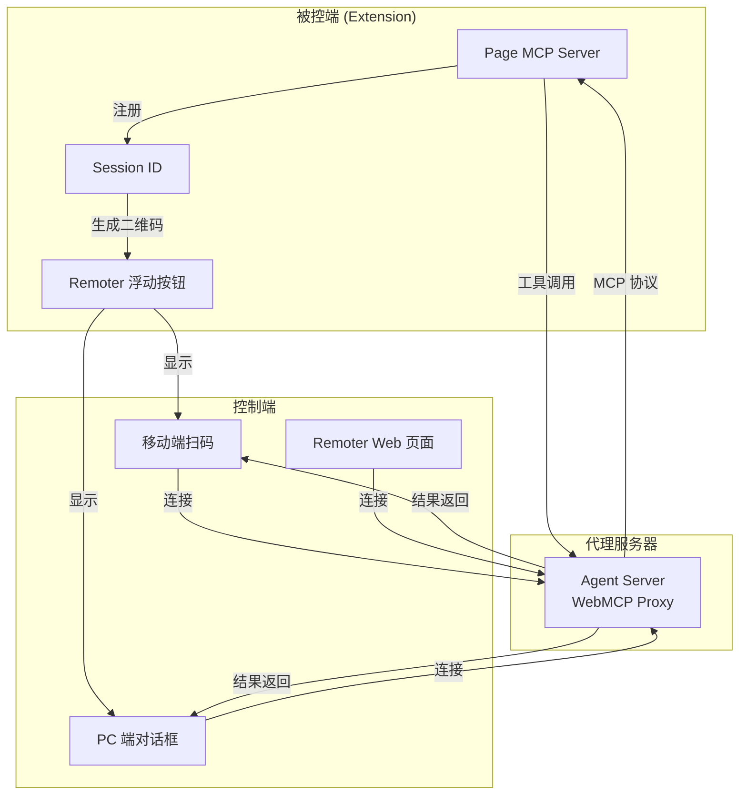
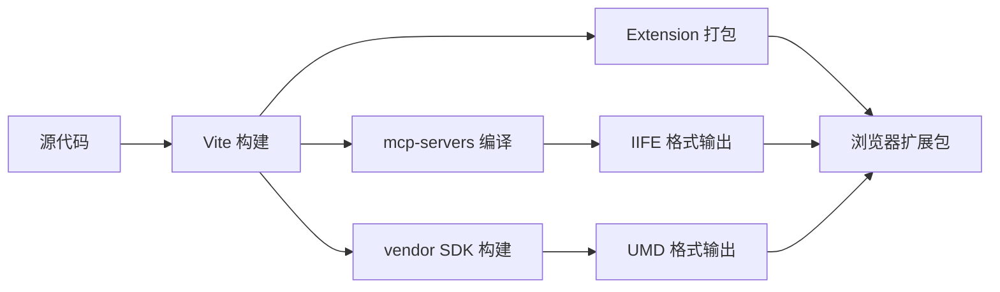

# Next-WXT 浏览器插件技术架构文档

## 一、架构概述

Next-WXT 是一个基于 WXT 框架构建的智能浏览器扩展插件，通过集成 MCP (Model Context Protocol) 协议，将任意网页转换为可被 AI 智能体操控的智能应用。该插件采用模块化设计，支持多域名工具协同、灵活的执行环境配置、远程控制以及内置的智能无障碍操作能力。

### 核心设计理念

- **零侵入式集成**：通过浏览器扩展机制，无需修改现有应用即可实现智能化
- **MCP 协议标准化**：基于标准 MCP 协议，兼容各类 MCP Host（如 Cursor、CodeMate、Coze 等）
- **多环境执行支持**：支持主世界（Main World）和 Content Script 两种执行环境，适应不同场景
- **渐进式增强**：通过工具注册机制，可按需为特定域名配置专属工具

### 快速架构概览



## 二、系统架构图



## 三、核心架构组件

### 3.1 执行环境层

插件支持两种执行环境，通过 `meta.ts` 中的 `type` 字段配置：

#### 3.1.1 主世界执行环境 (pageMcpServer)

**特点**：

- 工具代码在主世界的 JavaScript 上下文中执行
- 可访问页面原有的 JavaScript 内存和变量
- 能够直接调用页面内的方法和 API
- 需要 Chrome 120+ 支持 `userScripts` API

**实现机制**：

```typescript
// background.ts 中动态注入 User Script
browser.runtime.onMessage.addListener((message) => {
  if (message.type === 'inject-mcp-scripts') {
    injectMainScript(hostname, tabId) // 使用 userScripts API 注入
  }
})
```

**适用场景**：

- 需要访问页面内部状态或方法
- 需要与页面 JavaScript 深度集成
- 页面使用复杂的状态管理（如 React、Vue 状态）

#### 3.1.2 Content Script 执行环境 (contentScriptMcpServer)

**特点**：

- 工具代码在 Content Script 隔离环境中执行
- 无法访问页面 JavaScript 内存
- 只能通过 DOM API 操作页面
- 更安全，不影响页面原有逻辑

**实现机制**：

```typescript
// content.ts 中直接创建 MCP Server
if (mcpMeta.type === 'contentScriptMcpServer') {
  await createProxyMcpServer(tabId) // 在 Content Script 中创建
}
```

**适用场景**：

- 只需 DOM 操作，无需访问页面 JS
- 需要更高的安全隔离
- 简单的页面交互需求

### 3.2 工具注册与发现机制

#### 3.2.1 目录结构

```
mcp-servers/
├── index.ts              # 工具加载和匹配逻辑
├── types.d.ts            # TypeScript 类型定义
├── www.baidu.com/        # 域名工具目录
│   ├── meta.ts          # 工具元信息配置
│   └── index.ts         # 工具注册实现
└── opentiny.design/      # 另一个域名工具
    ├── meta.ts
    └── index.ts
```

#### 3.2.2 工具匹配流程



#### 3.2.3 工具注册示例

```typescript
// mcp-servers/www.baidu.com/index.ts
export default ({ server, z }) => {
  // 注册搜索框填充工具
  server.registerTool(
    'fill-textarea',
    {
      title: '填充搜索框',
      description: '填充百度搜索框的内容',
      inputSchema: { text: z.string() }
    },
    async ({ text }) => {
      const textarea = document.getElementById('kw')
      textarea.value = text
      return { content: [{ type: 'text', text: '填充完成' }] }
    }
  )
}
```

### 3.3 消息通信架构

插件内部采用多层消息通道实现不同上下文间的通信：



#### 3.3.1 Content Proxy 消息代理

`Content Proxy` 作为消息中转站，负责在不同上下文间路由消息：

```typescript
// utils/contentProxy.ts
export const createContentProxy = (tabId: number) => {
  // 监听 Sidepanel -> Content 的工具调用
  browser.runtime.onMessage.addListener((message) => {
    if (message.type === 'execute-tool-from-sidepanel-to-content') {
      // 转发到 Page World 或 Content Script
      window.postMessage({ ...message, requestId }, '*')
    }
  })
  
  // 监听 Page -> Content 的工具响应
  window.addEventListener('message', (event) => {
    if (event.data.type === 'execute-tool-from-page-to-content') {
      // 转发回 Sidepanel
      sendRuntimeMessage('execute-tool-from-content-to-sidepanel', data, 'content->side')
    }
  })
}
```

### 3.4 内置智能功能

#### 3.4.1 无障碍树快照系统

插件内置了类似 Chrome DevTools MCP 的无障碍树操作能力：



**核心实现**：

```typescript
// entrypoints/sidepanel/utils/snapshotManager.ts
export class SnapshotManager {
  async createTextSnapshot(verbose = false): Promise<Snapshot> {
    // 使用 Puppeteer 的 accessibility API
    const rootNode = await this.page.accessibility.snapshot({
      includeIframes: true,
      interestingOnly: !verbose
    })
    
    // 为每个节点分配唯一 UID
    const assignIds = (node) => {
      const uid = `${snapshotId}_${idCounter++}`
      // ...
    }
    
    return snapshot
  }
}
```

**内置工具集**：

- `takeSnapshot`：获取页面无障碍树快照
- `click`：通过 UID 点击元素
- `fill`：通过 UID 输入文本
- `selectOption`：通过 UID 选择下拉选项
- `getPageInfomation`：提取页面文本信息
- `openUrl`：打开新网址

#### 3.4.2 自动路径规划

AI 可以通过以下流程自动规划操作路径：

1. **获取页面状态**：调用 `takeSnapshot` 获取当前页面结构
2. **分析目标**：根据用户意图分析需要操作的元素
3. **执行操作**：使用 UID 执行点击、输入等操作
4. **验证结果**：自动获取新快照，确认操作结果

### 3.5 远程控制架构

#### 3.5.1 Remoter 组件

插件支持通过 Remoter 实现远程控制，架构如下：



#### 3.5.2 Session 管理

```typescript
// 生成 Session ID
const sessionId = serverTransport.sessionId
localStorage.setItem('mcp-sessionId', sessionId)

// 远程连接
const { sessionId } = await client.connect({
  url: 'https://agent.opentiny.design/api/v1/webmcp-trial/mcp',
  agent: true,
  sessionId: localStorage.getItem('mcp-sessionId')
})
```

### 3.6 多域名工具协同

插件支持多个域名的工具协同工作，通过 `meta.ts` 配置工具间的依赖关系：

```typescript
// meta.ts 配置示例
export default {
  name: 'opentiny.design',
  type: 'contentScriptMcpServer',
  url: 'https://opentiny.design',
  toolsJumpLinks: {
    'create-document': 'https://opentiny.design/docs/create',
    'edit-document': 'https://opentiny.design/docs/edit/123'
  },
  // 工具执行前需要打开的网址
  preOpenUrls: [
    'https://opentiny.design/login'
  ]
}
```

**协同机制**：

- AI 可以调用不同域名的工具
- 插件自动处理页面跳转和标签页管理
- 支持跨域操作流程编排

### 3.7 生成式 UI 集成

插件集成了生成式 UI，可快速将工具执行结果反馈给 AI：

```typescript
// 工具返回格式支持多种内容类型
return {
  content: [
    { type: 'text', text: '操作完成' },
    { type: 'schema-card', schema: { /* UI Schema */ } }
  ]
}
```

**UI Schema 渲染**：

- 支持动态表单生成
- 支持交互式卡片展示
- 支持流式更新

## 四、技术亮点详解

### 4.1 专属 MCP 工具快速定义

**技术实现**：

1. **声明式工具注册**：开发者只需在 `index.ts` 中使用 `server.registerTool()` 注册工具
2. **自动构建系统**：通过 `vite-plugin-mcp-servers` 插件自动编译和打包工具代码
3. **域名自动匹配**：系统根据页面 hostname 自动加载对应的工具配置

**优势**：

- 无需手动配置 MCP Server 和 Transport
- 工具代码自动隔离，互不干扰
- 支持 TypeScript 类型检查

### 4.2 极低改造成本

**零侵入设计**：

- 无需修改现有应用代码
- 通过浏览器扩展机制注入能力
- 工具配置与业务代码完全分离

**快速接入流程**：

1. 在 `mcp-servers/` 目录下创建域名目录
2. 编写 `meta.ts` 和 `index.ts`
3. 重启插件即可生效

### 4.3 灵活的执行环境配置

**双环境支持**：

- **主世界环境**：适用于需要深度集成的场景
- **Content Script 环境**：适用于简单 DOM 操作的场景

**配置示例**：

```typescript
// meta.ts
export default {
  type: 'pageMcpServer', // 或 'contentScriptMcpServer'
  // ...
}
```

### 4.4 多域名工具协同

**协同机制**：

- 支持在工具配置中定义 `toolsJumpLinks`，实现工具到特定 URL 的映射
- 支持 `preOpenUrls` 配置，自动打开依赖页面
- 插件自动管理多个标签页的状态

**使用场景**：

- 跨页面工作流程
- 多步骤任务编排
- 依赖页面自动准备

### 4.5 内置智能功能

**无障碍树操作**：

- 基于 Puppeteer 的无障碍 API
- 自动分配节点 UID
- 支持快照自动更新

**自动路径规划**：

- AI 可以通过快照理解页面结构
- 自动选择最佳操作路径
- 无需手动编写工具代码

### 4.6 远程操控支持

**多端支持**：

- PC 端：通过 Sidepanel 对话框
- 移动端：通过二维码扫码
- Web 端：通过 Remoter 页面

**连接方式**：

- 支持 SSE (Server-Sent Events)
- 支持 WebSocket
- 支持 HTTP Stream

### 4.7 极速与 AI 互动反馈

**流式响应**：

- 工具执行结果实时流式返回
- 支持生成式 UI 动态渲染
- 减少等待时间，提升交互体验

### 4.8 快速接入云端工具

**MCP 市场集成**：

- 支持从 MCP 市场加载云端工具
- 支持自定义 MCP 服务器配置
- 本地工具与云端工具协同工作

**配置示例**：

```typescript
// meta.ts
customMarketMcpServers: [
  {
    id: 'ppt-mcp',
    name: 'PPT文档MCP服务器',
    url: 'https://agent.opentiny.design/servers/ppt-mcp/sse',
    type: 'sse',
    enabled: true
  }
]
```

## 五、构建与部署架构

### 5.1 构建流程



### 5.2 插件编译系统

**自定义 Vite 插件**：

1. **mcp-servers-plugin**：
   - 扫描 `mcp-servers/` 目录
   - 为每个域名工具独立构建
   - 输出 IIFE 格式，便于动态加载

2. **vendor-sdk-plugin**：
   - 构建 `next-sdk` 为 UMD 格式
   - 注入到页面作为全局变量
   - 供工具代码使用

3. **code-recorder-plugin**：
   - 开发环境工具录制
   - 自动生成工具代码

## 六、安全与隔离机制

### 6.1 执行环境隔离

- **Content Script 隔离**：工具在隔离环境中执行，无法访问页面变量
- **User Script 沙箱**：主世界工具通过浏览器沙箱机制隔离

### 6.2 权限控制

插件采用最小权限原则：

- `host_permissions`: 仅声明需要的域名权限
- `permissions`: 仅声明必要的浏览器 API 权限

### 6.3 消息验证

- 所有跨上下文消息都经过验证
- 工具调用需要匹配域名配置
- Session ID 验证确保连接安全

## 七、性能优化

### 7.1 按需加载

- 工具代码按域名按需加载
- 未访问的域名工具不会加载
- 减少内存占用

### 7.2 快照缓存

- 快照结果缓存，避免重复获取
- 操作后自动更新，保持一致性

### 7.3 流式处理

- 工具执行结果流式返回
- 减少等待时间
- 提升用户体验

## 八、扩展性设计

### 8.1 工具市场

- 支持从市场加载工具
- 支持工具的动态启用/禁用
- 支持工具版本管理

### 8.2 自定义 UI

- 支持自定义生成式 UI 组件
- 支持自定义工具交互界面
- 支持主题定制

### 8.3 插件系统

- 支持第三方插件扩展
- 支持自定义构建插件
- 支持工具模板生成

## 九、技术亮点总结

### 9.1 八大核心亮点

#### ✅ 1. 专属 MCP 工具快速定义

- **特性**：可快速创建属于你域名的 MCP 工具，无需关注 MCP-Server 定义或 Transport 连接
- **能力**：既支持接口调用，也能直接操作 DOM，使用更便捷
- **实现**：通过 `mcp-servers/域名/` 目录结构，声明式工具注册，自动构建打包

#### ✅ 2. 极低改造成本

- **特性**：无需改动现有应用，通过插件中的 mcp-servers 工具即可快速实现应用智能化
- **优势**：零侵入式设计，工具配置与业务代码完全分离
- **流程**：创建域名目录 → 编写工具代码 → 重启插件即可生效

#### ✅ 3. 灵活的执行环境配置

- **特性**：通过 `meta.ts` 定义工具的运行环境
- **支持**：
  - 主世界（Main World）：可访问页面 JS 内存，深度集成
  - Content Script 环境：不访问主页面 JS 内存，安全隔离
- **应用**：适应不同场景需求，灵活选择执行环境

#### ✅ 4. 多域名工具协同

- **特性**：支持组合多个域名的工具协同完成任务
- **能力**：`meta.ts` 可定义工具运行前需打开的网址，插件将自动打开对应页面
- **效果**：提升操作效率，支持跨域工作流程编排

#### ✅ 5. 内置智能功能，类比 Chrome DevTools MCP

- **特性**：插件内置类似 Chrome DevTools MCP 的能力
- **能力**：可自动识别网页无障碍信息并规划执行路径
- **优势**：无需手动编写工具代码，开箱即用
- **工具集**：`takeSnapshot`、`click`、`fill`、`selectOption`、`getPageInfomation` 等

#### ✅ 6. 远程操控支持

- **特性**：支持远程控制，复制识别码或 remoter 链接地址
- **接入**：可在 codeMate、Cursor、Coze 空间等智能体中加载并使用该插件
- **能力**：实现跨设备协同，支持 PC 端和移动端远程操作

#### ✅ 7. 极速与 AI 互动反馈

- **特性**：集成生成式 UI，可快速将必要信息反馈给 AI
- **能力**：支持流式响应、动态 UI 渲染、交互式卡片展示
- **效果**：提升协作效率，减少等待时间

#### ✅ 8. 快速接入云端工具

- **特性**：可集成云端 MCP 能力与 Web 端 MCP 工具
- **能力**：支持从 MCP 市场加载工具，本地工具与云端工具协同完成复杂需求
- **配置**：通过 `customMarketMcpServers` 配置云端工具

### 9.2 架构优势总结

| 优势维度 | 具体体现 |
|---------|---------|
| **开发效率** | 声明式工具定义，自动化构建，零配置即可使用 |
| **集成成本** | 零侵入式设计，无需修改现有应用代码 |
| **灵活性** | 支持多种执行环境，适应不同业务场景 |
| **智能化** | 内置无障碍树操作，自动路径规划 |
| **扩展性** | 支持工具市场，多域名协同，云端工具集成 |
| **易用性** | 远程控制，多端支持，流式反馈 |

## 十、总结

Next-WXT 浏览器插件通过创新的架构设计，实现了：

1. **零侵入式智能化**：无需修改现有应用即可接入 AI 能力
2. **灵活的配置方式**：支持多种执行环境和工具注册方式
3. **强大的内置能力**：提供类似 Chrome DevTools MCP 的智能操作能力
4. **完善的远程控制**：支持多端远程操控和云端工具集成
5. **高效的开发体验**：声明式工具定义，自动化构建部署

该架构为 Web 应用的智能化提供了完整的解决方案，为开发者提供了便捷的工具定义方式，为 AI Agent 提供了强大的网页操控能力。通过八大核心亮点的有机结合，Next-WXT 实现了从工具定义到 AI 操控的完整闭环，为 Web 应用智能化领域树立了新的标杆。
