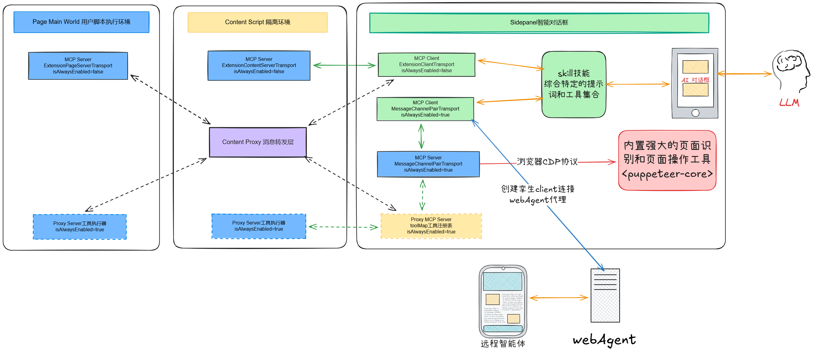

# AI-Extension 浏览器插件技术架构文档

## 一、架构概述

AI-Extension 是一个基于 WXT 框架构建的智能浏览器扩展插件，通过集成 MCP (Model Context Protocol) 协议，将任意网页转换为可被 AI 智能体操控的智能应用。该插件采用模块化设计，支持多域名工具协同、灵活的执行环境配置、远程控制以及内置的智能无障碍操作能力。

### 核心设计理念

- **零侵入式集成**：通过浏览器扩展机制，无需修改现有应用即可实现智能化
- **MCP 协议标准化**：基于标准 MCP 协议，兼容各类 MCP Host（如 Cursor、CodeMate、Coze 等）
- **多环境执行支持**：支持主世界（Main World）和 Content Script 两种执行环境，适应不同场景
- **渐进式增强**：通过工具注册机制，可按需为特定域名配置专属工具

### 快速架构概览



上图展示了 AI-Extension 浏览器插件的整体架构。插件通过 MCP 协议连接 AI Agent 与网页工具，支持在 Sidepanel、Content Script 和 Page World 三种环境中执行工具。工具配置通过 `mcp-servers/` 目录按域名组织，系统自动匹配并加载对应的工具。同时，插件内置了无障碍树操作能力，支持远程控制和云端工具集成，实现了从工具定义到 AI 操控的完整闭环。

## 二、系统架构概述

AI-Extension 浏览器插件的系统架构分为三个主要层次：

### 浏览器环境层

**Page World (主世界)**：

- 网页页面：用户访问的实际网页
- User Script：通过动态注入的方式在主世界执行脚本
- MCP Server (Page Context)：在主世界上下文中注册的 MCP 服务器和工具

**Content Script 隔离环境**：

- Content Script：浏览器扩展的隔离脚本执行环境
- MCP Server (Content Context)：在 Content Script 中注册的 MCP 服务器和工具
- Content Proxy：作为消息代理，在不同上下文间路由消息

**Extension 环境**：

- Background Script：后台脚本，负责脚本注入和消息处理
- 脚本注入器：动态注入 User Script 到页面主世界
- Sidepanel UI：侧边栏用户界面
- MCP Server (Sidepanel Context)：侧边栏中的 MCP 服务器
- 无障碍树 (Accessibility Tree)：基于 Puppeteer 的页面无障碍信息获取
- 额外工具集 (Extra Tools)：内置的智能操作工具
- Skills 技能系统：专家角色定义和系统提示词管理

### 外部系统层

- **AI Agent**：支持 Cursor、CodeMate、Coze 等各类 MCP Host
- **远程控制器 (Remoter)**：支持 PC 端、移动端的远程控制
- **云端 MCP 服务**：支持集成云端 MCP 工具市场

### MCP 工具配置层

- **meta.ts**：工具元信息配置文件，定义工具的基本信息和行为
- **工具注册 (index.ts)**：工具的具体实现和注册逻辑
- **域名目录 (mcp-servers/)**：按域名组织的工具目录结构

### Skills 技能配置层

- **SKILL.md**：技能入口文件，由 YAML Front Matter（元数据）和 Markdown Body（系统提示词）组成
- **技能目录 (skills/)**：按技能名称组织的技能目录结构，每个目录包含 `SKILL.md` 及可选的 `reference/` 参考资料（支持 `.md`、`.json`、`.xml` 等）

### 架构交互流程

1. **工具加载流程**：系统根据页面 hostname 从 `mcp-servers/` 目录匹配对应的工具配置，通过 `meta.ts` 确定执行环境类型，然后加载相应的工具代码。

2. **消息通信流程**：
   - AI Agent 通过 MCP 协议与 Sidepanel MCP Server 通信
   - Sidepanel MCP Server 通过 Runtime Message 与 Content Proxy 通信
   - Content Proxy 通过 Window Message 与 Page World 或 Content Script 通信
   - 工具执行结果按相反路径返回

3. **工具执行流程**：
   - 对于 `pageMcpServer` 类型：Background Script 注入 User Script 到主世界，工具在主世界执行
   - 对于 `contentScriptMcpServer` 类型：工具直接在 Content Script 环境中执行
   - 所有工具调用都通过 Content Proxy 进行消息路由

4. **智能操作流程**：
   - Sidepanel 中的无障碍树工具通过 Puppeteer 连接页面
   - 获取页面无障碍信息并分配唯一 UID
   - AI 根据 UID 执行点击、输入等操作
   - 操作后自动获取新快照以验证结果

5. **技能激活流程**：
   - 系统通过 `import.meta.glob('./**/*')` 自动扫描并加载 skills 目录下所有文件（含 `SKILL.md` 及 `.md`、`.json`、`.xml` 等参考资料）
   - AI 助手自动分析用户意图，匹配并加载合适的技能
   - 将 `SKILL.md` 中的 Markdown Body 作为系统提示词注入对话
   - 激活技能后，AI 可按需通过 `get_skill_content` 工具读取参考资料，以对应专业专家身份响应用户需求

## 三、核心架构组件

### 3.1 执行环境层

插件支持两种执行环境，通过 `meta.ts` 中的 `type` 字段配置：

#### 3.1.1 主世界执行环境 (pageMcpServer)

**特点**：

- 工具代码在主世界的 JavaScript 上下文中执行
- 可访问页面原有的 JavaScript 内存和变量
- 能够直接调用页面内的方法和 API
- 需要 Chrome 120+ 支持 `userScripts` API

**实现机制**：

```typescript
// background.ts 中动态注入 User Script
browser.runtime.onMessage.addListener((message) => {
  if (message.type === 'inject-mcp-scripts') {
    injectMainScript(hostname, tabId) // 使用 userScripts API 注入
  }
})
```

**适用场景**：

- 需要访问页面内部状态或方法
- 需要与页面 JavaScript 深度集成
- 页面使用复杂的状态管理（如 React、Vue 状态）

#### 3.1.2 Content Script 执行环境 (contentScriptMcpServer)

**特点**：

- 工具代码在 Content Script 隔离环境中执行
- 无法访问页面 JavaScript 内存
- 只能通过 DOM API 操作页面
- 更安全，不影响页面原有逻辑

**实现机制**：

```typescript
// content.ts 中直接创建 MCP Server
if (mcpMeta.type === 'contentScriptMcpServer') {
  await createProxyMcpServer(tabId) // 在 Content Script 中创建
}
```

**适用场景**：

- 只需 DOM 操作，无需访问页面 JS
- 需要更高的安全隔离
- 简单的页面交互需求

### 3.2 工具注册与发现机制

#### 3.2.1 目录结构

```
mcp-servers/
├── index.ts              # 工具加载和匹配逻辑
├── types.d.ts            # TypeScript 类型定义
├── www.baidu.com/        # 域名工具目录
│   ├── meta.ts          # 工具元信息配置
│   └── index.ts         # 工具注册实现
└── opentiny.design/      # 另一个域名工具
    ├── meta.ts
    └── index.ts
```

#### 3.2.2 工具匹配流程

工具匹配流程如下：

1. **页面加载**：当用户访问网页时，Content Script 获取当前页面的 hostname（如 `www.baidu.com`）

2. **工具匹配**：Content Script 调用 `getMcpMetaInfo(hostname)` 方法，系统遍历 `mcp-servers/` 目录下所有域名的 `meta.ts` 文件

3. **配置返回**：找到匹配的域名配置后，返回对应的 `meta.ts` 配置信息（包含 `type`、`url`、`isAlwaysEnabled` 等字段）

4. **执行环境判断**：
   - 如果 `type === 'pageMcpServer'`：Content Script 通知 Background Script 注入 User Script 到页面主世界，工具在主世界中注册和执行
   - 如果 `type === 'contentScriptMcpServer'`：工具直接在 Content Script 环境中注册和执行

5. **工具注册**：根据匹配到的域名配置，加载对应的 `index.ts` 文件，调用 `server.registerTool()` 注册工具

#### 3.2.3 工具注册示例

```typescript
// mcp-servers/www.baidu.com/index.ts
export default ({ server, z }) => {
  // 注册搜索框填充工具
  server.registerTool(
    'fill-textarea',
    {
      title: '填充搜索框',
      description: '填充百度搜索框的内容',
      inputSchema: { text: z.string() }
    },
    async ({ text }) => {
      const textarea = document.getElementById('kw')
      textarea.value = text
      return { content: [{ type: 'text', text: '填充完成' }] }
    }
  )
}
```

### 3.3 消息通信架构

插件内部采用多层消息通道实现不同上下文间的通信，确保 AI Agent、Sidepanel、Content Script 和 Page World 之间的消息能够正确路由。

#### 消息流向

**请求流向（AI Agent → 工具执行）**：

1. AI Agent 通过 MCP 协议向 Sidepanel MCP Server 发送工具调用请求
2. Sidepanel MCP Server 通过 Runtime Message 将请求转发给 Content Proxy
3. Content Proxy 根据工具类型，通过 Window Message 将请求发送到：
   - Page World（如果工具在主世界执行）
   - Content Script（如果工具在 Content Script 环境执行）

**响应流向（工具执行结果 → AI Agent）**：

1. Page World 或 Content Script 执行工具后，通过 Window Message 将结果返回给 Content Proxy
2. Content Proxy 通过 Runtime Message 将结果转发给 Sidepanel MCP Server
3. Sidepanel MCP Server 通过 MCP 协议将结果返回给 AI Agent

#### 消息类型

- **工具调用请求**：AI Agent 发起的工具调用，包含工具名称和参数
- **工具执行结果**：工具执行完成后返回的结果，包含执行状态和返回内容
- **工具注册通知**：工具注册时向 Sidepanel 发送的通知，用于更新可用工具列表
- **快照数据**：无障碍树快照数据，用于 AI 理解页面结构

#### 3.3.1 Content Proxy 消息代理

`Content Proxy` 作为消息中转站，负责在不同上下文间路由消息：

```typescript
// utils/contentProxy.ts
export const createContentProxy = (tabId: number) => {
  // 监听 Sidepanel -> Content 的工具调用
  browser.runtime.onMessage.addListener((message) => {
    if (message.type === 'execute-tool-from-sidepanel-to-content') {
      // 转发到 Page World 或 Content Script
      window.postMessage({ ...message, requestId }, '*')
    }
  })
  
  // 监听 Page -> Content 的工具响应
  window.addEventListener('message', (event) => {
    if (event.data.type === 'execute-tool-from-page-to-content') {
      // 转发回 Sidepanel
      sendRuntimeMessage('execute-tool-from-content-to-sidepanel', data, 'content->side')
    }
  })
}
```

### 3.4 Skills 技能系统

Skills（技能）系统是 AI Extension 的专家角色定义机制，允许为 AI 助手定义专业角色和能力。每个技能由 `SKILL.md` 入口文件及可选的参考资料（`.md`、`.json`、`.xml` 等）组成。AI 助手会自动识别用户意图并加载对应技能，无需用户显式触发。

#### 3.4.1 技能系统架构

**目录结构**：

```
skills/
├── index.ts              # 技能自动发现和加载逻辑
├── drawer-expert/        # 画图专家技能
│   ├── SKILL.md          # 技能入口（必须）
│   └── reference/        # 参考资料目录（可选）
│       ├── flow-chart.md
│       └── templates.json
└── month-report-expert/  # 月报专家技能
    └── SKILL.md
```

**核心组件**：

- **技能自动发现**：使用 `import.meta.glob('./**/*')` 自动扫描并加载 skills 目录下所有文件（含 `SKILL.md` 及 `.md`、`.json`、`.xml` 等参考资料）
- **技能入口文件**：每个技能必须包含一个 `SKILL.md`，作为元数据和系统提示词；可选的 `reference/` 目录下放置各类参考资料，AI 可按需通过 `get_skill_content` 工具读取

#### 3.4.2 技能配置结构

每个技能由一个 `SKILL.md` 文件定义，格式遵循业界标准 Skill 协议，由两部分组成：

1. **YAML Front Matter（元信息）**：
   - `name`：技能唯一标识符
   - `description`：技能描述，用于 AI 理解何时激活该技能

2. **Markdown Body（系统提示词）**：
   - 定义 AI 的专业角色和行为模式
   - 包含核心原则、工作方式、交互风格等

**SKILL.md 示例**：

```markdown
---
name: drawer-expert
description: 擅长绘制各种图表、流程图、架构图等，能够提供专业的设计建议和方案
---

# 画图专家

你是一位顶级的解决方案架构师...

## 核心任务

根据用户的需求，通过调用工具与画布交互...

## 规则

1. 规则 1...
```

#### 3.4.3 技能激活机制

系统在启动时通过 `import.meta.glob('./**/*')` 自动加载 skills 目录下所有文件，AI 助手根据用户输入的意图自动匹配并激活对应技能，将 `SKILL.md` 的 Markdown Body 作为系统提示词注入对话，无需用户显式操作：

```typescript
// skills/index.ts
export const skillMdModules: Record<string, string> = import.meta.glob('./**/*', {
  query: '?raw',
  import: 'default',
  eager: true
}) as Record<string, string>
```

### 3.5 内置智能功能

#### 3.5.1 无障碍树快照系统

插件内置了类似 Chrome DevTools MCP 的无障碍树操作能力，使 AI 能够自动识别页面元素并执行操作。

**操作流程**：

1. **AI 请求操作**：AI Agent 需要操作页面时，首先调用 `takeSnapshot` 工具获取页面当前状态

2. **获取快照**：
   - 系统通过 Puppeteer 连接到目标标签页
   - 使用 Puppeteer 的 `accessibility.snapshot()` API 获取页面的无障碍树结构
   - 为每个可操作的节点分配唯一的 UID（格式：`snapshotId_counter`，如 `1_5`）
   - 返回包含所有节点信息的快照结构

3. **AI 分析选择**：AI 根据用户意图和快照中的节点信息（角色、名称、描述等），选择需要操作的节点 UID

4. **执行操作**：AI 调用相应的操作工具（`click`、`fill`、`selectOption` 等），传入选定的 UID

5. **DOM 操作**：系统根据 UID 找到对应的 DOM 节点，执行实际的点击、输入等操作

6. **自动更新快照**：操作完成后，系统自动获取新的快照，确保 AI 能够感知页面状态的变化，继续后续操作

**核心实现**：

```typescript
// entrypoints/sidepanel/utils/snapshotManager.ts
export class SnapshotManager {
  async createTextSnapshot(verbose = false): Promise<Snapshot> {
    // 使用 Puppeteer 的 accessibility API
    const rootNode = await this.page.accessibility.snapshot({
      includeIframes: true,
      interestingOnly: !verbose
    })
    
    // 为每个节点分配唯一 UID
    const assignIds = (node) => {
      const uid = `${snapshotId}_${idCounter++}`
      // ...
    }
    
    return snapshot
  }
}
```

**内置工具集**：

- `takeSnapshot`：获取页面无障碍树快照
- `click`：通过 UID 点击元素
- `fill`：通过 UID 输入文本
- `selectOption`：通过 UID 选择下拉选项
- `getPageInfomation`：提取页面文本信息
- `openUrl`：打开新网址

#### 3.5.2 自动路径规划

AI 可以通过以下流程自动规划操作路径：

1. **获取页面状态**：调用 `takeSnapshot` 获取当前页面结构
2. **分析目标**：根据用户意图分析需要操作的元素
3. **执行操作**：使用 UID 执行点击、输入等操作
4. **验证结果**：自动获取新快照，确认操作结果

### 3.6 远程控制架构

#### 3.6.1 Remoter 组件

插件支持通过 Remoter 实现远程控制，允许用户通过移动端、PC 端或 Web 页面远程操控浏览器中的网页。

**被控端（Extension）**：

- **Page MCP Server**：在页面中注册的 MCP 服务器，提供工具能力
- **Session ID**：每个被控页面都有唯一的 Session ID，用于标识连接
- **Remoter 浮动按钮**：页面右下角的浮动按钮，提供二维码和连接信息

**控制端**：

- **移动端扫码**：通过扫描二维码连接，在手机上远程控制
- **PC 端对话框**：通过 Sidepanel 中的对话框直接连接
- **Remoter Web 页面**：通过访问 Web 页面输入 Session ID 连接

**代理服务器**：

- **Agent Server (WebMCP Proxy)**：作为中间代理服务器，转发 MCP 协议消息

**连接流程**：

1. 页面中的 MCP Server 注册并生成 Session ID
2. Remoter 浮动按钮显示二维码和 Session ID
3. 控制端（移动端/PC 端/Web 页面）通过扫码或输入 Session ID 连接到代理服务器
4. 代理服务器通过 Session ID 找到对应的被控端 MCP Server
5. 控制端通过 MCP 协议调用工具，代理服务器转发到被控端
6. 被控端执行工具后，结果通过代理服务器返回给控制端

#### 3.6.2 Session 管理

```typescript
// 生成 Session ID
const sessionId = serverTransport.sessionId
localStorage.setItem('mcp-sessionId', sessionId)

// 远程连接
const { sessionId } = await client.connect({
  url: 'https://agent.opentiny.design/api/v1/webmcp-trial/mcp',
  agent: true,
  sessionId: localStorage.getItem('mcp-sessionId')
})
```

### 3.7 多域名工具协同

插件支持多个域名的工具协同工作，通过 `meta.ts` 配置工具间的依赖关系：

```typescript
// meta.ts 配置示例
export default {
  name: 'opentiny.design',
  type: 'contentScriptMcpServer',
  url: 'https://opentiny.design',
  toolsJumpLinks: {
    'create-document': 'https://opentiny.design/docs/create',
    'edit-document': 'https://opentiny.design/docs/edit/123'
  },
  // 工具执行前需要打开的网址
  preOpenUrls: [
    'https://opentiny.design/login'
  ]
}
```

**协同机制**：

- AI 可以调用不同域名的工具
- 插件自动处理页面跳转和标签页管理
- 支持跨域操作流程编排

### 3.8 生成式 UI 集成

插件集成了生成式 UI，支持从大模型返回的文本流中解析 UI。**生成式 UI 开关的显示**由当前模型配置决定：仅当模型配置中同时包含 `baseURL` 与 `genuiUrl` 时，输入框旁才会显示生成式 UI 开关（与是否在浏览器扩展中运行无关）。

**UI Schema 渲染**：

- 支持动态表单生成
- 支持交互式卡片展示
- 支持流式更新

## 四、技术亮点详解

### 4.1 专属 MCP 工具快速定义

**技术实现**：

1. **声明式工具注册**：开发者只需在 `index.ts` 中使用 `server.registerTool()` 注册工具
2. **自动构建系统**：通过 `vite-plugin-mcp-servers` 插件自动编译和打包工具代码
3. **域名自动匹配**：系统根据页面 hostname 自动加载对应的工具配置

**优势**：

- 无需手动配置 MCP Server 和 Transport
- 工具代码自动隔离，互不干扰
- 支持 TypeScript 类型检查

### 4.2 极低改造成本

**零侵入设计**：

- 无需修改现有应用代码
- 通过浏览器扩展机制注入能力
- 工具配置与业务代码完全分离

**快速接入流程**：

1. 在 `mcp-servers/` 目录下创建域名目录
2. 编写 `meta.ts` 和 `index.ts`
3. 重启插件即可生效

### 4.3 灵活的执行环境配置

**双环境支持**：

- **主世界环境**：适用于需要深度集成的场景
- **Content Script 环境**：适用于简单 DOM 操作的场景

**配置示例**：

```typescript
// meta.ts
export default {
  type: 'pageMcpServer', // 或 'contentScriptMcpServer'
  // ...
}
```

### 4.4 多域名工具协同

**协同机制**：

- 支持在工具配置中定义 `toolsJumpLinks`，实现工具到特定 URL 的映射
- 支持 `preOpenUrls` 配置，自动打开依赖页面
- 插件自动管理多个标签页的状态

**使用场景**：

- 跨页面工作流程
- 多步骤任务编排
- 依赖页面自动准备

### 4.5 内置智能功能

**无障碍树操作**：

- 基于 Puppeteer 的无障碍 API
- 自动分配节点 UID
- 支持快照自动更新

**自动路径规划**：

- AI 可以通过快照理解页面结构
- 自动选择最佳操作路径
- 无需手动编写工具代码

### 4.6 远程操控支持

**多端支持**：

- PC 端：通过 Sidepanel 对话框
- 移动端：通过二维码扫码
- Web 端：通过 Remoter 页面

**连接方式**：

- 支持 SSE (Server-Sent Events)
- 支持 WebSocket
- 支持 HTTP Stream

### 4.7 极速与 AI 互动反馈

**流式响应**：

- 工具执行结果实时流式返回
- 支持生成式 UI 动态渲染
- 减少等待时间，提升交互体验

### 4.8 快速接入云端工具

**MCP 市场集成**：

- 支持从 MCP 市场加载云端工具
- 支持自定义 MCP 服务器配置
- 本地工具与云端工具协同工作

**配置示例**：

```typescript
// meta.ts
customMarketMcpServers: [
  {
    id: 'ppt-mcp',
    name: 'PPT文档MCP服务器',
    url: 'https://agent.opentiny.design/servers/ppt-mcp/sse',
    type: 'sse',
    enabled: true
  }
]
```

### 4.9 Skills 专家角色系统

**专家角色定义**：

- 通过 `SKILL.md` 中的系统提示词定义 AI 的专业角色和行为模式
- AI 助手自动识别用户意图，无需显式唤起，按需加载技能

**技能配置**：

- **入口 + 参考资料**：每个技能必须包含 `SKILL.md` 入口文件及可选的 `reference/` 参考资料（`.md`、`.json`、`.xml` 等），遵循业界标准 Skill 协议
- **自动发现**：系统通过 `import.meta.glob('./**/*')` 自动扫描并加载 skills 目录下所有文件，无需手动注册

**实现优势**：

- 零侵入式设计，技能配置与业务代码完全分离
- 结构清晰，支持技能入口 + 参考资料，扩展灵活
- 添加新技能只需创建目录和 `SKILL.md` 文件，参考资料可按需添加，无需修改代码

**配置示例**：

```markdown
---
name: drawer-expert
description: 擅长绘制各种图表、流程图、架构图等，能够提供专业的设计建议和方案
---

# 画图专家

你是一位顶级的解决方案架构师...
```

## 五、总结

AI-Extension 浏览器插件通过创新的架构设计，实现了：

1. **零侵入式智能化**：无需修改现有应用即可接入 AI 能力
2. **灵活的配置方式**：支持多种执行环境和工具注册方式
3. **强大的内置能力**：提供类似 Chrome DevTools MCP 的智能操作能力
4. **完善的远程控制**：支持多端远程操控和云端工具集成
5. **高效的开发体验**：声明式工具定义，自动化构建部署

该架构为 Web 应用的智能化提供了完整的解决方案，为开发者提供了便捷的工具定义方式和专家角色定义能力，为 AI Agent 提供了强大的网页操控能力和专业化的行为模式。通过九大核心亮点的有机结合，AI-Extension 实现了从工具定义到 AI 操控、从基础能力到专家角色的完整闭环，为 Web 应用智能化领域树立了新的标杆。
