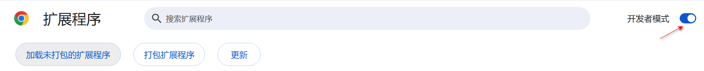
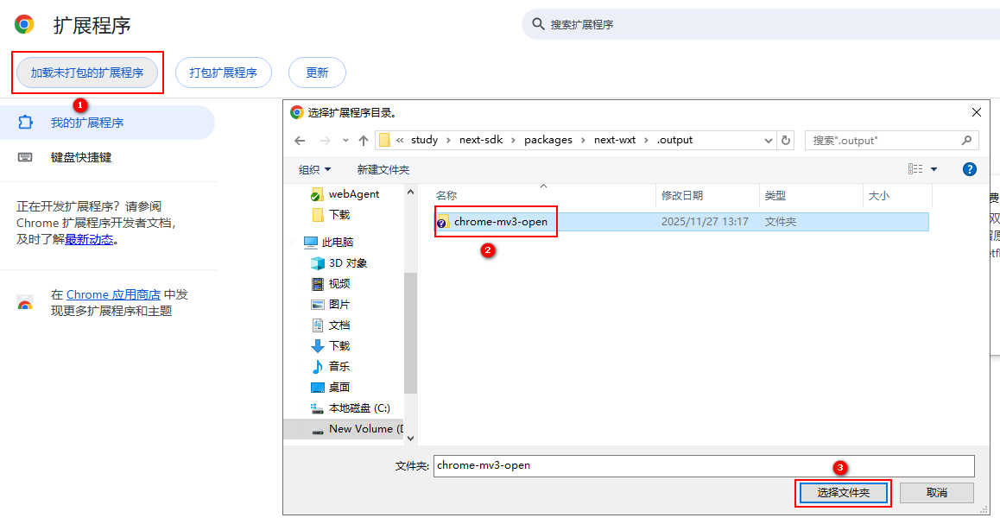
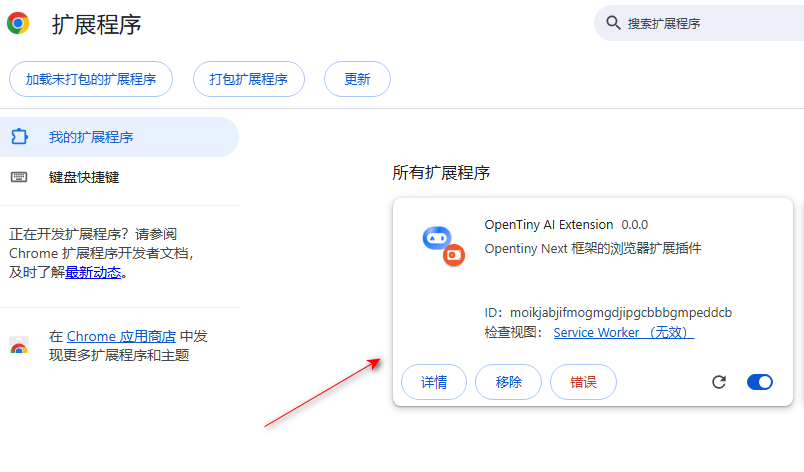

# AI Extension 扩展插件安装指南

本文档将详细介绍如何在 Chrome/Edge 浏览器中通过本地安装模式安装和使用 AI Extension 浏览器扩展插件。

## 概述

AI Extension 是一个基于 WXT 框架开发的智能浏览器扩展插件。它原生集成了 MCP（Model Context Protocol）协议，并能将浏览器的操作及页面内容转换为标准化工具供大模型调用。

## 前置要求

在开始安装之前，请确保你的浏览器满足以下要求：

### 浏览器要求

由于扩展需要动态注入主世界脚本并接管部分无障碍功能，需要以下最低浏览器版本：

- **Chrome**：>= 120.0.0
- **Microsoft Edge**：>= 120.0.0
- **其他基于 Chromium 的浏览器**：版本 >= 120.0.0（基于 Chromium 120+）

## 安装方式一：通过下载压缩包安装（推荐普通用户）

如果你是从官网直接下载的 ZIP 压缩包，请按照以下步骤操作：

### 步骤一：解压文件
1. 访问 [v0.0.7 下载地址](https://docs.opentiny.design/download/extension-0.0.7.zip) 下载 `ai-extension.zip` 到本地。
2. 将其解压到一个固定的文件夹中（安装后请勿移动或删除该文件夹）。

### 步骤二：开启开发者模式
1. 打开浏览器的扩展管理页面（Chrome 地址栏输入 `chrome://extensions/`）。
2. 开启右上角的“开发者模式” (Developer mode)。

### 步骤三：加载扩展
1. 点击“加载已解压的扩展程序” (Load unpacked) 按钮。
2. 在弹出窗口中选择刚才解压出来的文件夹。

## 安装方式二：本地构建安装（推荐开发者）

如果你拥有源代码，希望进行二次开发或本地构建：

### 步骤一：准备扩展文件
1. 在项目根目录运行 `pnpm build:wxt` 构建扩展。
2. 构建完成后，输出目录为 `packages/next-wxt/.output/chrome-mv3-open-prod`。

### 步骤二：加载扩展
参考上述“加载已解压的扩展程序”步骤，选择该输出目录即可。

## 核心配置与权限验证（必读）

无论采用哪种安装方式，完成后请务必检查以下配置：

### 1. 确认安装成功
检查扩展卡片是否已启用，并确认图标出现在浏览器工具栏中。

### 2. 扩展权限说明
扩展需要以下核心权限，安装时请点击“允许”：
- **scripting**：用于向页面注入 WebMCP 工具脚本。
- **storage**：存储会话与配置信息。
- **host_permissions** (`*://*/*`)：访问网页 DOM 以实现自动化操作。

## 调试扩展

### 1. 核心日志排查
- **Background 日志**：点击扩展管理页面卡片上的 "Service Worker" 链接，可以查看 MCP 连接状态、工具刷新等日志。
- **页面日志**：在任意网页按 `F12`，可以查看 Content Script 和原生工具注入执行的日志。

### 2. 常见问题
- **工具列表未刷新**：尝试刷新页面，或手动切换一次标签页触发 `list_changed` 通知。
- **页面报错 `DOM tree not indexed yet`**：不用担心，底层机制会自动拦截并在下一次点击前进行 `update_tree` 强制重载索引。

## 卸载扩展

- **临时禁用**：在扩展管理页面，将该扩展的开关关闭。
- **永久移除**：点击扩展卡片上的"移除"按钮即可完全清理。

## 技术支持

如果你需要技术支持或反馈问题，可以通过以下方式联系：

- 提交 Issue 到项目仓库
- 查看项目相关架构文档
