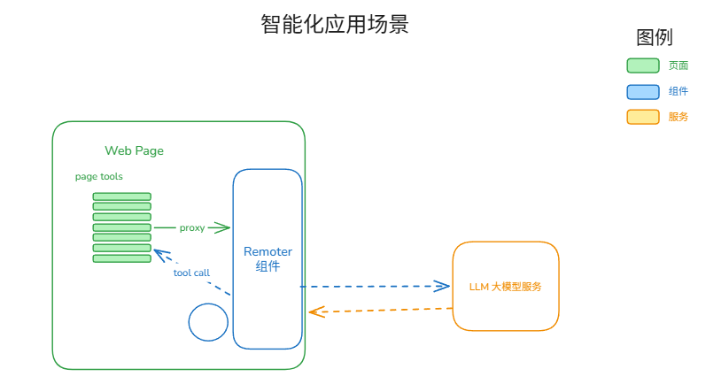
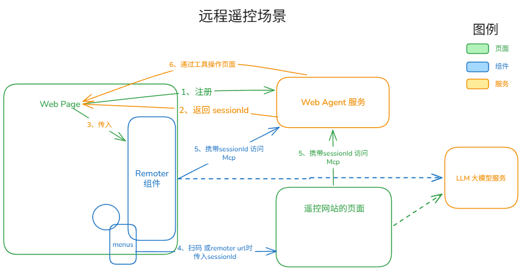

# 适配场景 与 FAQ

## 一、 WebMCP 的适配场景

通过[快速开始](./quick-start.md)一节， 我们可以看到使用**OpenTiny WebMCP-SDKs** 的2种常见场景：智能化应用场景与远程遥控场景。

- **智能化应用场景**是基础步骤，每个应用必须提前注册好自己的工具函数。
- **远程遥控场景**是在智能化应用的前提下，引入的一种复杂的高级场景，需要配套其它后端服务。

### 1. 智能化应用场景

**智能化应用场景**是用户在开发项目网站时，引入WebMCP SDLs后，注册一组页面工具函数，以便AI 大模型可以直接读取和控制网站应用，将应用变得 AI 驱动式应用。

当网站项目已经智能化之后，我们就可以通过一定的手段将页面工具传递给 AI 大模型，最简单就是引入 `Tiny Remoter`的Vue组件。如果你想深度定制UI与交互逻辑，你也可以直接选择 `Tiny Robot`组件库进行从零开发您的智能体程序, 智能化应用场景结构图如下。

通过上图看出，页面工具通过构造一个 `mcpServer` 来代理给 TinyRemoter组件，之后TinyRemoter组件与AI 模型对话时，会携带上页面工具信息。 在需要查询页面数据或操作页面功能时，AI 模型会发出工具调用的命令，TinyRemoter组件会在内部构造 `mcpClient` 来执行页面。

---

典型应用场景：快速在网页上添加一个智能对话框

### 2. 远程遥控场景

**远程遥控场景**是在智能化应用的之后，再将应用直接代理给后台的持续运行的服务，这样所有的智能体都可以通过后台服务来控制网站应用。

从上图可以看到，整个架构包含 5 个角色，其中**Web Agent 服务**和 **遥控网站**需要额外部署，参见[私有化部署方案](../remoter/remoter-mode.md)：

- **Web Page 应用**：用户正在开发的业务页面，需注册网页工具并向 `Web Agent` 服务注册，完成网页智能化改造。
- **Web Agent 服务**：本地部署的 Node.js 后端应用，作为智能代理中枢和 MCP 代理转发服务,。它接收页面的连接信息后，生成 `sessionId` 后与目标页面建立连接，同时创建标准的 HTTP Streamable MCP Server。任意 MCP Client 均可连接并调用其工具，调用会转发至目标页面。
- **Remoter 组件**：在系统中嵌入聊天界面，它本身也是前端智能体，内部可以添加 McpServer，并与 AI 大模型直接对话。当它接收当前页面的 `sessionId` 后，会创建 MCP Client 控制当前页面。
- **遥控网站**：一个部署的 Vue 项目, 通过 URL 参数接收 `sessionId`后，创建 MCP Client 控制目标页面。
- **LLM 大模型**：为 Remoter 组件或遥控网站提供 AI 对话能力

---

远程遥控场景的总结：

1.  Web Page 应用 和 Web Agent 服务 是组成一个的最小系统，并向外提供一个**标准 MCP Server 服务**。这个服务可被任意智能体访问。
2.  Remoter 组件 和 遥控网站 均为可选角色,它们自身是前端智能体，与 AI 大模型直接对话，并可使用**标准 MCP Server 服务**。
3.  第三方智能体 VS Code、CodeX、OpenCode 等，也可以配置McpServer来使用它。
4.  `TinyRemoter` 是整个架构的枢纽组件，Remoter 组件和遥控网站中的对话框均使用该组件开发。它一边接收页面的 `sessionId`，一边与 `Web Agent` 服务和 LLM 大模型建立连接，打通整个 AI 对话流程。

---

遥控模式的典型应用场景：

1. 跨浏览器的 AI 操作网页，例如异地办公操作远程浏览器
2. 连接到其他智能体操作网页，例如 VS Code、CodeX、OpenCode 等
3. 类似 Chrome DevTools MCP、Browser Use 等工具的用途，支持 AI 操作网页、自动化测试等

## 二、 FAQ

### 1. 为什么选择智能化应用，注册页面工具这条路

工具函数是AI智能体感知外界，操作外界唯一途径。自2025年MCP成为标准以后，人们一直在摸索在浏览器上使用MCP服务的最佳途径，目前主流有3种模式

1. **外挂式**：
   - 从应用的外部通过**浏览器调试协议**来操作页面,**应用无需修改代码**。
   - 典型产品： chrome-devtools-mcp，browser-use等。
2. **视觉式**:
   - 通过屏幕截图和视觉大模型，生成坐标点来操作页面，**应用无需修改代码**。
   - 典型产品：Midscene, computer use 等。
3. **内联式**：
   - 通过在页面注册工具，进行**智能化应用改造**，让工具直接操作应用内状态变量，
   - 典型产品：mcp-b, WebMCP SDKs 等。

**外挂式**严格依赖DOM结构的准确性，**视觉式**无法克服不可见区域问题（dialog 或 select选项）, 且他们都存在多轮次调用，Token消耗大，执行结果不稳定等问题。

我们推荐使用**内联式**工具， 因为只有应用自己了解自己，**内联式**可以编程式开发，打通应用内部数据和函数，一次执行多步的任务，且动作是准确可预测的。通过定义网页工具函数，可以实现许多外挂式/视觉式工具无法实现的能力。

### 2. 为什么选择WebMcp API

**OpenTiny WebMCP-SDKs** 是探索WebMcp的先行者，自2025年就在浏览器上定义WebMcp Server,并进行注册工具函数，详见：[WebMcp Server](../webmcp-sdk/webmcp-server.md)。

在2006.5.27号会议上， W3C 组织已经定义标准**WebMCP API**，并将在 Chrome 150 上正式推出。目前已经有成熟的 WebMcp Polyfill包，可以让我们在低版本浏览器上也能使用它，所以它目前已经是广泛可用的状态了。
随着它成为浏览器标准API并逐渐流行后，未来大多数网页应用都会内部集成WebMCP API， AI 智能体将可以无缝操作这些网站。

我们定义的WebMcp Server 与 标准WebMCP API的功能目的是一致的，用法是一致的。当WebMCP API成为标准后， 我们不建议继续使用WebMcp Server。
