<Info>
当一个传统的 Web 应用通过 NEXT-SDKs 升级为智能应用之后，该应用就可以被 AI 操控了。
</Info>

操控 Web 应用的程序我们称为 **遥控器**，它是一个接入了 AI 的对话框程序，遥控器的载体可以是多种多样的，可以是支持 MCP 的 IDE 软件，
比如：[VSCode Copilot](https://vscode.js.cn/) 、[ Cursor ](https://cursor.com/cn) 等，可以是通过智能体平台搭建的智能体应用，
比如：[Dify](https://docs.dify.ai/) 、[Coze](https://www.coze.cn/)等，也可以是网页 AI 对话框，比如： [Ant Design X](https://ant-design-x.antgroup.com/) 、[Element Plus X](https://element-plus.org/) 等，甚至可以是一个手机 App 或 小程序。

## VSCode Copilot

1. 在 VSCode 软件中打开你的项目工程，在项目根目录增加 `.vscode` 文件夹，里面添加一个 `mcp.json` 文件，在该文件中加入以下内容。

```json
{
  "servers": {
    "my-app-mcp-server": {
      "url": "https://ai.opentiny.design/mcp?sessionId=stream06-1921-4f09-af63-51de410e9e09"
    }
  }
}
```

2. 配置完成之后点击 `my-app-mcp-server` 上方的启动按钮，这时你的 Web 应用的 MCP Server 就启动了。


3. 然后使用快捷键 Ctrl + Alt + I 打开 VSCode Copilot AI 对话框，切换到 Agent 模式。


4. 在输入框中输入需要操作的内容，这时 AI 就会调用你的 Web 应用中定义的 MCP 工具，操作你的 Web 应用，例如帮我选中 ID 为 6 的公司,就会调用定义的 MCP 工具，点击继续按钮。

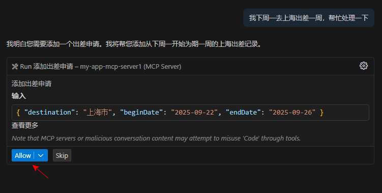

5. 查看是否调用 MCP 工具成功。

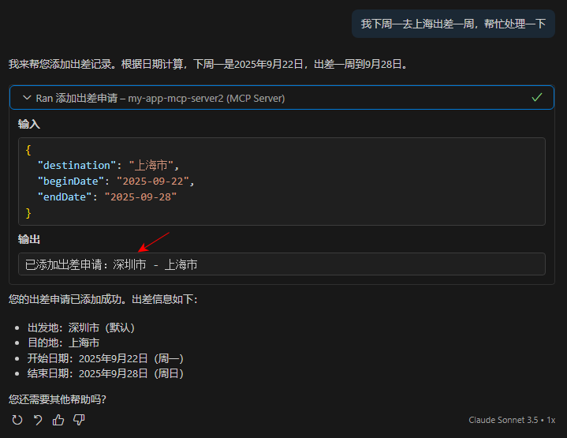

## Cursor

1. 在 [Cursor](https://cursor.com/cn) 官网下载软件。


2. 在 Cursor 使用快捷键 Ctrl + L 弹出 AI 对话框，点击设置按钮进行设置 MCP Server。


3. 按照下面的步骤手动进行手动添加。

```json
{
  "mcpServers": {
    "my-app-mcp-server": {
      "url": "https://ai.opentiny.design/mcp?sessionId=stream06-1921-4f09-af63-51de410e9e09"
    }
  }
}
```

4. 查看 MCP 是否配置成功并且进行验证。


5. 新建会话，切换到 Agent 模式，在输入框中输入需要操作的内容，这时 AI 就会调用你的 Web 应用中定义的 MCP 工具，操作你的 Web 应用。

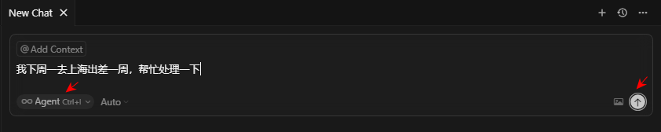

6. 查看是否调用 MCP 工具成功。

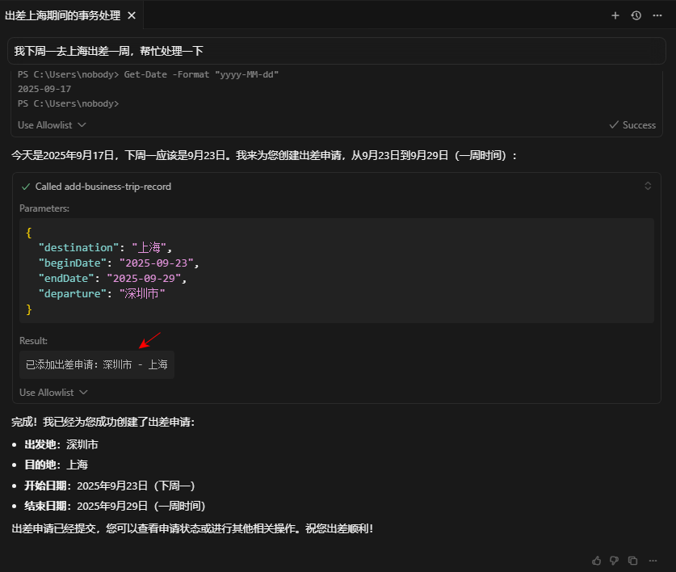


## Windsurf
1. 在 [Windsurf](https://windsurf.com/) 官网下载软件。


2. 在 Windsurf 中使用快捷键 Ctrl + L 弹出 AI 对话框，点击设置按钮进行设置 MCP Server。


3. 配置 `mcp_config.json` 文件，格式如下。

```json
{
  "mcpServers": {
    "my-app-mcp-server": {
      "url": "https://ai.opentiny.design/mcp?sessionId=stream06-1921-4f09-af63-51de410e9e09"
    }
  }
}
```


4. 点击 Refresh 会出现我们的 MCP Servers 是否成功。

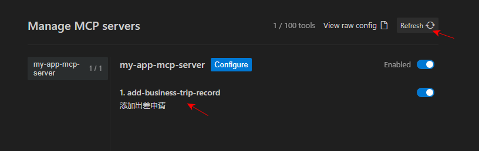

5. 新建会话，切换到 Agent 模式，在输入框中输入需要操作的内容，这时 AI 就会调用你的 Web 应用中定义的 MCP 工具，操作你的 Web 应用。

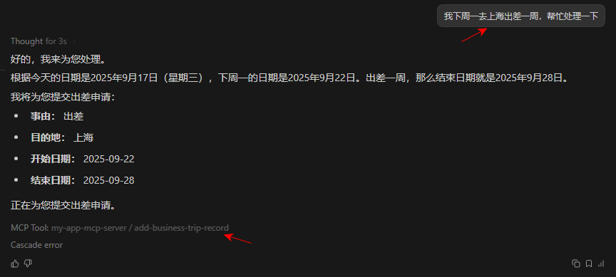

## Trae
1. 在 [Trae](https://www.trae.cn/ide/download) 官网下载软件。


2. 在 Trae 使用快捷键 Ctrl + U 弹出 AI 对话框，点击设置按钮进行设置 MCP Servers。


3. 继续按照下面的步骤手动添加 MCP Servers ，格式如下：

```json
{
  "mcpServers": {
    "my-app-mcp-server": {
      "url": "https://ai.opentiny.design/mcp?sessionId=34a49b60-3368-467d-b9a0-1f067dd9d2ce"
    }
  }
}
```


4. 查看 MCP Server 是否配置成功。


5. 新建会话，在输入框中输入需要操作的内容，这时 AI 就会调用你的 Web 应用中定义的 MCP 工具，操作你的 Web 应用。

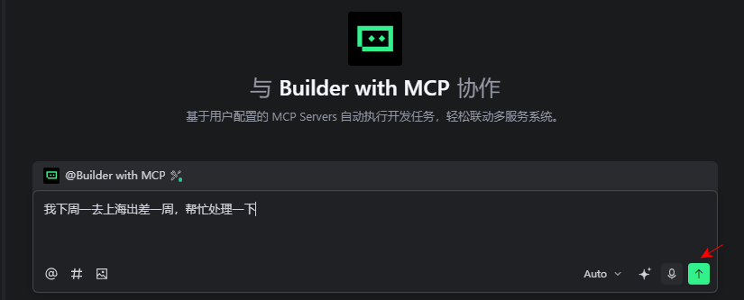

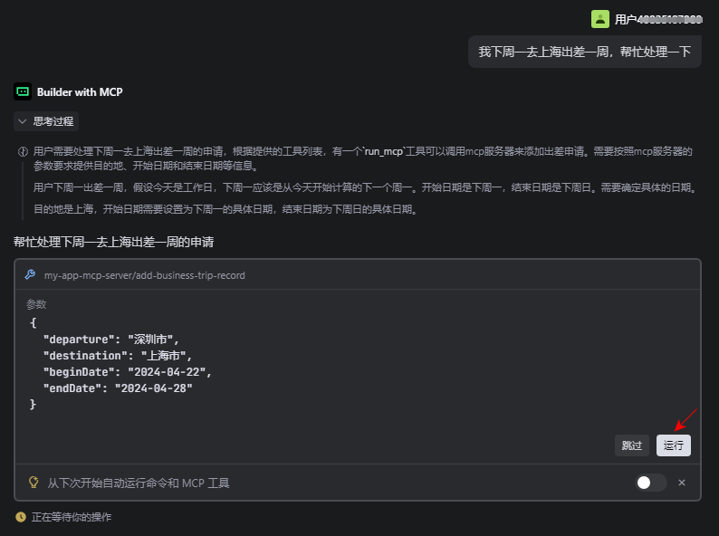

6. 查看是否调用 MCP 工具成功。

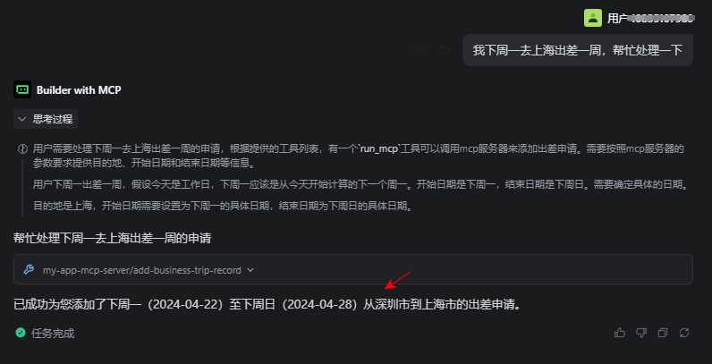

## Cherry Studio
1. 在 [Cherry Studio](https://www.cherry-ai.com/) 官网下载软件。


2. 选择助手


3.在 Cherry Studio 配置 MCP Servers。

```json
{
  "mcpServers": {
    "my-app-mcp-server": {
      "type": "streamableHttp",
      "url": "https://ai.opentiny.design/mcp?sessionId=f7e8e829-7eeb-4f10-816e-746253961237"
    }
  }
}
```


4. 查看 MCP Server 是否配置成功。


5. 新建会话，在输入框中输入需要操作的内容，选择定义的 MCP 工具，点击发送按钮。

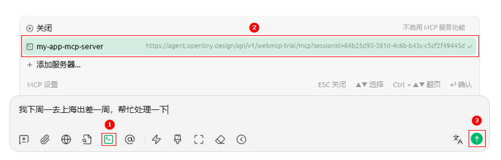

6. 查看是否调用 MCP 工具成功。

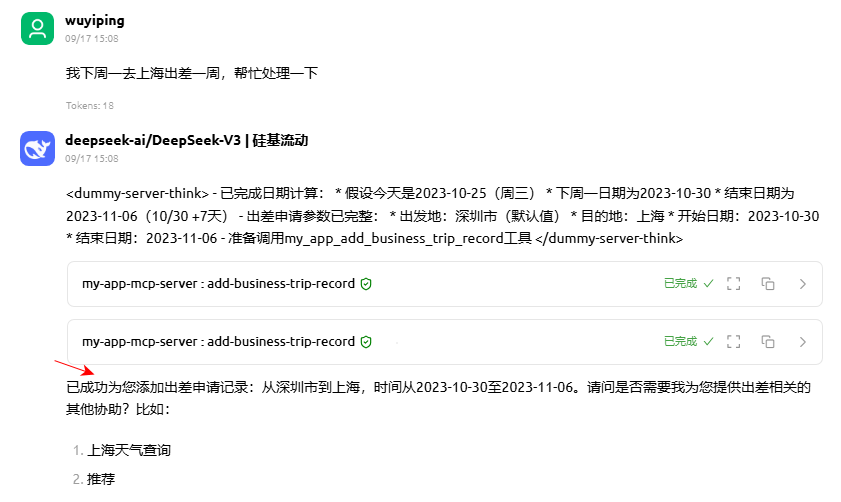

## Cline

1. Vscode 下载 Cline 插件。


2. 用 github 账号进行登录并且在 Cline 中配置 MCP Servers。


3. 配置好后会自动生成下面的文件。

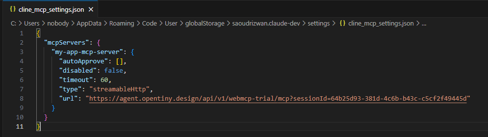


4. 查看 MCP Server 是否配置成功。


5. 新建会话，在输入框中输入需要操作的内容，点击发送按钮。

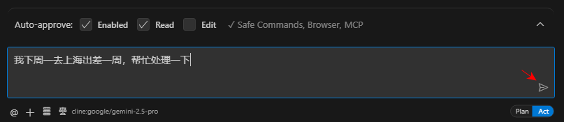

6. 查看是否调用 MCP 工具成功。

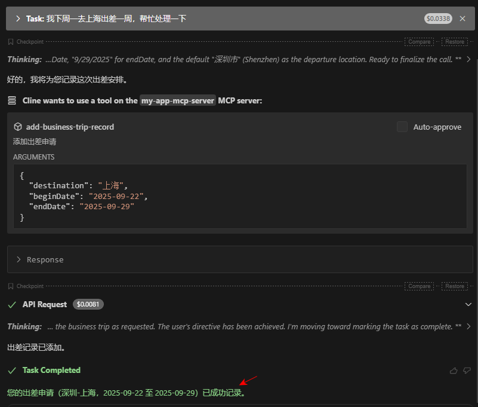

## 通义灵码

1. 在 [通义灵码](https://lingma.aliyun.com/) 官网下载软件。


2. 在通义灵码 IDE 使用快捷键 Ctrl + Shift + L  弹出 AI 对话框，点击设置按钮进行设置 MCP Server。


3. 继续按照下面的步骤手动添加 MCP Servers。


4. 手动配置格式如图。


5. 查看 MCP Server 是否配置成功。

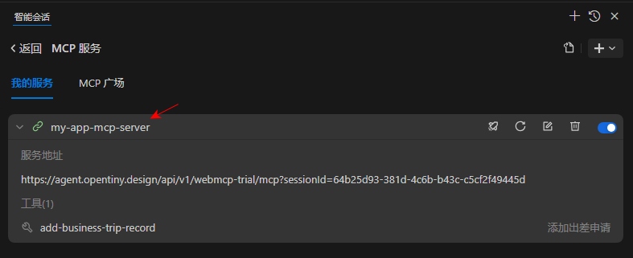

6. 新建会话，选择智能体，输入需要操作的内容，点击发送按钮。

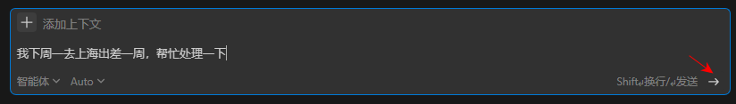

7. 查看是否调用 MCP 工具成功。

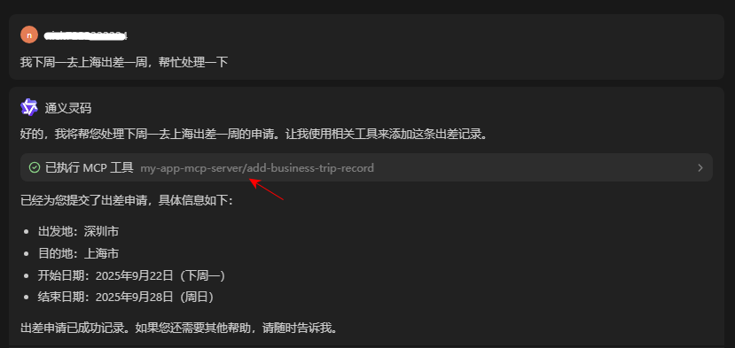


## Dify

1. 在 [Dify](https://dify.ai/) 官网进行登录


2.创建 Chatflow 空白应用。


3. 新建 Agent 智能体。


4. 设置 Agent 策略。


5. 设置模型。


6. MCP 服务配置中输入配置信息。

```json
{
  "my-app-mcp-server": {
    "transport": "streamable_http",
    "url": "https://ai.opentiny.design/sse?sessionId=df8f46fd-84a2-4079-88b9-b3dfef176f15"
  }
}
```


7. 查看运行是否成功。

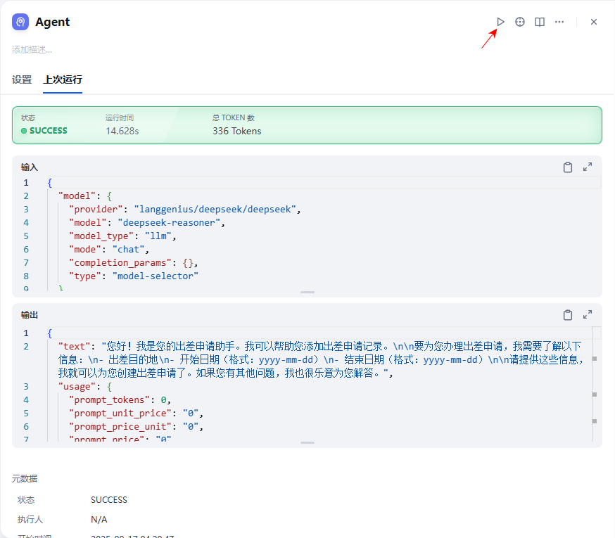

8. 预览这个编排任务并且在输入框中输入需要操作的内容验证这个任务。

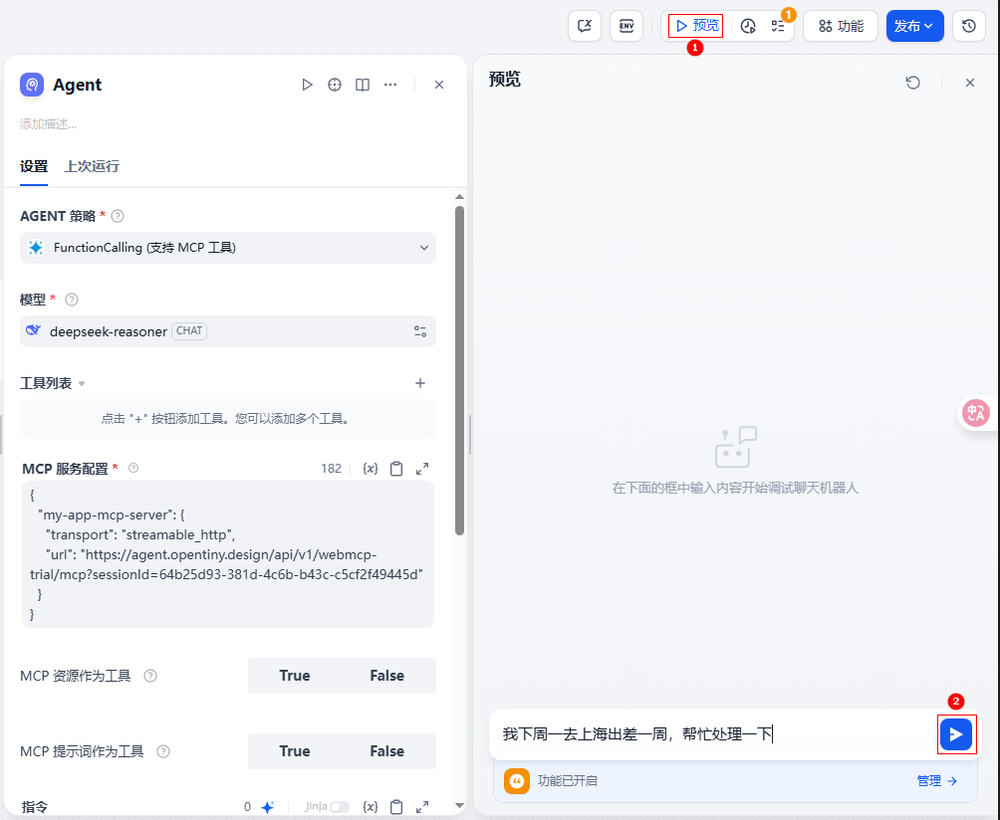

9. 查看是否调用 MCP 工具成功。

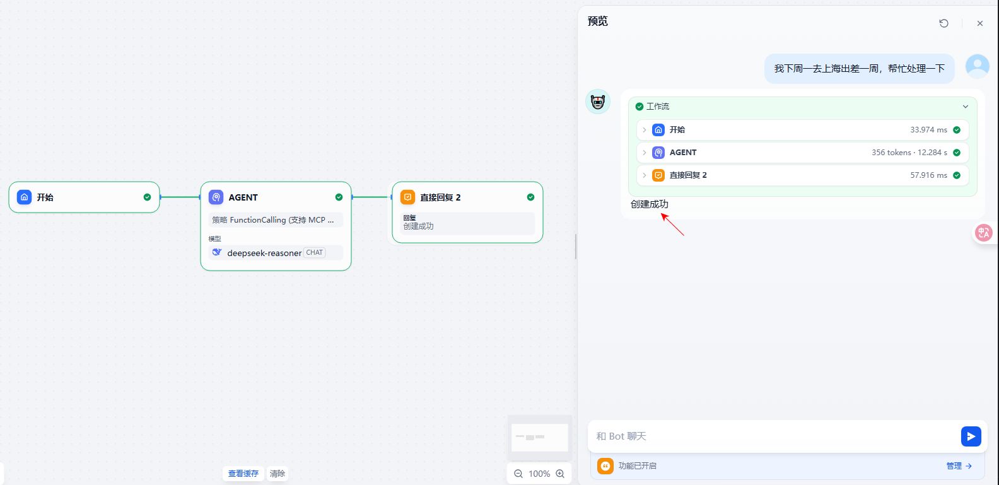


## Coze
1. 进入 [Coze](https://www.coze.cn/) 官网，登录后点击打开网页版。


2. 在 Coze 中配置 MCP Servers ，先添加管理工具。


3. 添加自定义管理工具。

```json
{
  "mcpServers": {
    "my-app-mcp-server": {
      "url": "https://ai.opentiny.design/mcp?sessionId=stream06-1921-4f09-af63-51de410e9e09"
    }
  }
}
```


4. 查看 MCP Server 是否配置成功。


5. 新建会话，选择智能体，输入需要操作的内容，点击发送按钮。

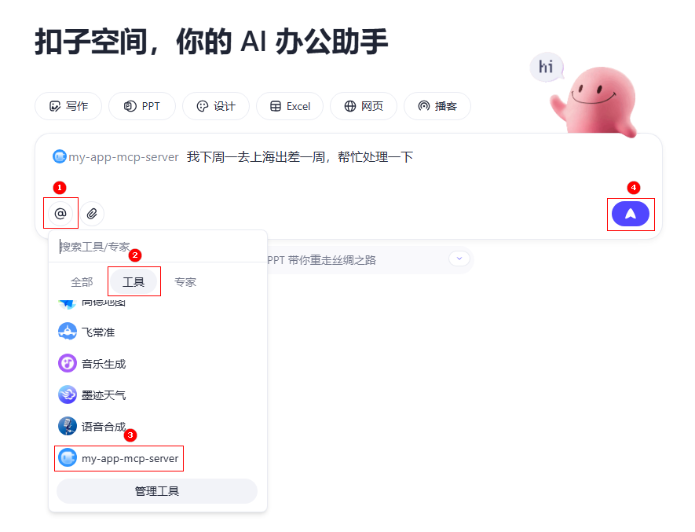

6. 查看是否调用 MCP 工具成功。


