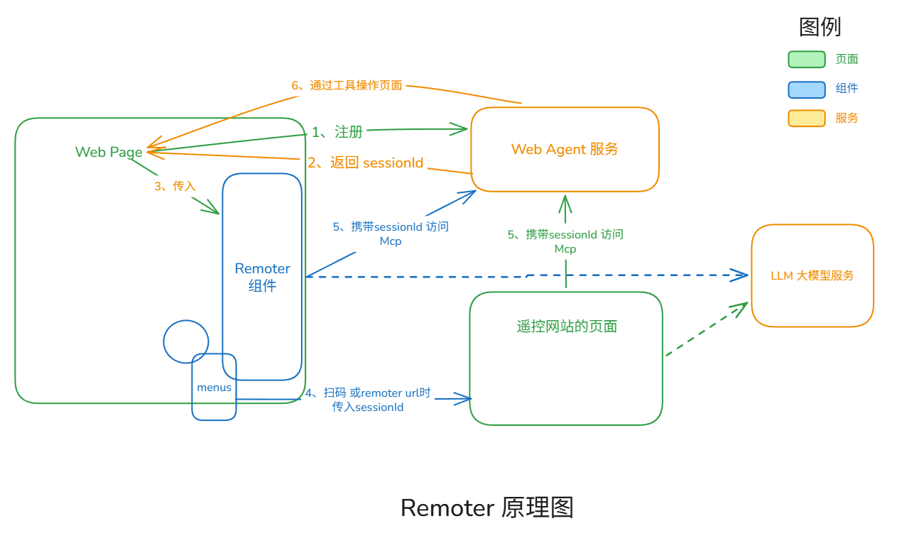

# 远程遥控模式

## 一、远程模式的原理



从上面的原理图可以看到，整个架构中一共有5个角色：

- `Web Page 应用` 是用户正在开发的业务应用页面，它需要注册网页工具，之后向`Web Agent服务`注册，完成网页智能化改造。
- `Remoter 组件` 是用户在系统中增加一个聊天界面窗口（即 TinyRemoter组件自身）。当它接收当前页面的`sessionId`之后，就能够创建`Mcp Client` 来控制当前页面。
- `Web Agent 服务` 是一个本地部署的`Nodejs 后端应用`， 它是一个智能代理中枢服务 ，MCP 代理转发解决方案 。它接收`sessionId`之后即与`目标页面`建立连接，同时创建一个`标准的 httpstreamable McpServer`， 任何Mcp Client都可以连接并调用它的工具，它再将该调用转发到`目标页面`之上。
- `遥控网站` 是一个部署的 Vue 项目，它通过 `url params` 来接收`sessionId`参数，就能够创建`Mcp Client` 来控制`目标页面`。
- `LLM 大模型` 是支持 `Remoter组件` 或者 `遥控网站` 进行AI对话的服务。

在这5个角色中，`Web Page 应用` 和 `Web Agent 服务`是必不可缺少的组成，它们形成一个最小系统，创建一个标准的McpServer 服务。 比如业务网站完成网页智能化改造之后，就可以使用任何智能体进行访问，比如： VS Code, CodeX, OpenCode...

而`Remoter 组件` 和 `遥控网站` 都是可选角色。`Remoter 组件`是在当前Web应用中立即创建一个聊天窗口，实现AI对话功能的闭环；`遥控网站` 则是面向异地办公等场景，比如从家里的`遥控网站`的网页上，通过AI对话操作公司电脑上运行的浏览器。

`TinyRemoter`组件正是整个架构中的枢纽组件， `Remoter 组件` 和 `遥控网站` 中的对话框都是使用的该组件。 它一边接收页面的`sessionId`, 一边与`Web Agent 服务` 和 `LLM 大模型` 建立连接，打通整个AI对话流程。

::: tip
普通场景下，网站应用可能不需要引入远程遥控的功能，它只需要简单的模式： 比如在页面使用原生 WebMcp编写工具，直接提供给页面上的Remoter 组件进行对话。 此时完全不必引入`Web Agent 服务`， 参考 [快速开始](../index)实现纯前端方案即可。
:::

遥控模式的应用场景：

1. 跨浏览器的AI操作网页的场景。
2. 使用其它智能体操作网页的场景，比如 VS Code, CodeX, OpenCode...
3. 类似于 `Chrome DevTools MCP`,`Browser Use` 等工具的用途，可以AI操作网页，自动化测试等。

## 二、私有化部署 `Web Agent 服务`

部署方法详见[Web Agent文档](https://docs.opentiny.design/web-agent/guide/getting-started) 或者 [Web Agent仓库](https://github.com/opentiny/web-agent/blob/main/README.zh-CN.md)。

它本质是一个`NodeJs`服务，在本地启动之后，会有一组 `API接口`, 比如 ping, list, mcp 等等。`TinyRemoter`组件的 `agentRoot` 属性配置自定义的 WebAgent 代理服务地址：`http://localhost:3000/api/v1/webmcp/` 即可。

```vue
<template>
  <TinyRemoter v-model:show="show" title="我的AI助手" agentRoot="http://localhost:3000/api/v1/webmcp/" />
</template>
```

## 三、私有化部署遥控网站

`遥控网站` 需要克隆官方仓库 ：https://github.com/opentiny/webmcp-sdk后，进行本地部署。

网站源码在`packages/next-remoter`目录，在启动之前，需要修改 `src\App.vue`的一一些代码，比如配置Remoter组件的 `agentRoot`,`llmConfigs`,`systemPrompt` 等属性。 以及修改 `vite.config.ts`的 `server`， `build`等配置。

```bash
cd packages/next-remoter

# 本地运行
pnpm dev

# 本地构建
pnpm build
```

启动后，遥控网站地址默认为：`http://localhost:8087/` ， 通过 url参数 `http://localhost:8087/sessionId=xxxxx` 来添加一个受控网页。

## 四、完整示例

```vue
<template>
  <TinyRemoter
    v-model:show="show"
    title="我的AI助手"
    AILogoUrl="https://xxxx.com/icon.png"
    sessionId="your-session-id"
    agentRoot="http://localhost:3000/api/v1/webmcp/"
    remoterUrl="http://localhost:8087/"
    qrCodeUrl="http://localhost:8087/"
    :menuItems="menuItems"
  />
</template>

<script setup>
import { ref } from 'vue'
import { TinyRemoter } from '@opentiny/next-remoter'
import '@opentiny/next-remoter/dist/style.css'

const show = ref(false)
const menuItems = ref([
  {
    action: 'qr-code',
    show: true,
    text: '扫码连接',
    icon: `<svg>...</svg>` // 自定义图标
  },
  {
    action: 'ai-chat',
    show: true,
    text: 'AI助手'
  },
  {
    action: 'remote-control',
    show: true,
    text: '远程遥控',
    icon: `<svg>...</svg>`
  },
  {
    action: 'remote-url',
    show: true,
    text: '远程URL',
    showCopyIcon: true // 显示复制图标
  }
])
</script>
```
