# 第三方 Agent 接入与操作全流程

本指南将详细介绍第三方 AI Agent（如 Claude、Gemini 或其他大模型代理）如何通过 `webmcp-skill` 的规范接入 `webmcp-cli`，并最终实现对 Chrome 浏览器中任意网页的感知与自动化操控。

---

## 🧭 系统定位与联动关系

要实现 AI 对网页的自动驾驶，需要以下三个核心组件协同工作：

```text
┌─────────────────┐        系统指令注入        ┌──────────────────┐
│  webmcp-skill   ├──────────────────────────►│  第三方 AI Agent │
│  (AI 操作指南)  │                           │   (决策与推理)   │
└─────────────────┘                           └────────┬─────────┘
                                                       │
                                                 终端命令  │ (state / run)
                                                       ▼
┌─────────────────┐         CDP 调试协议      ┌──────────────────┐
│   Chrome 浏览器 ◄───────────────────────────┤   webmcp-cli     │
│   (运行与呈现)  │                           │ (环境注入与驱动) │
└─────────────────┘                           └──────────────────┘
```

1. **`webmcp-skill`**：充当 AI Agent 的“操作手册”。它以标准 Markdown 指令集（如 `SKILL.md`）的形式存在，告诉 AI Agent 必须遵守的浏览器交互规范与调用命令的参数格式。
2. **`webmcp-cli`**：充当 AI Agent 的“眼”和“手”。它负责实际拉起/接管 Chrome 浏览器，注入运行环境，获取页面结构并执行 Agent 发送过来的指令。
3. **`第三方 AI Agent`**：充当系统的“大脑”。它负责解析用户的宏观指令，阅读页面状态，并根据技能手册自主决策何时点击、何时输入、何时滚动，直至任务完成。

---

## 🔄 网页操控全生命周期

下图展示了一个第三方 Agent 接收到用户任务后，从读取技能手册开始，到最终在 Chrome 中完成操控的完整生命周期：

```mermaid
sequenceDiagram
    autonumber
    actor User as 用户
    participant Agent as AI Agent (第三方)
    participant SK as webmcp-skill (指令集)
    participant CLI as webmcp-cli (命令行)
    participant Browser as Chrome 浏览器

    User->>Agent: 1. 提出任务 (如 "在百度搜索 OpenTiny 并打开官网")
    Agent->>SK: 2. 读取技能指南 (SKILL.md)
    Note over Agent: 载入操作手册，获取操作规范和命令行参数限制
    Agent->>CLI: 3. 执行 webmcp-cli open <url>
    CLI->>Browser: 启动/接管 Chrome 并导航至百度，自动注入环境
    
    rect rgb(240, 248, 255)
        Note over Agent, Browser: 核心操作循环
        Agent->>CLI: 4. 执行 webmcp-cli state (获取当前页面树与工具)
        CLI-->>Agent: 返回 JSON 格式状态及 DOM 索引树 (如 "[13]<input placeholder=搜索 />")
        Note over Agent: 5. 决策与推理：匹配输入框和按钮的数字索引
        Agent->>CLI: 6. 执行输入命令 (run page-agent-tool '{"action": "fill", "index": 13, "text": "OpenTiny"}')
        CLI->>Browser: 驱动页面在输入框内填入文本
        Agent->>CLI: 7. 再次执行 webmcp-cli state (获取点击搜索后的最新 DOM)
        CLI-->>Agent: 返回更新后的 DOM 树 (如 "[18]<button>百度一下</button>")
        Agent->>CLI: 8. 执行点击动作 (run page-agent-tool '{"action": "click", "index": 18}')
        CLI->>Browser: 触发点击，完成搜索
    end
    
    Agent-->>User: 9. 汇报任务完成结果
```



---

## 📝 详细操控步骤分解

以下我们以一个具体的任务：**“帮我登录系统并提交表单”** 为例，拆解第三方 Agent 的真实操作步骤。

### 第一步：大模型载入 `webmcp-skill` 系统指令
在启动任务前，第三方 Agent 必须载入位于 `packages/webmcp-skill/SKILL.md` 中的指令系统。
该文件内规定了极其严格的 **Browser Rules（浏览器规则）**，限制了大模型的行为：
- **无状态不操作**：绝对不能凭空猜测页面上的按钮或输入框。在进行 `click`、`fill`、`select` 动作前，**必须先执行一次 `state` 查询**。
- **参数闭环**：传递给操作工具 `page-agent-tool` 的动作参数必须是合法的 JSON 字符串，且必须用单引号包裹（例如：`'{"action": "click", "index": 18}'`）。
- **非侵入式特权**：对于复杂交互网站（例如 Excalidraw 画图页面），优先使用页面专属的子技能（`excalidraw_execute_command`）而非通用的页面鼠标模拟，以保障交互的高成功率。

### 第二步：开启目标网页
Agent 解析用户需求后，首先生成终端命令，通过 `webmcp-cli` 在 Chrome 中开启页面：

```bash
webmcp-cli open "http://127.0.0.1:3003/login"
```
**底层机制**：`webmcp-cli` 接收到指令后，会通过 CDP 驱动 Puppeteer 自动拉起带有 `9222` 调试端口的 Chrome，并在该页面上自动注入 `navigator.modelContext` Polyfill 及操控代理 `page-agent-tool`。

### 第三步：感知并获取当前 DOM 状态
Agent 执行 `state` 命令来感知页面结构：

```bash
webmcp-cli state
```
**返回的 JSON 数据结构示例**：
```json
{
  "url": "http://127.0.0.1:3003/login",
  "title": "系统登录",
  "content": "[0]<input placeholder='用户名' />\n[1]<input type='password' placeholder='密码' />\n[2]<button>登录</button>",
  "webmcpTools": [
    { "name": "page-agent-tool" }
  ]
}
```

### 第四步：智能推理与决策
第三方 Agent 读取到 `state` 返回的数据后，在自身的上下文（Context）中进行推理和决策：
- 观察到 `content` 中，用户名输入框的索引为 `0`，密码输入框的索引为 `1`，登录按钮的索引为 `2`。
- 确认当前暴露的可调用工具只有内置的 `page-agent-tool`。
- 决策出第一步：应当在用户名输入框中填写文本。

### 第五步：动作执行（写入用户名与密码）
Agent 发送命令，在输入框中填入信息：

```bash
# 写入用户名
webmcp-cli run page-agent-tool '{"action": "fill", "index": 0, "text": "admin"}'

# 写入密码
webmcp-cli run page-agent-tool '{"action": "fill", "index": 1, "text": "password123"}'
```

### 第六步：重新查询并点击登录
由于输入密码后，页面状态或焦点可能发生微小改变，Agent 严格遵守“无状态不操作”原则，在点击前重新获取页面树：

```bash
webmcp-cli state
```
确认登录按钮的索引依然为 `2`。下发点击登录的指令：

```bash
webmcp-cli run page-agent-tool '{"action": "click", "index": 2}'
```
此时浏览器接收到 CDP 发送的原生点击事件，执行登录逻辑并发生页面跳转。

### 第七步：特定领域技能的高级调用 (以 Excalidraw 为例)
当页面发生跳转，进入到一个更加复杂且交互密集的系统（如白板系统）中时：
1. Agent 再次执行 `state` 命令，发现 `url` 已经变更为 `https://excalidraw.com`，并且在 `webmcpTools` 中多出了一个专属的页面工具 `excalidraw_execute_command`。
2. 根据 `webmcp-skill` 中关于域名的判定规则，Agent 会自动加载子技能描述文件 `domains/excalidraw.md`。
3. 此时，Agent 不再依赖 `page-agent-tool` 的鼠标模拟点击来笨拙地作画，而是直接调用专属的 MCP 工具，发送高度抽象且精准的画布作画参数：
   ```bash
   webmcp-cli run excalidraw_execute_command '{"command": "create_rect", "x": 100, "y": 100, "width": 200, "height": 80, "label": "开始节点"}'
   ```
4. Excalidraw 画布底层接收到由 WebMCP 桥接传来的内部调用，零延迟、零失误地在白板上创建了一个带文字的矩形。

### 第八步：终结与结果汇报
当 Agent 在 `state` 中观测到页面已成功呈现最终所需的目标，或已经满足了用户“提交表单”的要求后，向用户返回成功报告：
> **Agent**: "我已成功为您登录系统，并在白板上绘制了您所需的开始节点。目前操作已完成。"

任务圆满结束。
