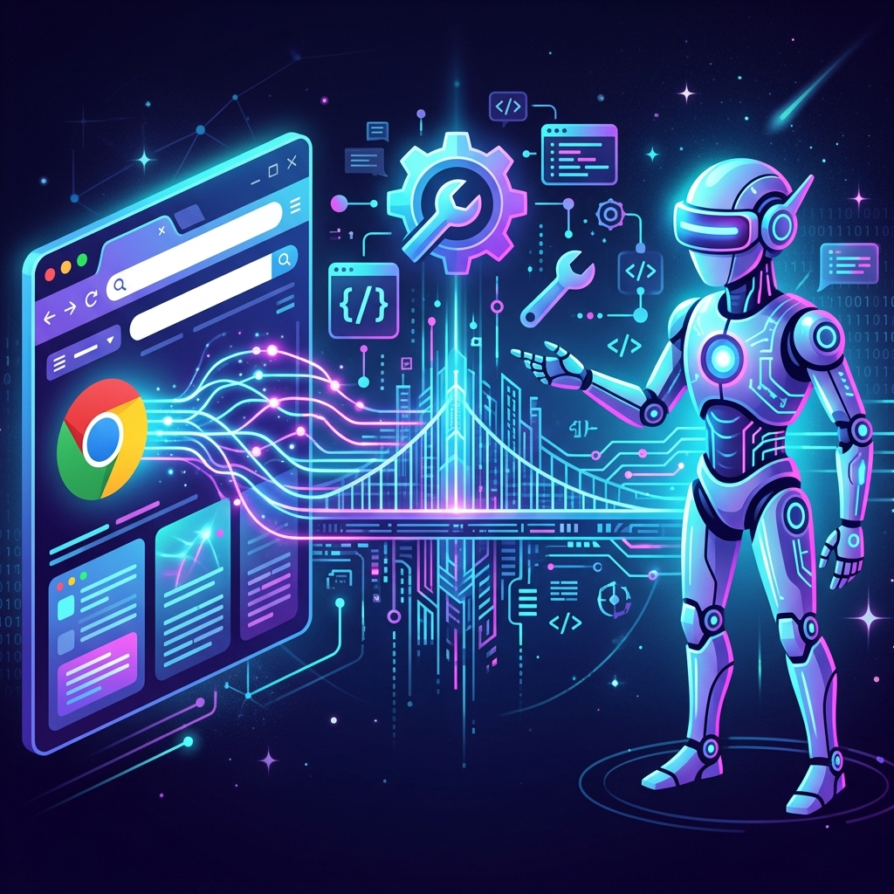
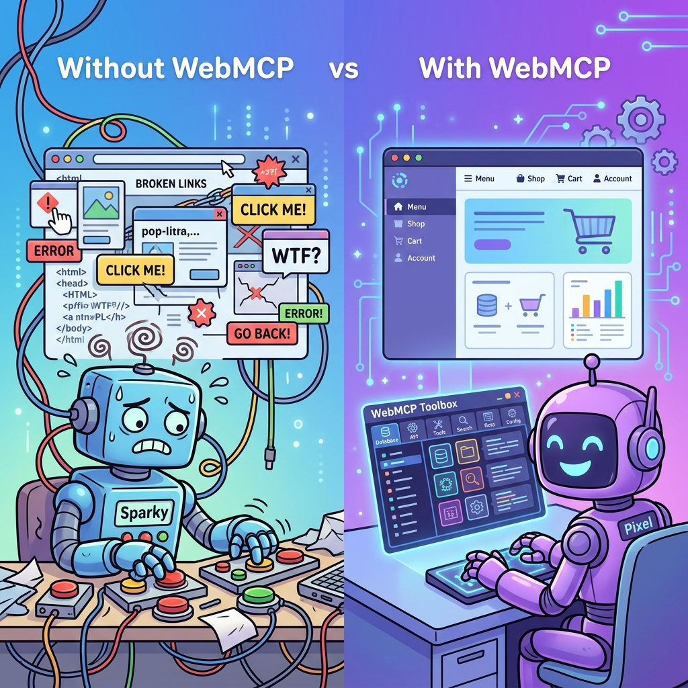
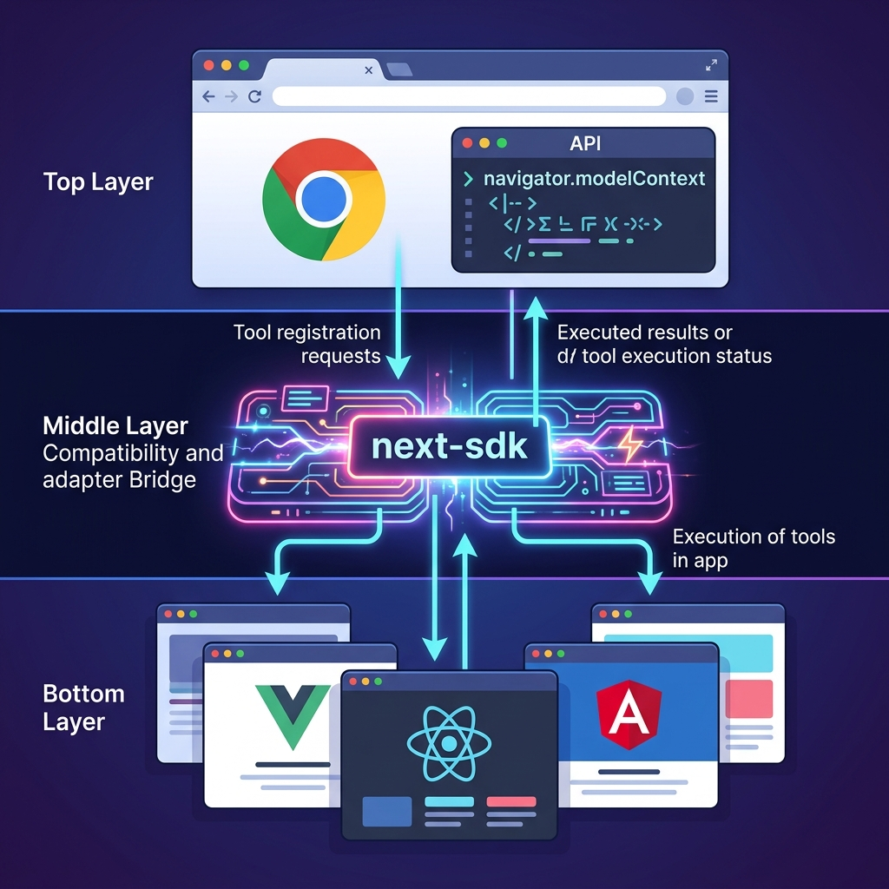

# Chrome WebMCP 深度解析：开启浏览器原生 AI 智能调用的新时代



在 Web AI 技术飞速发展的今天，如何让 AI Agent 有效地感知并操作网页端业务逻辑，已成为提升开发者体验的关键。随着谷歌 Chrome 近期推出的 **WebMCP (Model Context Protocol for Web)**，浏览器正在从一个单纯的渲染工具，演变为具备“原生工具调用能力”的智能交互平台。

本文将深入探讨 WebMCP 的核心机制、行业现状，以及 **OpenTiny next-sdk** 如何通过兼容性适配层，助力开发者平滑接入这一前沿协议。

---

## 一、 WebMCP 协议概述

传统意义上的 AI 操作网页往往依赖于外部插件或复杂的 DOM 模拟。而 **WebMCP** 则定义了一套标准化的通信协议，允许浏览器直接作为 MCP（模型上下文协议）工具的承载容器。

- **生态定位**：如果说 MCP 解决了 AI 与后端服务的连接，那么 WebMCP 则补齐了 AI 与**浏览器前端业务上下文**交互的最后一块版图。
- **交互逻辑**：AI 代理通过浏览器提供的原生接口，直接发现并调用网页中注册的“工具（Tools）”，从而实现对业务功能的语义化操控。

> [!TIP]
> 核心差异：以前 AI 需通过视觉或代码猜测用户意图，现在只需通过 `navigator.modelContext` 获取业务方显式暴露的标准化接口。



---

## 二、 现有 Web AI 方案的局限性剖析

在 WebMCP 出现之前，业界主要通过以下三种方式实现 AI 对页面的操控。然而，这些技术在本质上都是从“非结构化数据”中逆向推导逻辑，存在难以突破的技术瓶颈：

### 1. 基于 DOM 解析：结构与语义的脱节

主流方案依靠爬取 HTML DOM 并将其输入给 LLM。

- **技术局限**：DOM 是为“渲染”设计的，而非“逻辑”。一个 `<div>` 标签在代码层面可能承载了核心业务逻辑，但在 AI 看来只是一个通用的容器。
- **Token 溢出风险**：现代网页 DOM 树极其庞大，将完整的 HTML 发送给 AI 会占用大量的上下文窗口（Context Window），导致推理成本激增且响应延迟。
- **不稳定性**：前端框架频繁生成的动态 Class 名及 ID 会导致 AI 的交互指令（如 CSS Selector）极其脆弱，任何 UI 的微调都可能引发“蝴蝶效应”。

### 2. 基于无障碍 tree（AOM）：描述能力的缺失

利用 ARIA 属性和辅助功能树进行逻辑映射。

- **技术局限**：无障碍树的设计初衷是“平替视觉”，而非“暴露功能”。它能告诉 AI “这是一个提交按钮”，但无法解释“点击它会触发带有 A 条件的 B 类型订单审批”。
- **生态短板**：由于历史原因，大量存量网页的 AOM 信息缺失或错误，依靠 AOM 犹如在“断章取义”中还原真相。

### 3. 基于视觉模型（VLM）：昂贵的“盲人摸象”

通过截取网页图像送入视觉模型进行多模态分析。

- **技术局限**：视觉模型具有严重的“空间幻觉”，经常发生坐标偏移或无法识别重叠层（如弹窗、遮罩）的情况。
- **深度不可感知**：AI 只能看到“表面”，无法感知网页背后隐藏的状态（如未展示在 UI 上的后端元数据）。
- **性能黑洞**：截图的编码、传输与推理极其缓慢，无法满足毫秒级的实时交互需求。

---

## 三、 Chrome 原生 WebMCP 的实现机制

WebMCP 的核心创新在于它从“逆向推导”转向了**“正向显式声明”**。它提供了两种注册工具的方式，兼顾了灵活性与发现效率：

### 1. 声明式定义（Declarative Definition）：零代码表单升级

这是 WebMCP 最具“Web 原生感”的特性。开发者无需编写 JavaScript 逻辑，通过在现有的 HTML `<form>` 标签上添加特定属性，即可将其原地升级为 AI 可感知的工具：

```html
<!-- 声明式注册：通过 toolname 和 tooldescription 属性，将表单直接暴露给 AI -->
<form toolname="apply_price_protection" tooldescription="提交商品价保申请，自动核算差价并赔付">
  <input name="order_id" type="text" placeholder="请输入订单编号" required />
  <select name="reason">
    <option value="price_drop">百亿补贴降价</option>
    <option value="coupon">领券价格更低</option>
  </select>
  <button type="submit">申请补差价</button>
</form>
```

这种方案的精妙之处在于：AI 代理能自动识别表单的 `input` 结构作为其调用参数，并直接触发 `submit` 事件。这意味着你无需为 AI 单独维护一套接口，**你的 UI 就是 AI 的 API**。

### 2. 编程式注册（Imperative Registration）：动态绑定

对于复杂的异步交互或非表单类业务，可以通过 `navigator.modelContext` 进行动态绑定：

> [!IMPORTANT]
> **环境要求与配置**：
>
> - **浏览器版本**：Chrome 146+ (建议使用 Canary/Dev 渠道)
> - **开启标志位**：访问 `chrome://flags/#enable-webmcp-testing` 并设置为 Enabled
> - **安全上下文**：必须在 HTTPS 协议或 localhost 环境下运行

- **业务端注册示例**：推荐使用 SDK 导出的 `modelContext`（自带 Iframe 穿透与 SPA 握手支持）

  ```javascript
  import { modelContext } from '@opentiny/next-sdk'

  modelContext.registerTool({
    name: 'get_coordinates',
    description: '查询指定城市的经纬度坐标',
    inputSchema: {
      type: 'object',
      properties: {
        city: { type: 'string', description: '城市名称' }
      },
      required: ['city']
    },
    execute: async ({ city }) => {
      // 调用真实的业务 API，确保数据的权威性
      const data = await businessApi.fetchCity(city)
      return { content: [{ type: 'text', text: JSON.stringify(data) }] }
    }
  })
  ```

- **客户端调用示例**：

  ```javascript
  // 1. 发现工具
  const tools = await navigator.modelContextTesting.listTools()

  // 2. 模拟智能调用
  const result = await navigator.modelContextTesting.executeTool('get_coordinates', JSON.stringify({ city: '上海' }))
  ```

---

## 四、 现状与挑战：原生 WebMCP 的落地限制

1.  **环境碎片化严重**：目前仅在特定版本的 Chrome 实验特性中启用，无法直接应用于全量用户环境。
2.  **生命周期管控缺失**：在 SPA 路由切换时，如何确保工具发现的原子性（即跳转后工具即时生效）仍是行业痛点。
3.  **安全性与合规性**：如何防止恶意脚本恶意注册伪造工具来钓取用户指令，仍需浏览器层面的严格权限隔离机制。

---

## 五、 OpenTiny next-sdk 的生产级增强方案

虽然原生 WebMCP 提供了基础能力，但在生产环境下直接使用仍面临 API 变更频繁、Schema 不规范等挑战。**OpenTiny next-sdk** 通过一层精悍的“智能化环境感知层”，将实验性的原生接口转化为标准化的生产力工具。



### 1. 内置工具的“零成本”集成

开发者不再需要手动编写 `navigator.modelContextTesting` 的发现和调用逻辑。在 `next-sdk` 中，你只需一行配置即可将浏览器内置工具注入 Agent：

```typescript
import { AgentModelProvider, modelContext } from '@opentiny/next-sdk'

const agent = new AgentModelProvider({
  llmConfig: {
    /* ... */
  },
  mcpServers: {
    // 声明为 builtin 类型，SDK 将自动接管原生 WebMCP 接口
    browserBuiltin: {
      type: 'builtin',
      client: modelContext // 推荐传递 SDK 导出的 modelContext
    }
  }
})
```

### 2. 标准化补强（Normalization & Hardening）

`next-sdk` 针对目前浏览器原生实现的不确定性做了深度加固：

- **API 差异抹平**：自动兼容 `listTools` 与 `getTools` 等实验性命名的变动，确保在各版本 Chrome 渠道下的稳定性。
- **Schema 自动修复**：原生工具声明可能存在 `inputSchema` 结构不完整的情况（如缺失 `properties` 或 `type` 定义）。SDK 会在加载时自动进行规范化补全，确保 AI SDK（如 Vercel AI SDK）能精确解析工具参数。
- **执行代理化**：通过 `getBuiltinMcpTools` 将原生回调包装为统一的 `dynamicTool`，使得内置工具可以与远程 MCP 服务（SSE/HTTP）在同一个 Agent 实例中无缝并排运行。

---

## 六、 进阶特性：从“控制页面”到“智能联动”

通过 `next-sdk`，WebMCP 将释放出超越原生协议的能量：

1.  **上下文感知的工具发现**：SDK 能够感知工具所在的特定路由。当 AI 尝试调用时，它会自动驱动 SPA 跳转、等待页面 Ready 信号、注册工具并完成执行，整个过程对用户完全透明。
2.  **类型安全的校验过滤**：深度集成 Zod 等校验方案，并支持工具黑白名单（`ignoreToolnames`），确保 AI 只能在合适的时机调用合适的业务功能。
3.  **沉浸式交互反馈**：内置了针对 AI 调用状态的 UI 联动机制，通过 `tiny-robot` 等组件让 AI 的后台操作实现“可视化回显”。


---

## 结语

WebMCP 的核心价值在于：**它将 Web 的交互逻辑从“视觉呈现”中剥离，通过结构化契约重新交付给 AI。**

**OpenTiny next-sdk** 致力于让这一前沿协议落地，帮助开发者构建不仅“可看”而且“可交流、可操控”的下一代智能 Web 应用。

---

💡 **相关资料：**

- [Chrome 原生文档：WebMCP 最佳实践](https://developer.chrome.com/blog/webmcp-mcp-usage?hl=zh-cn)
- [OpenTiny WebMCP SDK 相关讨论](https://github.com/opentiny/next-sdk/discussions/393)
- [快速开始：OpenTiny NEXT-SDKs 开发者中心](https://github.com/opentiny/next-sdk)
