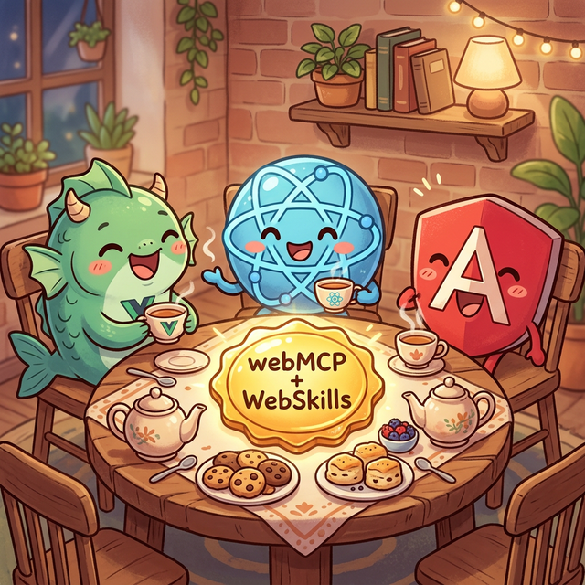
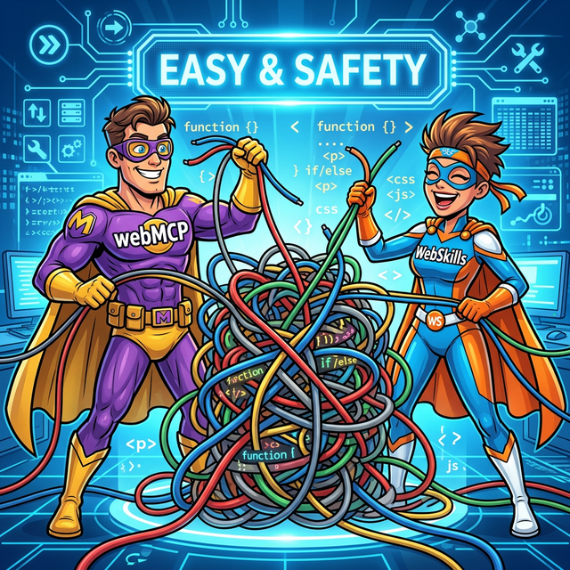

# WebMCP+WebSkills 最佳实践：告别页面操作痛点，解锁前端高效新姿势

> **内容摘要**：本文深度解析了 **WebMCP + WebSkills** 这套专为前端页面驱动设计的“组合拳”方案。通过解决现有自动化方案（无障碍适配、视觉模型）在**安全性、成本及适配难度**上的核心痛点，提供了 Vue、Angular 及 React 三大主流技术栈的工程级最佳实践，助力开发者在不改变现有业务系统的架构下，实现极简、高效、安全的 AI 驱动页面操作。



## 1. 背景与痛点

### 1.1 场景引子：为什么页面自动化这么难？

做前端工程、AI业务接入的小伙伴，是不是都有过这样的崩溃时刻？想实现页面自动化操作，要么被各种方案的坑绊住脚，要么配置复杂到让人头大，好不容易跑通还面临安全隐患……别慌！这篇文档要介绍的“组合拳”——WebMCP+WebSkills，就是帮你在**不大改现有系统**的前提下，把页面操作做得又稳又安全。


### 1.2 业界主流方案与痛点

先吐个槽：业界现有方案，坑是真的多！

在 WebMCP 出现之前，咱们做页面操作自动化，主流就两种方案，但说句实在话，用起来都让人一言难尽，痛点直接拉满：

**方案一：基于无障碍信息（如 chrome-devtools-mcp）**

听着挺专业，但实际用起来全是“门槛”：首先得要求业务系统页面做好完善的无障碍信息适配，可现实里很多老项目、复杂业务页面，根本达不到这个要求；其次，业务逻辑一旦复杂，基于无障碍信息的操作就会出现各种不确定性，时而正常时而报错，排查起来比找 bug 还难；更麻烦的是，想用它还得额外装浏览器扩展插件，或者依赖 playwright 等工具，步骤繁琐，兼容性还参齐不齐。

**方案二：基于视觉模型截图操作**

这个方案看似不用适配页面，实则“费钱又费时间”：视觉模型运行起来特别消耗 token，长期用下来成本蹭蹭涨；而且执行速度慢得让人着急，复杂业务操作能卡到你怀疑人生；最关键的是，它根本扛不住复杂业务系统的考验，稍微多几个交互步骤就直接“罢工”。

**共同致命伤：安全不可控**

不管是无障碍信息方案，还是视觉模型方案，都存在一个核心隐患——安全性。两种方案都需要一定程度上获取页面敏感信息，且缺乏有效的安全管控机制，一不小心就可能造成数据泄露，给业务带来不可挽回的损失。


### 1.3 WebMCP + WebSkills 的定位

就在大家被这些痛点折磨得焦头烂额时，WebMCP+WebSkills 横空出世，直接精准戳中所有痛点，给前端页面操作自动化带来了新希望！

**WebMCP 不是“替代者”，而是“最强补充”**

很多小伙伴会误以为 WebMCP 是要取代业界现有的 MCP 协议，其实不然！WebMCP 是基于业界 MCP 协议打造的前端优化方案，核心定位是“补充和增强”——它保留了 MCP 协议的核心优势，同时针对前端页面操作的痛点做了针对性优化，让页面操作更简单、更高效、更安全。

**WebSkills：让 AI 真的“懂你的业务”**

而 WebSkills 则是 WebMCP 的“神助攻”，它能进一步增强 AI 对业务的理解能力，让页面操作自动化更智能，哪怕是复杂的业务场景，也能轻松应对，两者搭配使用，直接实现“1+1>2”的效果。



## 2. 三大技术栈最佳实践总览

干货来袭：三大技术栈最佳实践，直接抄作业！

不管你是用 Vue、React 还是 Angular，WebMCP+WebSkills 都能完美适配，而且实现方式高度统一：**核心是通过前端路由 + 页面工具（Page Tool Bridge）把业务页面和 MCP 工具打通，再通过 WebSkills 和 TinyRemoter 做“知识与对话入口”**。下面分别给出 Vue / Angular 的摘要示例，并附上工程级最佳实践链接。

### 2.1 Vue 工程最佳实践（摘要）

> 源码工程：[`packages/doc-ai`](https://github.com/opentiny/next-sdk/tree/dev/packages/doc-ai)  
> 完整工程路径：`packages/doc-ai`  
> 详细文档：`docs/guide/vue-webmcp-best-practice.md`

**步骤 1：安装依赖**

```bash
pnpm add @opentiny/next-sdk @opentiny/next-remoter
```

> 说明：这里直接引入 WebMCP 核心 SDK 与 TinyRemoter 组件包，为后续“页面工具 + 对话框 UI”打基础。

**步骤 2：在 `main.ts` 中注册路由导航器**

```ts
// src/main.ts
import { createApp } from 'vue'
import router from './router'
import App from './App.vue'
import { setNavigator } from '@opentiny/next-sdk'

const app = createApp(App)
app.use(router)
app.mount('#app')

// 告诉 SDK：需要跳转页面时统一走 router.push
setNavigator((route) => router.push(route))
```

> 中文小结：`setNavigator` 是 Page Tool Bridge 的前提，只需在入口调用一次，之后所有“与页面绑定的工具”在执行时都会通过这里完成路由跳转。

**步骤 3：配置业务路由**

```ts
// src/router/index.ts
import { createRouter, createWebHistory } from 'vue-router'

const router = createRouter({
  history: createWebHistory(),
  routes: [
    { path: '/', component: () => import('../views/home/index.vue') },
    { path: '/product-list', component: () => import('../views/product-list/index.vue') },
    { path: '/price-protection', component: () => import('../views/price-protection/index.vue') }
  ]
})

export default router
```

> 中文小结：后面在 `registerTool` 和 `registerPageTool` 里会引用这些 path，请保持一致，避免因为路由不对导致工具调用超时。

**步骤 4：创建 MCP Server，并通过 `withPageTools` 绑定路由**

```ts
// src/mcp-servers/index.ts
import {
  WebMcpServer,
  createMessageChannelPairTransport,
  withPageTools,
  registerNavigateTool
} from '@opentiny/next-sdk'
import registerProductGuideTools from './product-guide/tools'
import registerPriceProtectionTools from './price-protection/tools'

const rawServer = new WebMcpServer()
const [serverTransport, clientTransport] = createMessageChannelPairTransport()

export const server = withPageTools(rawServer)
export { clientTransport }

export const createMcpServer = async () => {
  registerNavigateTool(rawServer)
  registerProductGuideTools(server)
  registerPriceProtectionTools(server)
  await rawServer.connect(serverTransport)
}
```

> 中文小结：`withPageTools` 让工具可以和路由产生映射；`registerNavigateTool` 注册了一个通用的 `navigate_to_page` 工具，供大模型主动发起“先跳转再用页面工具”的链路。

**步骤 5：注册与页面绑定的业务工具**

```ts
// src/mcp-servers/product-guide/tools.ts
import { z } from '@opentiny/next-sdk'
import type { PageAwareServer } from '@opentiny/next-sdk'

const registerProductGuideTools = (server: PageAwareServer) => {
  server.registerTool(
    'product-guide',
    {
      title: '产品指南',
      description: '根据产品 ID 获取产品详细信息',
      inputSchema: {
        productId: z.string().describe('产品 ID')
      }
    },
    { route: '/product-list' } // 工具执行时自动导航到该路由
  )
}

export default registerProductGuideTools
```

> 中文小结：第三个参数 `{ route: '/product-list' }` 是关键，它告诉 SDK“这个工具需要在哪个页面内执行”，从而触发 Page Tool Bridge 的自动跳转与消息投递。

**步骤 6：在页面内通过 `registerPageTool` 注册工具处理器**

```vue
<!-- src/views/product-list/index.vue -->
<template>
  <div class="products-page">
    <div v-for="product in products" :key="product.id">{{ product.name }} - ¥{{ product.price }}</div>
  </div>
</template>

<script setup lang="ts">
import { ref, onMounted, onUnmounted } from 'vue'
import { registerPageTool } from '@opentiny/next-sdk'
import productsData from './products.json'

type Product = {
  id: number
  name: string
  price: number
  stock: number
  status: 'on' | 'off' | string
}

const products = ref<Product[]>(productsData as Product[])
let cleanupPageTool: () => void

onMounted(() => {
  cleanupPageTool = registerPageTool({
    handlers: {
      'product-guide': async ({ productId }: { productId: string }) => {
        const product = products.value.find((p) => String(p.id) === productId)
        const text = product ? `产品信息：${JSON.stringify(product, null, 2)}` : `未找到产品 ID 为 ${productId} 的商品`
        return { content: [{ type: 'text', text }] }
      }
    }
  })
})

onUnmounted(() => cleanupPageTool?.())
</script>
```

> 中文小结：页面挂载时把 handler 注册进去，卸载时清理；handler 中可以直接访问 Vue 响应式数据，实现“AI 调工具 → 工具调页面逻辑”的完整闭环。

**步骤 7：在 App.vue 中挂载 TinyRemoter + Skills**

```vue
<!-- src/App.vue -->
<template>
  <div class="app-container">
    <router-view />
    <TinyRemoter
      :show="true"
      :skills="skillMdModules"
      :mcpServers="mcpServers"
      title="智能助手"
      :llmConfig="llmConfig"
    />
  </div>
</template>

<script setup lang="ts">
import { onMounted } from 'vue'
import { TinyRemoter } from '@opentiny/next-remoter'
import { createMcpServer, clientTransport } from './mcp-servers'

// 建议通过服务端中转 API 请求，或使用临时 Token，避免在前端明文暴露 API Key
const llmConfig = {
  apiKey: import.meta.env.VITE_LLM_API_KEY || 'your-api-key-placeholder',
  baseURL: import.meta.env.VITE_LLM_BASE_URL || 'https://api.openai.com/v1',
  providerType: 'openai',
  model: 'gpt-4o',
  maxSteps: 10
}

const skillMdModules = import.meta.glob('./skills/**/*', {
  query: '?raw',
  import: 'default',
  eager: true
}) as Record<string, string>

const mcpServers = {
  'my-mcp-server': {
    type: 'local',
    transport: clientTransport
  }
}

onMounted(async () => {
  await createMcpServer()
})
</script>
```

> 中文小结：通过 `skills + mcpServers`，TinyRemoter 就能在一个对话面板里同时掌握“业务知识 + 业务工具”，真正做到“对话即页面操作”。

### 2.2 Angular 工程最佳实践（摘要）

> 源码工程：[`packages/doc-ai-angular`](https://github.com/opentiny/next-sdk/tree/dev/packages/doc-ai-angular)  
> 完整工程路径：`packages/doc-ai-angular`  
> 详细文档：`docs/guide/angular-webmcp-best-practice.md`

Angular 与 Vue 最大的差异在于：**TinyRemoter 是 Vue 组件，Angular 不能直接引入，需要通过 iframe + MessageChannel 与主应用通讯**。

整体架构：

- Angular 主应用：负责路由、业务页面、WebMCP Server、`registerPageTool`
- Vue Remoter 子应用（iframe 内）：负责 TinyRemoter UI + Skills，使用 `createMessageChannelClientTransport` 连接主应用

**步骤 1：在根组件中注册 `setNavigator` 并启动 MCP Server**

```ts
// src/app/app.component.ts
import { Component, OnInit, inject } from '@angular/core'
import { Router, RouterOutlet } from '@angular/router'
import { setNavigator } from '@opentiny/next-sdk'
import { createMcpServer } from '../mcp-servers'

@Component({
  selector: 'app-root',
  standalone: true,
  imports: [RouterOutlet],
  templateUrl: './app.component.html',
  styleUrl: './app.component.scss'
})
export class AppComponent implements OnInit {
  private router = inject(Router)

  async ngOnInit(): Promise<void> {
    setNavigator(async (route) => {
      const navigated = await this.router.navigateByUrl(route)
      if (!navigated) {
        throw new Error(`页面跳转失败：导航至 "${route}" 被取消或拦截`)
      }
    })

    await createMcpServer()
  }
}
```

> 中文小结：和 Vue 版类似，这里统一封装“页面跳转策略”，同时在应用入口启动 MCP Server，确保后续 iframe 连接时已有可用的工具服务。

**步骤 2：在根模板中通过 iframe 嵌入 Remoter**

```html
<!-- src/app/app.component.html -->
<div class="app-container">
  <div class="main-content">
    <router-outlet />
  </div>
  <aside class="remoter-sidebar">
    <iframe class="remoter-frame" src="/remoter.html" frameborder="0" allow="clipboard-write" title="AI 助手"></iframe>
  </aside>
</div>
```

> 中文小结：`/remoter.html` 会通过代理指向 Remoter 子应用入口（例如 Vite dev server 的 `/remoter/`），两端同源后即可使用 MessageChannel 互通。

**步骤 3：在主窗口创建 MCP Server，并暴露 MessageChannel 服务端**

```ts
// src/mcp-servers/index.ts
import {
  WebMcpServer,
  createMessageChannelServerTransport,
  withPageTools,
  registerNavigateTool
} from '@opentiny/next-sdk'
import registerProductGuideTools from './product-guide/tools'
import registerPriceProtectionTools from './price-protection/tools'

const rawServer = new WebMcpServer()
export const server = withPageTools(rawServer)

export const createMcpServer = async () => {
  registerNavigateTool(rawServer)
  registerProductGuideTools(server)
  registerPriceProtectionTools(server)

  const serverTransport = createMessageChannelServerTransport('local-mcp')
  await serverTransport.listen()
  await rawServer.connect(serverTransport)
}
```

> 中文小结：这里不再使用“同窗口内存对”的 `createMessageChannelPairTransport`，而是用 `createMessageChannelServerTransport('local-mcp')` 等待 iframe 侧主动连入。

**步骤 4：在 Angular 页面中注册页面工具处理器**

```ts
// src/app/pages/comprehensive/comprehensive.component.ts（节选）
import { Component, OnInit, OnDestroy } from '@angular/core'
import { registerPageTool } from '@opentiny/next-sdk'

@Component({
  /* 模板与样式省略 */
})
export class ComprehensiveComponent implements OnInit, OnDestroy {
  products: Product[] = productsData as Product[]
  private cleanupPageTool!: () => void

  ngOnInit(): void {
    this.cleanupPageTool = registerPageTool({
      handlers: {
        'product-guide': async ({ productId }: { productId: string }) => {
          const product = this.products.find((p) => String(p.id) === productId)
          const text = product
            ? `产品信息：${JSON.stringify(product, null, 2)}`
            : `未找到产品 ID 为 ${productId} 的商品`
          return { content: [{ type: 'text', text }] }
        }
      }
    })
  }

  ngOnDestroy(): void {
    this.cleanupPageTool?.()
  }
}
```

> 中文小结：写法和 Vue 版高度类似，只是生命周期钩子由 `onMounted/onUnmounted` 换成了 `ngOnInit/ngOnDestroy`，其余 Page Tool Bridge 行为完全一致。

**步骤 5：在 Remoter 子应用中，通过 `createMessageChannelClientTransport` 连接主窗口**

```vue
<!-- remoter/src/App.vue（节选） -->
<template>
  <tiny-remoter :skills="skillMdModules" :show="true" :fullscreen="true" :mcpServers="mcpServers" />
</template>

<script setup lang="ts">
import { TinyRemoter } from '@opentiny/next-remoter'
import { createMessageChannelClientTransport } from '@opentiny/next-sdk'

const skillMdModules = import.meta.glob('./skills/**/*', {
  query: '?raw',
  import: 'default',
  eager: true
}) as Record<string, string>

const clientTransport = createMessageChannelClientTransport('local-mcp', window.parent)

const mcpServers = {
  'local-mcp-server': {
    type: 'local',
    transport: clientTransport
  }
}
</script>
```

> 中文小结：endpoint `'local-mcp'` 和主窗口必须一致，通过这一对 Transport，TinyRemoter 就可以把所有工具调用发送到 Angular 主应用，再由 Page Tool Bridge 转发到具体页面。

### 2.3 React 工程最佳实践（工程入口）

> 源码工程：[`packages/doc-ai-react`](https://github.com/opentiny/next-sdk/tree/dev/packages/doc-ai-react)  
> 完整工程路径：`packages/doc-ai-react`

React 工程的整体架构与 Angular 工程高度一致，同样是：

- **主应用（React SPA）**：直接对接 `@opentiny/next-sdk`，在浏览器中创建 WebMCP Server、注册业务工具，结合路由和 `registerPageTool` 在各业务页面内挂载页面工具处理器；
- **Remoter 子应用（Vue）**：作为一个独立的前端子工程，通过 iframe 嵌入到 React 主应用中，内部渲染 TinyRemoter 组件并加载 WebSkills 文档；
- **通信方式**：主应用和 iframe 之间通过 `MessageChannel` 建立连接，主应用侧暴露服务端 Transport，Remoter 侧创建客户端 Transport，最终由 TinyRemoter 将对话中的工具调用透传到 React 主应用，再由 Page Tool Bridge 负责路由跳转和页面内业务逻辑执行。

> 简单理解：**React 主应用负责“工具和页面”，Remoter 子应用负责“对话 UI 和技能文档”，两者通过 iframe + MessageChannel 打通，整体模式与 Angular 版本完全一致**。示例工程可参考 `packages/doc-ai-react`，根据你的 React 路由和对话组件做适配即可。

## 3. 总结

总结：WebMCP+WebSkills，前端页面操作的“最优解”

对比业界现有方案，WebMCP+WebSkills的优势简直一目了然：

- 无需依赖复杂工具：不用装浏览器插件，不用额外部署playwright，轻量化接入，降低开发成本；

- 适配性更强：不要求业务页面做复杂的无障碍适配，不管是简单页面还是复杂业务系统，都能稳定运行；

- 高效又省钱：摆脱视觉模型的token消耗，执行速度更快，长期使用能节省大量成本；

- 安全可控：从底层设计上保障数据安全，避免敏感信息泄露，让业务落地更放心；

- 多技术栈适配：Vue、React、Angular全覆盖，实现方式统一，降低团队学习成本。

未来，WebMCP+WebSkills还会持续迭代优化，进一步简化接入流程、增强功能适配，覆盖更多复杂业务场景，让前端页面操作自动化变得更简单、更智能、更高效。

如果你也正在被页面操作自动化的痛点困扰，不妨试试WebMCP+WebSkills这套组合方案，直接去GitHub下载对应技术栈的最佳实践代码，跟着操作，分分钟解锁前端高效新姿势！
