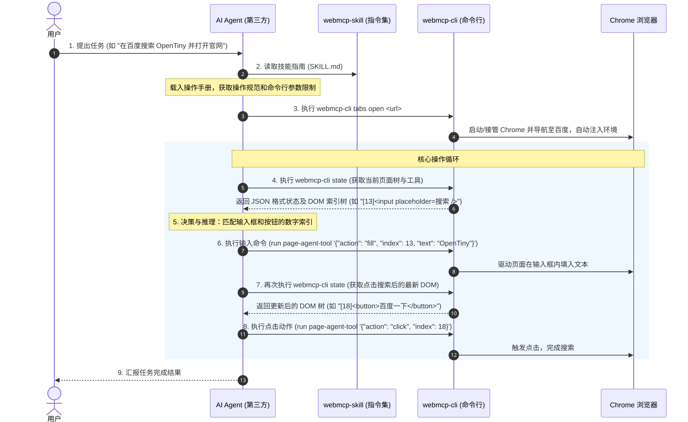

# Skill 使用指南

## 概述

本指南介绍如何让 AI 大模型通过 `webmcp-cli` 控制浏览器。整个过程不需要写代码，核心只有一步：

**将 `SKILL.md` 技能文件提供给 AI 大模型作为系统指令。**

`SKILL.md` 位于 `packages/webmcp-cli-skill/SKILL.md`，其中详细描述了 `webmcp-cli` 的命令格式、参数说明和操作规范。AI 读取后即可自主调用 CLI 命令来打开网页、获取页面元素、执行点击和输入等操作。

可以理解为：Skill 文件是给 AI 的操作手册，AI 读完就能像人一样用命令行操控浏览器。

## 前置准备

开始之前，请确保已完成以下准备：

1. **安装 webmcp-cli**：这是 AI 操作浏览器的"手"，没装就用不了。安装方法见 [CLI 使用指南](./webmcp-cli#安装)。
2. **获取 SKILL.md**：这是教 AI 怎么用 CLI 的"操作手册"，位于 `packages/webmcp-cli-skill/SKILL.md`。如果你是通过 npm 安装的 skill 包，文件会在 `node_modules/@opentiny/webmcp-cli-skill/SKILL.md`。
3. **准备一个 AI Agent**：支持读取系统提示词的 AI 大模型（如 DeepSeek、通义千问、ChatGPT 等）。

## 核心组件



| 角色 | 说明 | 类比 |
| :--- | :--- | :--- |
| **AI 大模型**（如 DeepSeek、通义千问、ChatGPT 等） | 负责理解用户意图、做决策、发命令 | 大脑 |
| **webmcp-cli** | 命令行工具，负责控制 Chrome 浏览器 | 手 |
| **webmcp-cli-skill**（SKILL.md） | 说明书，告诉 AI 有哪些命令、怎么用 | 操作手册 |

用户跟 AI 说"帮我搜一下 OpenTiny"，AI 读完说明书后知道要执行 `webmcp-cli tabs open "https://baidu.com"` 打开百度，然后用 `webmcp-cli run page-agent-tool` 在搜索框里输入文字、点搜索按钮。

若用户在页面中通过 **WebMCP** 浮钮进入检视、点选元素后，剪贴板会直接得到 Cursor 元素卡片元数据（`ELEMENT` / `PATH` / `ATTRIBUTES` / …）；粘贴到对话并附修改意见时，AI 应据此改本地源码（不必再调工具）。

**AI 全程在终端里执行命令来完成操作，无需额外的 API 对接。**

## 操作流程



核心循环很简单：**打开页面 → 看看页面有什么 → 决定做什么 → 做完再看变化 → 重复直到完成**。

下面时序图展示了一个完整任务的全过程：



## 实操示例：登录系统

假设用户说："帮我登录 http://127.0.0.1:3003/login，账号 admin，密码 password123"。

AI 读完 SKILL.md 后，会这样操作：

### 第 1 步：打开页面

```bash
webmcp-cli tabs open "http://127.0.0.1:3003/login"
```

CLI 启动 Chrome 并打开登录页，同时自动注入操作工具。

### 第 2 步：查看可用工具

```bash
webmcp-cli state
```

返回：

```json
{
  "url": "http://127.0.0.1:3003/login",
  "title": "系统登录",
  "webmcpTools": [{ "name": "page-agent-tool" }],
  "activeTabid": "2EA73ED3..."
}
```

AI 发现页面有 `page-agent-tool` 这个万能工具可用。

> [!NOTE]
> `state` 只告诉你"有哪些工具"，不告诉你"页面上有哪些按钮和输入框"。要获取页面元素，需要下一步。

### 第 3 步：搜索页面元素

AI 知道要找输入框和登录按钮，所以用 `searchTree` 精准搜索，不用拉取整棵树：

```bash
# 搜索输入框
webmcp-cli run page-agent-tool '{"action": "searchTree", "query": "textbox"}'
```

返回类似：

```yaml
无障碍树搜索结果 — 关键词: "textbox" | 命中: 2 行
    1 | - main:
    2 |   - textbox #0 "用户名"
    3 |   - textbox #1 "密码"
    4 |   - button #2 "登录"
```

AI 看到：用户名输入框是 `#0`，密码输入框是 `#1`，登录按钮是 `#2`。

### 第 4 步：填写表单

```bash
# 填用户名
webmcp-cli run page-agent-tool '{"action": "fill", "index": 0, "text": "admin"}'

# 填密码
webmcp-cli run page-agent-tool '{"action": "fill", "index": 1, "text": "password123"}'
```

每次 `fill` 后，工具会自动返回页面变化（diff），AI 可以确认操作是否成功。

### 第 5 步：点击登录

填完后，AI 重新确认按钮编号（因为操作后编号可能变），然后点击：

```bash
# 搜索"登录"按钮，拿到当前编号
webmcp-cli run page-agent-tool '{"action": "searchTree", "query": "登录"}'
# 用搜索结果返回的 index 点击（示例中是 2，实际以搜索结果为准）
webmcp-cli run page-agent-tool '{"action": "click", "index": 2}'
```

页面跳转，登录成功。AI 看到返回的 URL 变成了首页，就知道任务完成了。

## 领域专用技能

有些网站有专属工具，比万能的 `page-agent-tool` 更好用。比如打开 Excalidraw 后，`state` 会返回一个 `excalidraw_execute_command` 工具：

```json
{
  "webmcpTools": [
    { "name": "page-agent-tool" },
    { "name": "excalidraw_execute_command" }
  ]
}
```

这时 AI 应该优先用专属工具。`webmcp-cli-skill` 的 `domains/` 目录下有详细的子技能文档，指导 AI 怎么用这些专属工具：

| 子技能文档 | 适用网站 | 告诉 AI 什么 |
| :--- | :--- | :--- |
| `excalidraw.md` | Excalidraw 白板 | 怎么用 JSON 画矩形、箭头、文字 |
| `publish-article.md` | 通用发文章 | 转义规则、表单处理技巧 |
| `publish-article-in-csdn.md` | CSDN | 怎么关弹窗、填标签、点对按钮 |
| `publish-article-in-juejin.md` | 掘金 | 摘要必须 50-100 字、分类推断 |
| `publish-article-in-oschina.md` | 开源中国 | 草稿创建和审核流程 |
| `publish-article-in-segmentfault.md` | 思否 | 15 种操作、定时发布、错误码 |

AI 会根据当前页面 URL，自动判断该读哪个子技能文档。

## 操作规范

SKILL.md 给 AI 定了几条核心规则，保证操作不出错：

| 规则 | 为什么 |
| :--- | :--- |
| **操作前先看状态** | 不能凭记忆猜元素编号，页面可能已经变了 |
| **searchTree 优先** | 已知要找什么就搜索，别拉整棵树浪费 Token |
| **编号用完即失效** | 每次操作后元素编号会重新分配，不能复用 |
| **有专属工具就用** | 专属工具比鼠标模拟靠谱得多 |
| **JSON 参数格式要对** | 不同终端（Bash/CMD/PowerShell）引号规则不同 |
| **避免无效重试** | 同一个操作失败 3 次就停止，告知用户遇到问题 |

## 接入方式

取决于你用的 AI Agent 平台：

- **DeepSeek / 通义千问 / ChatGPT 等对话型 AI**：把 SKILL.md 的内容作为系统提示词（System Prompt）粘贴进去，或者作为附件上传
- **Cursor / Windsurf 等编程 AI**：把 `packages/webmcp-cli-skill/` 目录放在项目里，AI 会自动读取
- **自定义 Agent 平台**：通过 API 把 SKILL.md 内容注入到系统提示中

只要 AI 能读到这份说明书，并且终端装了 `webmcp-cli`，就能开始用了。

---

- 想了解 CLI 命令完整用法 → 看 [CLI 使用指南](./webmcp-cli)
- 想了解浏览器插件版 → 看 [快速入门](../ai-extension/install)
