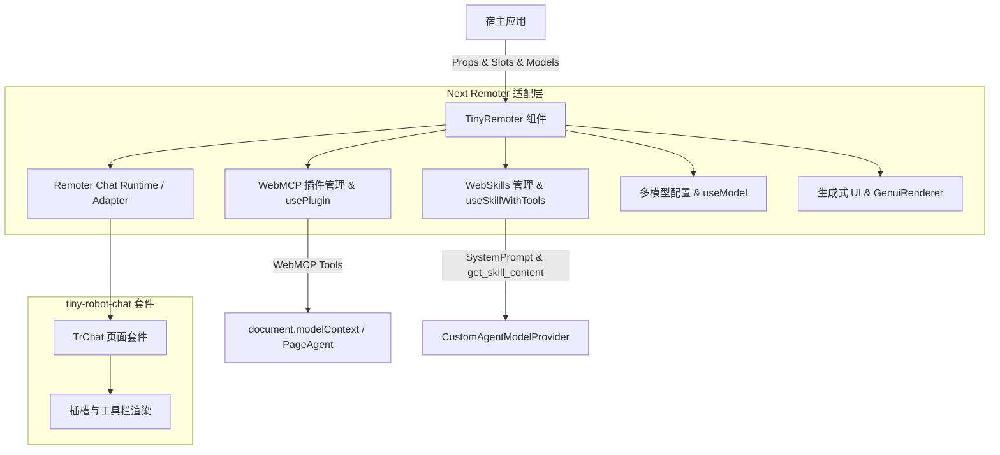

# Spec: 适配 tiny-robot-chat 组件设计方案

## 方案概述

将 `packages/next-remoter/src/components/TinyRobotChat.vue` 的底层视图层改造为直接基于 `@opentiny/tiny-robot-chat` 聊天套件（`TrChat`）。
利用其提供的扩展插槽（`layout-header`、`welcome-footer`、`composer-before`、`sender-footer`、`sender-footer-right`）与统一协议，承接 Remoter 的特色扩展：
1. **WebMCP 工具集成**：通过 `usePlugin` 与 `document.modelContext` 双向通信，并在输入框下方提供一键唤起 `TrMcpServerPicker` 的扩展入口；
2. **WebSkills 业务集成**：通过 `useSkillWithTools` 解析技能 Markdown 并动态注册 `get_skill_content` 工具供大模型自主调用；
3. **多模型无缝切换**：通过 `useModel` 与 `ModelSwitch.vue` 提供即时切换，并联动调整上传按钮与 GenUI 状态；
4. **生成式 UI**：集成 `GenuiRenderer` 与 `BubbleImageRenderer` 实现卡片流式展示与 `continueChat` 双向通信；
5. **投屏扫码与悬浮控制**：保留顶部操作插槽与 `QrCodeScan` 二维码扫码能力。

## 架构与数据流

## 关键模块职责与变更

1. **依赖层**：
   - `pnpm-workspace.yaml` 与 `packages/next-remoter/package.json`：
     - 添加 `@opentiny/tiny-robot-chat: 0.5.2-alpha.16`
     - 更新 `@opentiny/tiny-robot*` 套件到 `0.5.2-alpha.16`
2. **视图层 (`TinyRobotChat.vue`)**：
   - 使用 `<TrChat :runtime="chatRuntime" :ui="chatUI">` 作为聊天交互主容器；
   - 插槽映射与扩展：
     - `#operations` 挂载到顶部栏操作区域，保留历史会话与扫码入口；
     - `#welcome` 映射到 `#welcome-footer`（消息为空时呈现自定义欢迎内容）；
     - `#suggestions` / `pillItems` 挂载到 `#composer-before`；
     - 底部操作栏（插件开关、模型切换、GenUI 开关、附件上传）挂载到 `#sender-footer`；
     - 语音输入（`allowSpeech`）挂载到 `#sender-footer-right`；
3. **WebMCP 与 WebSkills 扩展**：
   - 保持 `usePlugin`、`useRouteBasedTools` 和 `useSkillWithTools` 组合式函数；
   - 保持与 `agent`（`CustomAgentModelProvider`）工具调用闭环无缝协作。
4. **API 与 Expose 兼容**：
   - 维持 `defineProps` 的 22 个属性、`defineModel` 的 5 个绑定、`defineEmits` 以及 `defineExpose` 17 个暴露项完全不变。

## 风险与兼容性评估

- **兼容性**：对外 API 无破坏性变动，现有宿主代码无需任何修改。
- **样式规范**：引入 `@opentiny/tiny-robot-chat/dist/style.css`，保持 Remoter 抽屉动画、悬浮球等特色样式稳定。
