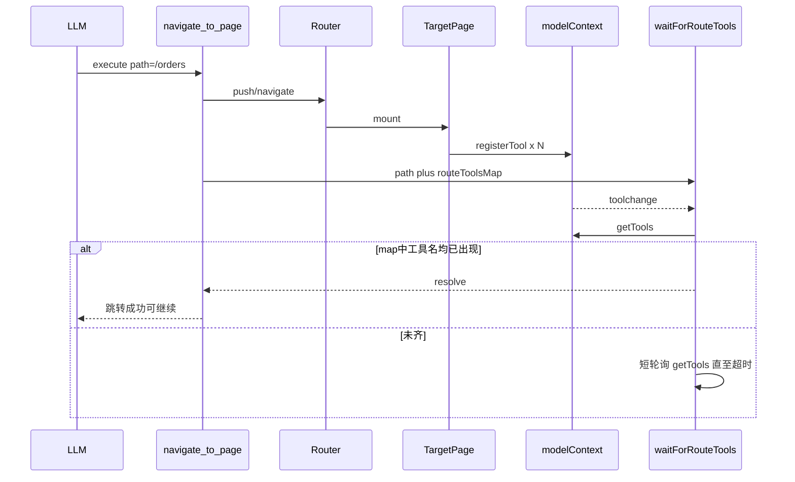

# Spec：design — 移除自动导航，用户自配导航 + 握手

## 方案概述

从 next-sdk 删除整份 `page-tools/bridge.ts`（含自动导航与 remoter postMessage 同步）。业务侧自行注册 `navigate_to_page`；跳转后调用 SDK 导出的 `waitForRouteTools(path, routeToolsMap)` 做精确握手。Remoter 改听 `modelContext.toolchange`，WXT 改用 `getTools()`。

## 涉及模块 / 文件

- `packages/next-sdk/page-tools/bridge.ts`（删除）
- `packages/next-sdk/page-tools/wait-for-route-tools.ts`（新增：仅握手 helper）
- `packages/next-remoter/src/composable/useRouteBasedTools.ts`（改听 toolchange）
- `packages/next-wxt/...`（改用 getTools）
- `packages/doc-ai|doc-ai-react|doc-ai-angular` 入口、mcp-servers、finance 页面
- `docs/best-practice/*`

## 核心数据结构 / 类型定义

```typescript
/** 用户维护：规范化 path → 该页必须就绪的工具名 */
type RouteToolsMap = Record<string, string[]>

/** 判断 path 在 map 中声明的工具是否已全部加载；map 无该 path 则立即返回 */
async function waitForRouteTools(
  path: string,
  routeToolsMap: RouteToolsMap,
  options?: { timeoutMs?: number; pollMs?: number }
): Promise<void>
```

## 依赖变更

- 无新增 npm 依赖

## API / 行为变更

| 符号或行为 | 变更类型 | 说明 |
|---|---|---|
| `setNavigator` | 删除 | 不再由 SDK 注入导航函数 |
| `registerNavigateTool` | 删除 | 改为用户自行 registerTool |
| `waitForRouteTools` | 新增 | 握手 helper：`path` + `routeToolsMap` |
| `RouteConfig` / `routeConfig` | 删除 | 不再自动跳转包装 execute |
| `withPageTools` | 删除 | 拆分注册下线 |
| `registerPageTool` | 删除 | 拆分注册下线 |
| `setupModelContextBridge` / `MSG_TOOL_*` | 删除 | Remoter 改听 `toolchange`；WXT 改用 `getTools()` |

## 数据流 / 时序



## 风险与兼容

- 破坏性变更：依赖旧 API 的业务需迁移到页面内注册 + 自配导航模版
- 若 `routeToolsMap` 与页面实际工具名不一致，会握手超时

## 备选方案

- 将 `registerNavigateToPageTool` 也收入 SDK：已否决，过度封装，工具定义留在业务侧更灵活
