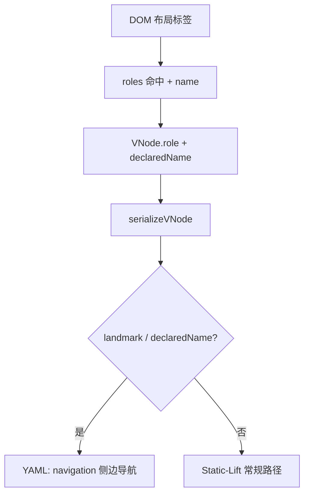

# Spec：design — console layout landmark + A11yRoleRule.name

## 方案概述

为 `A11yRoleRule` 增加可选 `name`（声明可访问名，不改 DOM）。构建 VNode 时写入 `declaredName`；序列化时 landmark / 声明名节点强制保留结构，且不得通过 Static-Lift（含中间层 generic 包装器的递归吸名）把分区名抬到外层。`consoleCloud` 预设将 `ti-app-layout-*` / `tp-layout-*` 映射为 landmark + 中文分区名。

## 涉及模块 / 文件

- `packages/next-sdk/page-tools/a11y/config.ts` — `A11yRoleRule.name`、`A11yInfo.name`
- `packages/next-sdk/page-tools/a11y/types.ts` — `VNode.declaredName`
- `packages/next-sdk/page-tools/a11y/vnode.ts` — 声明名接入、landmark 防 Lift、空壳省略
- `packages/next-sdk/page-tools/configs/console-cloud.ts` — 布局 role 规则
- `packages/next-sdk/test/page-tools/configs/console-cloud.test.ts`
- `packages/next-sdk/test/page-tools/a11y/config.test.ts`
- `docs/webmcp-sdk/page-agent-tool.md`
- `packages/next-sdk/skills/page-agent/SKILL.md`

## 核心数据结构 / 类型定义

```typescript
interface A11yRoleRule extends A11yMatcher {
  role: string
  force?: boolean
  /** 可选声明可访问名（不改 DOM） */
  name?: string
}

interface A11yInfo {
  role: string
  tokens: string[]
  name?: string
}

interface VNode {
  role: string
  name: string
  declaredName?: string
  tokens: string[]
  ref?: number
  el: HTMLElement
  children: VNode[]
}
```

## 依赖变更

- 无新增 npm 依赖

## API / 行为变更

| 符号或行为 | 变更类型 | 说明 |
|---|---|---|
| `A11yRoleRule.name` | 新增 | 规则声明可访问名 |
| `A11yInfo.name` | 新增 | `resolveA11yInfo` 命中带 name 的规则时返回 |
| `VNode.declaredName` | 新增 | 构建期缓存声明名 |
| Static-Lift | 修改 | 不吸收 landmark / 声明名及其包装器子树文案 |
| `consoleCloudPageAgentToolOptions` | 修改 | 增加 layout landmark 规则 |

## 数据流 / 时序（可选）



## 风险与兼容

- 若错误给大范围容器加 `name`，可能保留过多层级；consoleCloud 仅映射明确布局标签
- 折叠右栏：`ti-app-layout-right` 常 width=0 且子树被 `isHidden`；空壳 complementary 省略，避免噪音

## 备选方案

- 仅用 `preserveRoles` 接线到 tool-config：需扩展运行期配置面，本次用 `declaredName` 更直接且能输出可读分区名
- 运行时写 DOM `aria-label`：侵入页面，否决
