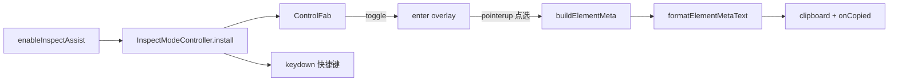

# Spec：dom-inspect 设计

## 方案概述

将 webmcp-cli `element-inspect` 的 UI/元信息能力剥离协议层，迁入 `@opentiny/next-sdk/dom-inspect`。点击复制走 `formatElementMetaText(buildElementMeta(el))`；用单例 `enableInspectAssist` / `disableInspectAssist` 管理生命周期。

## 涉及模块 / 文件

- `packages/next-sdk/dom-inspect/types.ts`
- `packages/next-sdk/dom-inspect/metadata.ts`
- `packages/next-sdk/dom-inspect/overlay.ts`
- `packages/next-sdk/dom-inspect/control-fab.ts`
- `packages/next-sdk/dom-inspect/inspect-mode.ts`
- `packages/next-sdk/dom-inspect/index.ts`
- `packages/next-sdk/index.ts`（导出）
- `packages/next-sdk/test/dom-inspect.test.ts`

## 核心数据结构 / 类型定义

```typescript
export const DOM_INSPECT_UI_ATTR = 'data-opentiny-dom-inspect-ui'
export const HTML_ELEMENT_MAX_CHARS = 2048

export interface ElementPosition {
  top: number
  left: number
  width: number
  height: number
}

export interface ElementMeta {
  /** ELEMENT：开标签摘要，如 `<div class="…">` */
  element: string
  /** PATH（可含兄弟 [n]） */
  path: string
  attributes: ElementAttribute[]
  computedStyles: Record<string, string>
  position: ElementPosition
  innerText: string
}

export interface InspectAssistOptions {
  /** FAB idle 文案，默认 'Inspect' */
  brandLabel?: string
  /** 是否显示 FAB，默认 true */
  showFab?: boolean
  /** 复制成功回调 */
  onCopied?: (text: string, meta: ElementMeta) => void
}

export interface InspectAssistHandle {
  disable: () => void
  isActive: () => boolean
  enter: () => void
  exit: () => void
  toggle: () => void
}
```

剪贴板文本分区（对齐 Cursor 元素卡片）：

```text
ELEMENT
<div class="tr-prompt medium prompt-item">
PATH
div#app > … > div.tr-prompt medium prompt-item[3]
ATTRIBUTES
class:
tr-prompt medium prompt-item
COMPUTED STYLES
color:
…
POSITION & SIZE
top:
…
INNER TEXT
…
```

## 依赖变更

- 无新 npm 依赖

## API / 行为变更

| 符号或行为 | 变更类型 | 说明 |
|---|---|---|
| `enableInspectAssist` | 新增 | 安装 Inspect Assist 单例（幂等） |
| `disableInspectAssist` | 新增 | 销毁单例 |
| `buildElementMeta` 等 | 新增导出 | metadata helpers |
| `InspectAssistOptions` / `InspectAssistHandle` / `ElementMeta` / `ElementPosition` | 新增类型 | |

## 数据流 / 时序



## 风险与兼容

- FAB / overlay ID 与 webmcp-cli 隔离，同页并存时互不抢 ID
- `showFab: false` 时仍可 Cmd/Ctrl+Shift+C 切换检视

## 备选方案

- 直接 re-export webmcp-cli inject 代码：耦合 CLI 协议，否决
