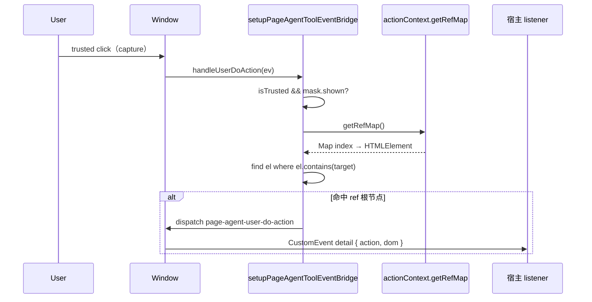

# Design：Page Agent 用户手动操作事件

## 方案概述

在既有 `setupPageAgentToolEventBridge` 中增加 `handleUserDoAction`：于 `window` 捕获阶段监听 `click`；当 mask 可见且为 trusted 点击时，用 `actionContext.getRefMap()` 反查包含 `ev.target` 的 ref 根节点，向 `window` 派发 `page-agent-user-do-action` 自定义事件。生命周期与 tool-call / chat-end 监听共用同一 cleanup。

## 涉及模块 / 文件

- `packages/next-sdk/page-tools/page-agent-tool-event.ts`：常量、`handleUserDoAction`、监听注册与 cleanup。
- `packages/next-sdk/page-tools/page-agent-tool.ts`：向 `setupPageAgentToolEventBridge` 传入 `actionContext`（第三个参数）。

## 核心数据结构 / 类型定义

```typescript
export const PAGE_AGENT_USER_DO_ACTION_EVENT = 'page-agent-user-do-action'

export type PageAgentUserDoActionEventDetail = {
  /** 当前仅支持 'click'，预留其它用户操作类型 */
  action: 'click'
  /** refMap 中命中 ev.target 的根 DOM 元素 */
  dom: HTMLElement
}
```

## 依赖变更

- 无新 npm 依赖。
- `setupPageAgentToolEventBridge` 签名新增第三参 `actionContext: ActionContext`（仅内部调用，不对外 breaking）。

## API / 行为变更

| 符号或行为                                          | 变更类型     | 说明                                            |
| --------------------------------------------------- | ------------ | ----------------------------------------------- |
| `PAGE_AGENT_USER_DO_ACTION_EVENT`                   | 新增         | 模块内已导出；包入口 `index.ts` 待补导出        |
| `PageAgentUserDoActionEventDetail`                  | 新增（类型） | 模块内待显式导出；包入口待补                    |
| `window` `click` 捕获监听                           | 新增         | 随 `registerPageAgentTool` 挂载，cleanup 时移除 |
| `setupPageAgentToolEventBridge(..., actionContext)` | 修改         | 新增第三参，用于 `getRefMap()`                  |

## 数据流 / 时序



## 触发条件（决策表）

| isTrusted | mask.shown | target ∈ refMap 子树 | 是否派发 |
| --------- | ---------- | -------------------- | -------- |
| false     | \*         | \*                   | 否       |
| true      | false      | \*                   | 否       |
| true      | true       | 否                   | 否       |
| true      | true       | 是                   | 是       |

ref 反查：`Array.from(refMap.values()).find(el => el.contains(target))`，取第一个命中项作为 `detail.dom`。

## 风险与兼容

- **捕获阶段**：不影响现有 bubble 阶段业务点击；仅只读 refMap，不 `preventDefault`。
- **refMap 时效**：依赖最近一次工具调用时的 ref 快照；mask 展示但 refMap 为空或点击在外部时不派发，属预期。
- **向后兼容**：纯新增 window 事件，未监听方无感知；`setupPageAgentToolEventBridge` 第三参为内部接线，外部无 API 变更。

## 备选方案（若有）

- **在 SimulatorMask 层监听**：与 refMap 解耦困难，未采用。
- **bubble 阶段监听**：可能晚于部分 stopPropagation 场景，采用 capture 更稳妥。
