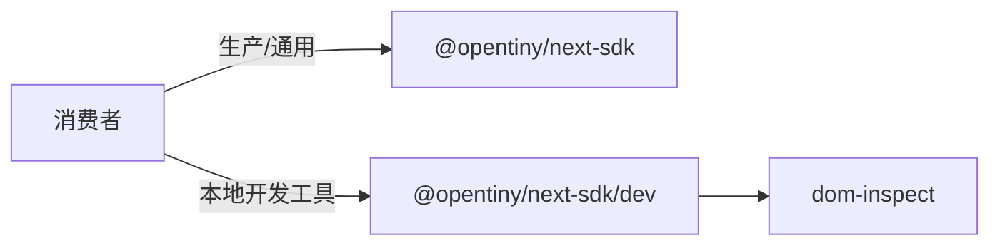

# Spec：dev 入口拆分设计

## 方案概述

新增与 `index` / `core` 并列的 Vite lib 入口 `dev`，由 `dev.ts` 再导出 `./dom-inspect`。主入口 `index.ts` 删除 Inspect Assist 导出。`package.json` 的 `exports` 与 `publishConfig.exports` 同步增加 `./dev`。仓内唯一已知消费方 `doc-ai` 改为从 `@opentiny/next-sdk/dev` 导入。

## 涉及模块 / 文件

- `packages/next-sdk/dev.ts`（新增）
- `packages/next-sdk/vite.config.ts`
- `packages/next-sdk/package.json`
- `packages/next-sdk/index.ts`
- `packages/next-sdk/AGENTS.md`
- `packages/next-sdk/specs/README.md`
- `packages/doc-ai/src/main.ts`
- `packages/next-sdk/test/dev-entry.test.ts`（新增）

## 核心数据结构 / 类型定义

无新类型；`dev.ts` 对 `dom-inspect` 做透明再导出：

```typescript
export {
  enableInspectAssist,
  disableInspectAssist,
  buildElementMeta,
  formatElementMetaText,
  truncateHtml,
  buildDomPath,
} from './dom-inspect'
export type {
  InspectAssistOptions,
  InspectAssistHandle,
  ElementMeta,
  ElementPosition,
  ElementAttribute,
} from './dom-inspect'
```

## 依赖变更

无新 npm 依赖。

## API / 行为变更

| 符号或行为 | 变更类型 | 说明 |
|---|---|---|
| `@opentiny/next-sdk` → Inspect Assist 导出 | 废弃/移除 | 主入口不再导出 |
| `@opentiny/next-sdk/dev` | 新增 | 开发态入口，导出 Inspect Assist |
| `dist/dev.js` / `dist/dev.d.ts` | 新增 | 构建产物 |

## 数据流 / 时序（可选）



## 风险与兼容

- **破坏性**：原先从主入口导入 `enableInspectAssist` 的外部消费者需改路径；仓内已同步 `doc-ai`。
- 单元测试仍可直接 `from '../dom-inspect'`，不受入口拆分影响。

## 备选方案（若有）

- 仅文档约定「勿在生产使用」但仍挂在主入口：无法真正解耦，否决。
