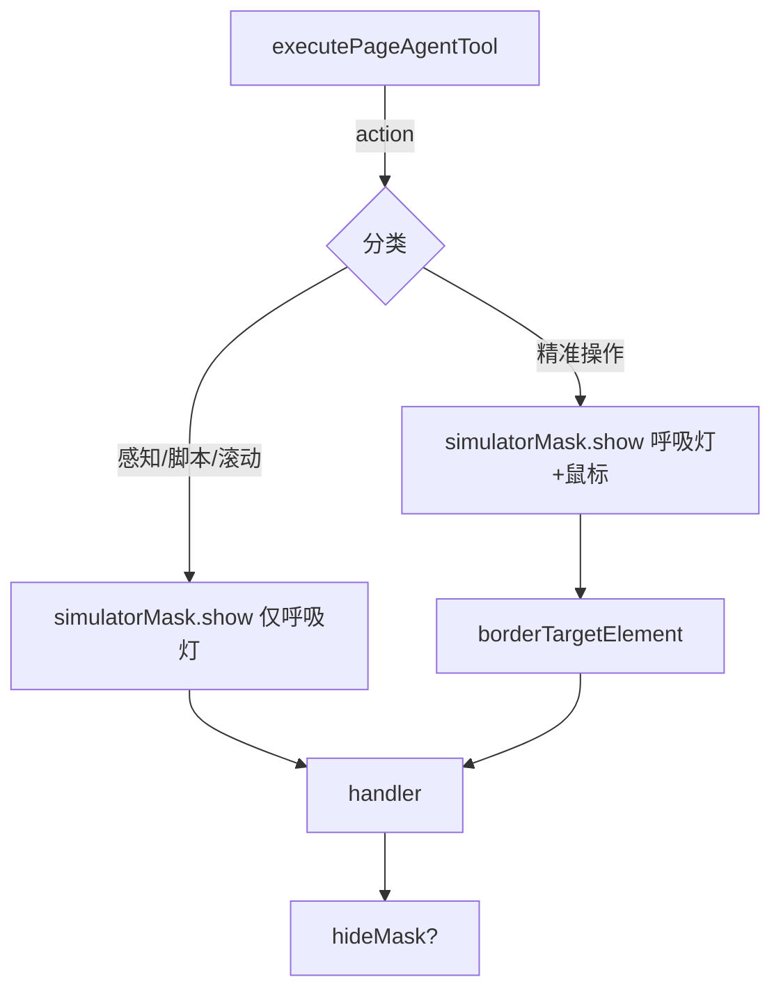

# Design：遮罩效果拆分 —— 呼吸灯与鼠标图标分层控制

## 方案概述

在 `SimulatorMask.show()` 上增加可选参数 `{ showCursor?: boolean }`，调用时决定是否显示鼠标图标元素（`#cursor`）。不修改 `@page-agent/page-controller` 的外部包签名，而是在 `page-agent-tool.ts` 的调度层直接调用 `simulatorMask.show()` 来控制。

由于 `pageController.showMask()` 内部会委托 `mask.show()`，但不支持传参，我们改为在 `switch` 各分支直接调用 `simulatorMask.show({ showCursor })` 并跳过 `pageController.showMask()`（后者本就是对 mask.show 的转发）。

## 涉及模块 / 文件

- `packages/next-sdk/page-tools/page-agent-mask/SimulatorMask.ts`：改造 `show()` 方法
- `packages/next-sdk/page-tools/page-agent-tool.ts`：调度层按 action 分类调用
- `packages/next-sdk/test/page-tools/page-agent-tool-dispatch.test.ts`：更新 mock + 补测试
- `packages/next-sdk/test/page-tools/page-agent-tool.test.ts`：补 showCursor 相关断言

## 核心数据结构 / 类型定义

```typescript
// SimulatorMask.ts
interface ShowOptions {
  /** 是否显示 AI 鼠标图标，默认 true */
  showCursor?: boolean
}

class SimulatorMask {
  show(options?: ShowOptions): void
}
```

## API / 行为变更

| 符号或行为 | 变更类型 | 说明 |
|---|---|---|
| `SimulatorMask.show()` | 修改 | 新增可选 `options.showCursor`，默认 `true` 保持向后兼容 |
| `page-agent-tool` `hover` action | 修改 | 补调 `showMask`、`borderTargetElement`、`hideMask` |
| `page-agent-tool` `scroll` action | 修改 | 改为 `showCursor: false`，仅呼吸灯 |
| `page-agent-tool` `browserState` / `searchTree` / `executeJavascript` | 新增 | 补调 `showMask({ showCursor: false })`，呼吸灯提示 AI 在工作 |

## 数据流 / 时序



## 实现细节

### SimulatorMask.show() 改造

```typescript
show(options?: { showCursor?: boolean }) {
  if (this.shown || this.#disposed) return
  this.shown = true
  this.motion?.start()
  this.motion?.fadeIn()
  this.wrapper.classList.add('visible')

  const showCursor = options?.showCursor ?? true
  if (showCursor) {
    this.#cursor.style.display = ''  // 恢复默认显示
    // 重置到视口中心
    this.#currentCursorX = window.innerWidth / 2
    this.#currentCursorY = window.innerHeight / 2
    this.#targetCursorX = this.#currentCursorX
    this.#targetCursorY = this.#currentCursorY
    this.#cursor.style.left = `${this.#currentCursorX}px`
    this.#cursor.style.top = `${this.#currentCursorY}px`
  } else {
    this.#cursor.style.display = 'none'
  }
}
```

### hide() 改造（重置 cursor 显示状态）

```typescript
hide() {
  if (!this.shown || this.#disposed) return
  this.shown = false
  this.motion?.fadeOut()
  this.motion?.pause()
  this.#cursor.classList.remove('clicking')
  // 恢复 cursor 显示，为下次 show 做准备
  this.#cursor.style.display = ''
  setTimeout(() => {
    this.wrapper.classList.remove('visible')
  }, 800)
}
```

### page-agent-tool.ts 调度层

```typescript
// 精准操作类：呼吸灯 + 鼠标
case 'click':
case 'fill':
case 'select':
case 'hover':
  simulatorMask.show({ showCursor: true })  // 直接调用，绕过 pageController
  borderTargetElement(args.index)
  ret = await handler(args, actionContext)
  options.removeMaskAfterToolCall && (await pageController.hideMask())
  break

// 感知/脚本/滚动类：仅呼吸灯
case 'browserState':
case 'searchTree':
case 'executeJavascript':
case 'scroll':
  simulatorMask.show({ showCursor: false })
  ret = await handler(args, actionContext)
  options.removeMaskAfterToolCall && (await pageController.hideMask())
  break
```

## 风险与兼容

- `SimulatorMask.show()` 默认值 `showCursor: true`，向后兼容现有 `handle.showMask()` 调用（内部转发到 `pageController.showMask()` → `mask.show()`，无参数，走默认值）。
- `searchTree` 和 `executeJavascript` 的 handler 内部有 `ctx.pageController.hideMask()` 调用，与调度层的 `removeMaskAfterToolCall` 控制不冲突（`hideMask` 幂等）。

## 备选方案

- 为 `SimulatorMask` 单独增加 `showCursorOnly()` 方法：语义更明确，但方法数增加；不如参数化简洁。
