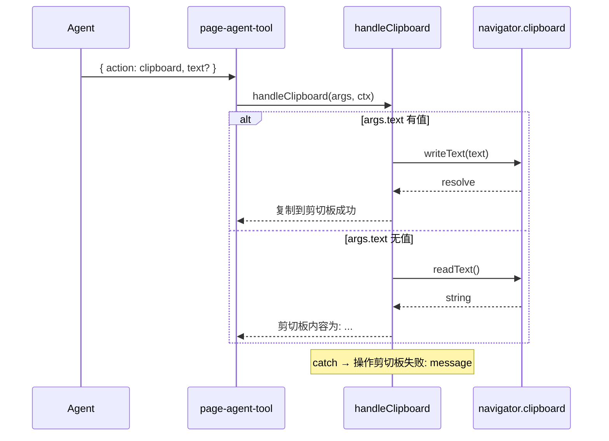

# Design：Page Agent 剪切板读写

## 方案概述

在 `page-agent-tool` 的 `action` 分发中增加 `clipboard` 分支，委托至独立 handler `handleClipboard`。根据 `args.text` 是否存在选择 `writeText` 或 `readText`，统一返回 MCP 文本 `content`；错误在 handler 内 try/catch 转为可读文案，不向调用方抛出。

## 涉及模块 / 文件

| 路径 | 职责 |
| --- | --- |
| `packages/next-sdk/page-tools/handlers/clipboard.ts` | `handleClipboard` 实现 |
| `packages/next-sdk/page-tools/page-agent-tool.ts` | `case 'clipboard'` 分发，不展示 mask |
| `packages/next-sdk/page-tools/schema.ts` | Zod `action` 枚举与 `text` 字段描述 |

## 核心类型 / 入参

沿用既有 `PageAgentToolInput`（`schema.ts` 导出）：

```typescript
// action === 'clipboard' 时
{
  action: 'clipboard'
  text?: string  // 有值 → 写；无值 → 读
}
```

`ActionContext` 在 clipboard 分支中未使用，签名保留与其它 handler 一致以便未来扩展（如写后附带 browserState）。

## API / 行为变更

| 符号或行为 | 变更类型 | 说明 |
| --- | --- | --- |
| `inputSchema.action` 枚举值 `clipboard` | 新增 | LLM / 工具协议可见 |
| `handleClipboard` | 新增 | 内部 handler，不单独包入口导出 |
| `page-agent-tool` `case 'clipboard'` | 新增 | 无 mask、无 ref 校验 |

## 数据流



## 决策表

| `args.text` | 调用 API | 成功返回文案 |
| --- | --- | --- |
| 非空字符串 | `writeText(text)` | `复制到剪切板成功` |
| `undefined` / 未传 | `readText()` | `剪切板内容为: ${text}` |
| `''`（空字符串） | `readText()` | 同上（空串为 falsy，走读分支） |

## 与 mask / refMap 的关系

- `clipboard` 不依赖 `index`，不参与 `refMap` 解析。
- 不调用 `simulatorMask.show` / `borderTargetElement`，避免无 DOM 目标时的多余遮罩。

## 风险与兼容

- **权限与安全上下文**：与 `createRemoter` 等模块相同，依赖 `navigator.clipboard`；失败时仅返回错误文案，不设置 `isError: true`（与当前实现一致；若后续需与 `actionError` 对齐可单独立项）。
- **向后兼容**：纯新增 `action` 枚举值，未使用 clipboard 的调用方无感知。
- **与 dom-inspect 复制**：`dom-inspect/overlay.ts` 有元素复制与 clipboard fallback，与本 handler 职责分离，不共用代码。

## 备选方案（未采用）

- **通过 `executeJavascript` 操作剪切板**：依赖页面脚本权限且难测，未采用。
- **clipboard 写后自动 `browserState`**：无 DOM 变更，不必要。
