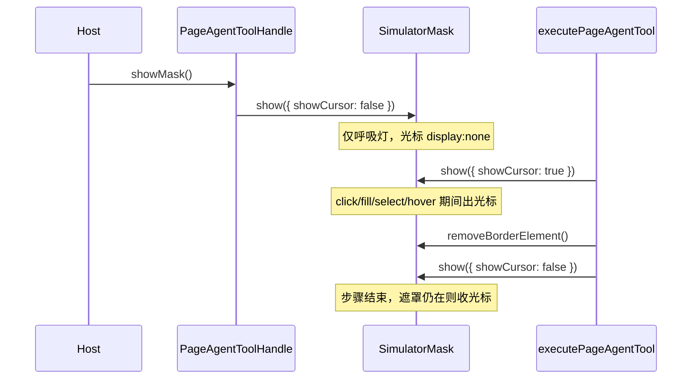

# Design：遮罩接管态与光标生命周期分离

## 方案概述

把「遮罩是否可见」和「光标是否可见」彻底解耦：`show()` 默认只开呼吸灯；宿主句柄可传 `showCursor`；操作类步骤结束后若遮罩仍在则收光标；运行期 `cursorMode` 作为全局策略覆盖默认解析。

`pageController.showMask()` 无参、无法透传，句柄改为直调已构造好的 `simulatorMask.show(options)`。

## 涉及模块 / 文件

| 路径 | 职责 |
| --- | --- |
| `page-tools/page-agent-mask/SimulatorMask.ts` | 光标初始隐藏；`show()` 默认 `showCursor: false` |
| `page-tools/page-agent-tool.ts` | 句柄透传；`finally` 收光标；按 `cursorMode` 解析 |
| `page-tools/tool-config.ts` | `cursorMode` 配置面 |
| `test/page-tools/simulator-mask-cursor.test.ts` | 默认隐藏 / 初始 display |
| `test/page-tools/page-agent-tool-dispatch.test.ts` | 操作结束收光标、`cursorMode` |
| `test/page-tools/page-agent-tool.test.ts` | 句柄传参 |
| `test/page-tools/tool-config.test.ts` | `cursorMode` 读写 |
| `docs/webmcp-sdk/page-agent-tool.md` | 用户文档 |
| `skills/page-agent/SKILL.md` | 编码 Agent Skill |

## 核心数据结构 / 类型定义

```typescript
export type PageAgentCursorMode = 'actionOnly' | 'always' | 'never'

export type ShowMaskOptions = {
  /** 是否显示 AI 鼠标图标；未传时由 cursorMode 决定（actionOnly 下为 false） */
  showCursor?: boolean
}

export type PageAgentToolHandle = {
  showMask: (options?: ShowMaskOptions) => Promise<void>
  hideMask: () => Promise<void>
}

export interface PageAgentToolConfig {
  // ...既有字段
  /** 鼠标光标展示策略，默认 'actionOnly' */
  cursorMode: PageAgentCursorMode
}
```

### `cursorMode` 与显式 `showCursor` 的解析

优先级（高 → 低）：`never`（全局关闭）> 显式 `showCursor` > `always`（未传参时默认出光标）> `actionOnly` 按 action 种类。

因此 `always` 不是绝对锁死：`showMask({ showCursor: false })` 仍可临时隐藏；操作结束的自动收光标仅在 `cursorMode !== 'always'` 时发生。

```typescript
type CursorKind = 'host' | 'pointer' | 'observe'

function resolveShowCursor(kind: CursorKind, explicit?: boolean): boolean {
  const mode = getPageAgentToolConfig().cursorMode ?? 'actionOnly'
  // 优先级：never > 显式 showCursor > always > actionOnly 按 kind
  if (mode === 'never') return false
  if (explicit !== undefined) return explicit
  if (mode === 'always') return true
  return kind === 'pointer'
}
```

| 场景 | actionOnly（默认） | always | never |
| --- | --- | --- | --- |
| 宿主 `showMask()` 无参 | 否 | 是 | 否 |
| 宿主 `showMask({ showCursor: true })` | 是 | 是 | 否（never 优先） |
| 宿主 `showMask({ showCursor: false })` | 否 | 否（显式优先于 always） | 否 |
| 操作类 action | 是（结束后收起） | 是（结束后不收） | 否 |
| 感知/滚动类 Action | 否 | 是 | 否 |

## API / 行为变更

| 符号或行为 | 变更类型 | 说明 |
|---|---|---|
| `SimulatorMask.show()` | 修改 | 默认 `showCursor`：`true` → `false` |
| `SimulatorMask.#createCursor()` | 修改 | 初始 `style.display = 'none'` |
| `PageAgentToolHandle.showMask` | 修改 | 可传 `ShowMaskOptions`；直调 `simulatorMask.show` |
| `executePageAgentTool` `finally` | 修改 | `shown && cursorMode !== 'always'` 时 `show({ showCursor: false })` |
| `PageAgentToolConfig.cursorMode` | 新增 | 默认 `'actionOnly'` |

## 数据流 / 时序



## 实现细节

### SimulatorMask

- `#createCursor()` 末尾：`this.#cursor.style.display = 'none'`。
- `show()`：`const showCursor = options?.showCursor ?? false`。
- `hide()` 保持现有「fadeOut 期间也 `display: none`」，无需改回 `''`。

### 句柄

```typescript
showMask: async (options?: ShowMaskOptions) => {
  simulatorMask.show({ showCursor: resolveShowCursor('host', options?.showCursor) })
},
hideMask: async () => {
  simulatorMask.hide()
}
```

两处 return（`modelContext` 缺失提前返回、正常注册返回）共用同一实现，避免再转发无参的 `pageController.showMask()`。

### finally 收光标

```typescript
} finally {
  simulatorMask.removeBorderElement()
  const mode = getPageAgentToolConfig().cursorMode ?? 'actionOnly'
  if (mode !== 'always' && simulatorMask.shown) {
    simulatorMask.show({ showCursor: false })
  }
}
```

`removeMaskAfterToolCall === true` 时分支内已 `hideMask()`，`shown === false`，finally 不会把遮罩重新打开。

## 风险与兼容

- **有意不兼容**：无参 `show()` / `showMask()` 不再出光标。这是本需求的修复目标；需要光标的调用方改为显式 `{ showCursor: true }` 或 `cursorMode: 'always'`。
- `never` 覆盖宿主显式 `showCursor: true`，避免全局关闭被单次调用打破。
- `always` 不覆盖显式 `showCursor: false`：策略决定默认值，单次调用仍可临时隐藏。
- 不修改外部 `@page-agent/page-controller` 签名。

## 备选方案

- 仅改默认值、不加 `cursorMode`：宿主无法声明 always/never，扩展性不足。
- 单独 `hideCursor()` 方法：语义更直，但 `show({ showCursor: false })` 已覆盖且不增加 API。
