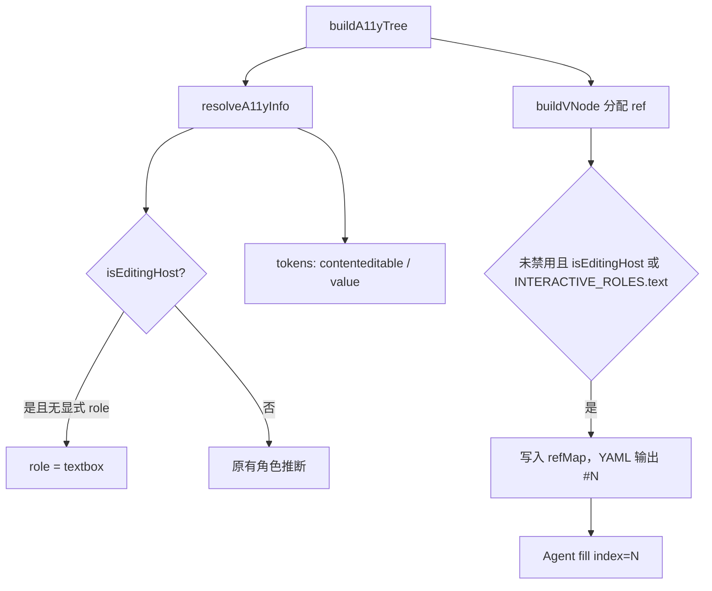

# Design：无障碍树识别 contenteditable 编辑宿主

## 方案概述

在角色解析与 ref 分配两处补齐「编辑宿主」语义，使 `browserState` 产出的 YAML / `refMap` 与已有 `fill` 能力对齐。

判定只认**自身声明**的 `contenteditable`，避免继承可编辑子孙被当成独立填写目标。

## 涉及模块 / 文件

| 路径 | 职责 |
| --- | --- |
| `packages/next-sdk/page-tools/a11y/config.ts` | `isEditingHost`；`computeRole` 隐式 `textbox`；`computeStates` 输出 token / value |
| `packages/next-sdk/page-tools/a11y/vnode.ts` | 未禁用的编辑宿主强制分配 ref；空名时收集子树文本 |
| `packages/next-sdk/page-tools/a11y/utils.ts` | `collectDescendantText` 遇编辑宿主停止吸收，避免父节点兜底名吞掉编辑区 |
| `packages/next-sdk/page-tools/schema.ts` | `fill` 描述写明覆盖 contenteditable |
| `docs/webmcp-sdk/page-agent-tool.md` | 用户文档 |
| `packages/next-sdk/skills/page-agent/SKILL.md` | 编码 Agent Skill |

## 核心数据结构 / 类型定义

无新公开类型。内部辅助：

```typescript
/** 自身声明 contenteditable 的编辑宿主（不含 inherit / false） */
export function isEditingHost(el: Element): boolean {
  if (!(el instanceof HTMLElement)) return false
  const ce = el.contentEditable
  if (ce === 'true' || ce === 'plaintext-only') return true
  const raw = el.getAttribute('contenteditable')
  if (raw === null) return false
  const v = raw.trim().toLowerCase()
  return v === '' || v === 'true' || v === 'plaintext-only'
}
```

属性兜底是为了兼容 jsdom 等环境对 IDL `contentEditable` 实现不完整的情况。

## 依赖变更

无。

## API / 行为变更

| 符号或行为 | 变更类型 | 说明 |
| --- | --- | --- |
| `resolveA11yRole`（编辑宿主） | 修改 | 无显式 role / 未命中 roles 规则 / 非 `input[type]` 时隐式为 `textbox` |
| `resolveA11yStates`（编辑宿主） | 修改 | 增加 `contenteditable` 或 `contenteditable=plaintext-only`；有文本时增加 `value="…"` |
| `buildA11yTree` / `refMap` | 修改 | 未禁用的编辑宿主分配 ref |
| `inputSchema` `fill` 描述 | 修改 | 写明目标含 contenteditable 编辑宿主 |
| 公开包入口 | 无 | 不导出 `isEditingHost` |

角色优先级保持：

1. 命中的 `roles` 规则
2. 显式 `role` 属性（排除 `presentation` / `none`）
3. `input` 的 `type` 映射
4. **编辑宿主 → `textbox`**（新增）
5. `TAG_ROLE_MAP` / `generic`

这样 `<p contenteditable>` / `<h1 contenteditable>` / `<div contenteditable>` 对 Agent 呈现为可填 `textbox`；`<input type="checkbox">` 不被 contenteditable 属性带偏；显式 `role="combobox"` 仍保留。

## 数据流



## 风险与兼容

- **YAML 变长**：页面上每个富文本框多一行带 ref 的 `textbox`。这是预期，否则 fill 无法寻址。
- **继承子孙**：只给宿主 ref，避免编辑区内每个 `<p>` 都变成可操作节点导致高亮泛滥。
- **`generic` + `tabindex` 过滤**：编辑宿主改为 `textbox` 后可走 `INTERACTIVE_ROLES`；同时在 `interactive` 条件中显式加入 `isEditingHost`，覆盖「显式 role 不是 textbox」的情况。
- **向后兼容**：仅新增识别，不改变 input/textarea/button 既有行为。

## 备选方案（未采用）

- **仅靠 whitelist / 站点规则**：无法覆盖任意 contenteditable，与 `fill` 已支持任意编辑宿主不一致。
- **凡 `isContentEditable` 都分配 ref**：会把宿主内部每个子孙都标成可填，不可用。
