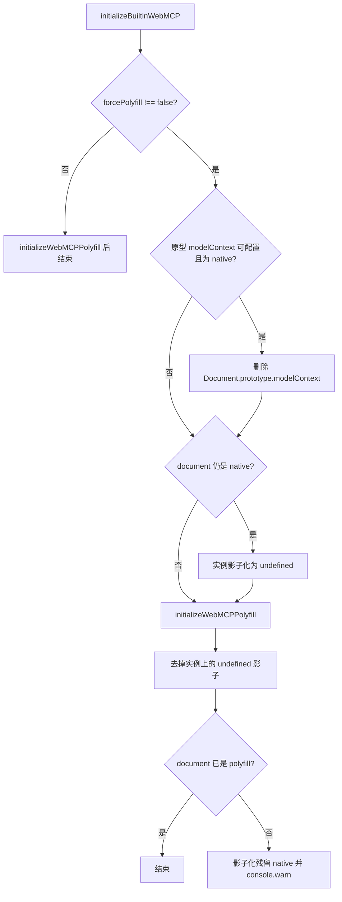

# Design：强制 JS Polyfill 覆盖 Chromium 实验性 modelContext

## 方案概述

`@mcp-b/webmcp-polyfill@5.1.0` 见 native 即 no-op，且已删除 `forceOverride`。与 3.x 不同，5.x 把 getter 装在 **`Document.prototype`**：若原型上已有 native，polyfill **不会替换**该 getter。
此外，5.x 在探测旧版规范原生实现时，直接属性访问 `nav.modelContext`；若环境中已存在废弃兼容 getter（如微前端、重复注入或多实例），此访问会触发其自带的 deprecation 警告并误判分支提前退出。

因此 `initializeBuiltinWebMCP` 的完整执行流程如下：

1. **幂等检查**：在 `try` 块内检查当前 `document.modelContext` 是否已为 JS polyfill，若已就绪直接短路返回；`isWebMCPPolyfill` 内部进行防护，避免宿主属性为抛错 Proxy 时崩溃。
2. **清理废弃 getter**：调用 `neutralizeDeprecatedNavigatorModelContext()` 遍历 `navigator` 与 `Navigator.prototype`，若存在可配置的 `modelContext` getter 则通过 `Reflect.deleteProperty` 摘除，并记录被删除的原始描述符。若 getter 不可配置或不存在则保持原状不受影响。
3. **强制 Polyfill 准备**（若 `forcePolyfill !== false`）：
   - 若 `Document.prototype.modelContext` 可配置且不是 polyfill，则删除该原型属性，让 5.x 自己安装 getter。
   - 若 `document.modelContext` 仍是 native，则影子化为 `undefined`，避免 polyfill 提前 return。
   - 若 `navigator` 或其原型仍有 native，做影子化/清理。
4. 调用 `initializeWebMCPPolyfill()` 安装标准 polyfill（并在末尾由 polyfill 重新建立 `navigator.modelContext` 废弃兼容 alias）。
5. 若实例上的 `undefined` 影子挡住了刚装上的原型 getter，则挂回或暴露 polyfill。
6. **失败恢复机制**：若初始化各步骤发生未捕获异常，在 `catch` 块中通过保存的描述符恢复 `navigator` 及原型上的 `modelContext` getter，避免环境处于半损坏状态。

5.1.0 ESM **无 import 副作用**。`registerTool` 返回 Promise：工具仍在首个 `await` 前写入 registry，但重复名、非法描述、已 abort 的 `signal` 会 **reject**。同步 `try/catch` 接不住该失败。本 PR 范围内 `registerPageAgentTool` 已对返回值 `.catch`；业务侧应 `await` 或 `.catch`，不要把 Promise 丢掉。

## 涉及模块 / 文件

| 路径 | 职责 |
| --- | --- |
| `pnpm-workspace.yaml` | catalog：`@mcp-b/webmcp-polyfill` / `@mcp-b/webmcp-types` → `^5.1.0` |
| `packages/next-sdk/page-tools/initialize-builtin-WebMCP.ts` | `forcePolyfill`、摘掉 document native、清理 navigator 废弃 getter 与失败回退、init |
| `packages/next-sdk/index.ts` / `core.ts` | 导出 `initializeBuiltinWebMCP` |
| `packages/webmcp-cli/src/inject/page-init.ts` | 走 `registerPageAgentTool`，不直调 polyfill |
| `packages/next-sdk/test/page-tools/initialize-builtin-WebMCP.test.ts` | 行为测试（含原型 getter、废弃 getter 清理与失败回退） |
| `docs/webmcp-sdk/global-tools.md` | 公开 API 说明 |

`registerPageAgentTool` 已调用 `initializeBuiltinWebMCP()`，无参即默认强制 polyfill。

## 核心数据结构 / 类型定义

```typescript
export function initializeBuiltinWebMCP(options?: {
  /** @default true */
  forcePolyfill?: boolean
}): void

const POLYFILL_MARKER = '__isWebMCPPolyfill'

interface RestorableDescriptor {
  target: object
  descriptor: PropertyDescriptor
}
```

判定 polyfill：`Boolean(ctx && typeof ctx === 'object' && POLYFILL_MARKER in ctx && ctx[POLYFILL_MARKER])`（带安全 try/catch）。

原型 native（可配置）用 `Reflect.deleteProperty(Document.prototype, 'modelContext')` 摘掉，不读写 `WeakMap.prototype`。

## 依赖变更

- `@mcp-b/webmcp-polyfill`：`^3.0.0` → `^5.1.0`
- `@mcp-b/webmcp-types`：`^3.0.0` → `^5.1.0`（与 polyfill 对齐）

## API / 行为变更

| 符号或行为 | 变更类型 | 说明 |
| --- | --- | --- |
| `initializeBuiltinWebMCP(options?)` | 修改 | 可选 `forcePolyfill`，默认 `true` |
| 有 native 时的默认行为 | 修改 | 不再沿用 native，改为 JS polyfill |
| polyfill 大版本 | 修改 | 3 → 5；`registerTool` 返回 Promise（失败路径需 await / `.catch`）；无 ESM auto-init |

## 数据流 / 时序



## 风险与兼容

- **Chrome 内置 Agent 看不到页内工具**：工具只在 JS polyfill 注册表。对本 SDK / remoter 链路是预期。
- **已捕获的 native 引用**：须在入口最先调用本函数。
- **5.x `isSecureContext === false` 时 polyfill 直接 return**：非安全上下文本来也不该走 WebMCP。
- **`registerTool` Promise**：5.1.0 校验失败会 reject。`registerPageAgentTool` 已 `.catch`；其它调用方须自行 `await` 或 `.catch`，否则可能出现未处理 rejection。
- **不可配置 native 原型属性**：删不掉则实例影子化为 `undefined` 并 warn，避免调用 native `getTools`。

## 备选方案（未采用）

- **继续停在 3.0.0**：短期强制覆盖更简单，但后续仍要跨两个 major。
- **`@mcp-b/global` 的 `nativeModelContextBehavior: 'patch'`**：仍 mirror 到 native，照样崩溃。
- **默认 `forcePolyfill: false`**：漏改一处即整页崩溃；拒绝。
