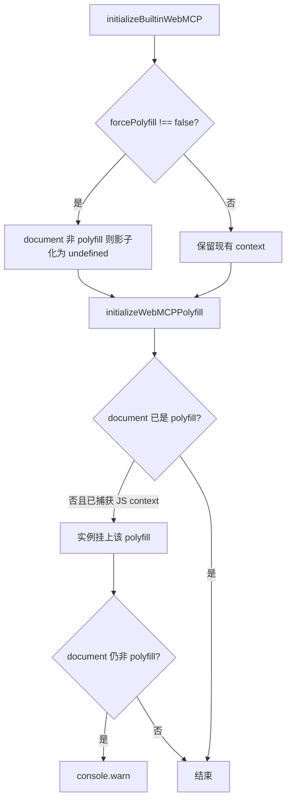

# Design：强制 JS Polyfill 覆盖 Chromium 实验性 modelContext

## 方案概述

`@mcp-b/webmcp-polyfill@5.1.0` 见 native 即 no-op，且已删除 `forceOverride`。与 3.x 不同，5.x 把 getter 装在 **`Document.prototype`**（WeakMap 按 document 存值）。若原型上已有 Chromium WebIDL 属性，polyfill 只写入 WeakMap、**不会替换原型 getter**；再若 SDK 在实例上影子化了 `undefined`，`document.modelContext` 会一直是 `undefined`。

因此 `initializeBuiltinWebMCP` 在 `forcePolyfill !== false` 时：

1. 影子化 `document.modelContext` 上非 polyfill 的实现。
2. 调用 `initializeWebMCPPolyfill()`，并拦截 polyfill 写入内部 WeakMap 时以 `document` 为 key 的 JS context。
3. 若 `document.modelContext` 仍不是 polyfill，则把捕获到的 JS 实例挂到 document 上（盖住原型上的 native getter）。

5.1.0 ESM **无 import 副作用**。`registerTool` 返回 Promise：工具仍在首个 `await` 前写入 registry，但重复名、非法描述、已 abort 的 `signal` 会 **reject**。同步 `try/catch` 接不住该失败。本 PR 范围内 `registerPageAgentTool` 已对返回值 `.catch`；业务侧应 `await` 或 `.catch`，不要把 Promise 丢掉。

## 涉及模块 / 文件

| 路径 | 职责 |
| --- | --- |
| `pnpm-workspace.yaml` | catalog：`@mcp-b/webmcp-polyfill` / `@mcp-b/webmcp-types` → `^5.1.0` |
| `packages/next-sdk/page-tools/initialize-builtin-WebMCP.ts` | `forcePolyfill`、影子化、init、实例领养 |
| `packages/next-sdk/index.ts` / `core.ts` | 导出 `initializeBuiltinWebMCP` |
| `packages/webmcp-cli/src/inject/page-init.ts` | 走 `registerPageAgentTool`，不直调 polyfill |
| `packages/next-sdk/test/page-tools/initialize-builtin-WebMCP.test.ts` | 行为测试（含原型 getter） |
| `docs/webmcp-sdk/global-tools.md` | 公开 API 说明 |

`registerPageAgentTool` 已调用 `initializeBuiltinWebMCP()`，无参即默认强制 polyfill。

## 核心数据结构 / 类型定义

```typescript
export function initializeBuiltinWebMCP(options?: {
  /** @default true */
  forcePolyfill?: boolean
}): void

const POLYFILL_MARKER = '__isWebMCPPolyfill'
```

判定 polyfill：`Boolean(ctx && ctx[POLYFILL_MARKER])`。

影子化后若 `document.modelContext` 仍非 polyfill，则把初始化时从 WeakMap 捕获的 JS context 挂到 document 实例：

```typescript
Object.defineProperty(document, 'modelContext', {
  value: captured, // 已确认带 __isWebMCPPolyfill
  configurable: true,
  writable: true,
  enumerable: true
})
```

## 依赖变更

- `@mcp-b/webmcp-polyfill`：`^3.0.0` → `^5.1.0`
- `@mcp-b/webmcp-types`：`^3.0.0` → `^5.1.0`（与 polyfill 对齐）

## API / 行为变更

| 符号或行为 | 变更类型 | 说明 |
| --- | --- | --- |
| `initializeBuiltinWebMCP(options?)` | 修改 | 可选 `forcePolyfill`，默认 `true` |
| 有 native 时的默认行为 | 修改 | 不再沿用 native，改为 JS polyfill |
| polyfill 大版本 | 修改 | 3 → 5；`registerTool` 返回 Promise（失败路径需 await / `.catch`）；无 ESM auto-init |

## 数据流 / 时序



## 风险与兼容

- **Chrome 内置 Agent 看不到页内工具**：工具只在 JS polyfill 注册表。对本 SDK / remoter 链路是预期。
- **已捕获的 native 引用**：须在入口最先调用本函数。
- **5.x `isSecureContext === false` 时 polyfill 直接 return**：非安全上下文本来也不该走 WebMCP。
- **`registerTool` Promise**：5.1.0 校验失败会 reject。`registerPageAgentTool` 已 `.catch`；其它调用方须自行 `await` 或 `.catch`，否则可能出现未处理 rejection。
- **不可配置 native 原型属性**：不替换原型，只在实例上覆盖。

## 备选方案（未采用）

- **继续停在 3.0.0**：短期强制覆盖更简单，但后续仍要跨两个 major。
- **`@mcp-b/global` 的 `nativeModelContextBehavior: 'patch'`**：仍 mirror 到 native，照样崩溃。
- **默认 `forcePolyfill: false`**：漏改一处即整页崩溃；拒绝。
