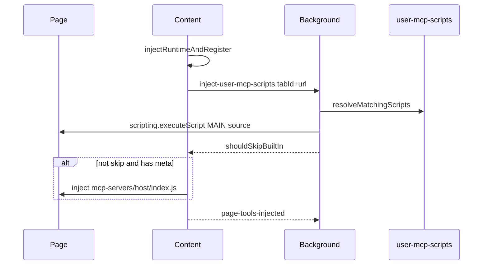

# Spec：design.md — 用户 MCP 脚本

## 方案概述

新增与内置 `mcp-servers` 并行的 `user-mcp-scripts` 模块：用户脚本以结构化记录存入 `@wxt-dev/storage`；运行时由 content 请求 background，按 `@match` 解析后对匹配脚本执行 MAIN-world `executeScript`；若命中 `replacesBuiltIn`，跳过内置 hostname 注入。Options 提供独立 Tab 管理，不复用 skills-storage。

## 涉及模块 / 文件

| 路径 | 变更 |
|---|---|
| `packages/next-wxt/user-mcp-scripts/*` | 新增核心模块 |
| `packages/next-wxt/entrypoints/background/inject-user-mcp-scripts.ts` | 新增注入适配 |
| `packages/next-wxt/entrypoints/background.ts` | 注册消息与 reinject |
| `packages/next-wxt/entrypoints/content.ts` | 薄钩子 |
| `packages/next-wxt/entrypoints/options/UserMcpScriptsTab.vue` | 新增 UI |
| `packages/next-wxt/entrypoints/options/Options.vue` | 挂载 Tab |
| `packages/next-wxt/test/user-mcp-scripts/*.test.ts` | 单测 |
| `packages/next-wxt/vitest.config.ts` / `package.json` | 测试基建 |
| `docs/ai-extension/next-wxt.md` | 用户文档 |

## 核心数据结构 / 类型定义

```typescript
export interface UserMcpScript {
  id: string
  name: string
  description?: string
  matches: string[]
  enabled: boolean
  replacesBuiltIn: boolean
  source: string
  updatedAt: number
}

export type UserMcpScriptsStore = Record<string, UserMcpScript>

export const USER_MCP_SCRIPTS_KEY = 'local:user-mcp-scripts'
```

## 依赖变更

- `packages/next-wxt` 增加 `vitest`（devDependencies）与 `test` script（`vitest.config.ts` 使用 `environment: 'node'`）

## API / 行为变更

| 符号或行为 | 变更类型 | 说明 |
|---|---|---|
| `matchUrl(pattern, url)` | 新增 | `@match` 匹配 |
| `validateMatchPattern(pattern)` | 新增 | 保存前校验 |
| `resolveMatchingScripts(store, url)` | 新增 | 返回 enabled 且匹配的脚本 |
| `shouldSkipBuiltIn(store, url)` | 新增 | 任一匹配脚本 `replacesBuiltIn` 则为 true |
| `get/set/upsert/removeUserMcpScript*` | 新增 | storage CRUD |
| `createDefaultScriptTemplate()` | 新增 | 默认 JS 模板 |
| `exportUserMcpScriptsZip` / `importUserMcpScriptsZip` | 新增 | 与 `mcp-servers/<host>/{index,meta}.ts` 一致的 zip；主导入导出路径 |
| `export/importUserMcpScriptsJson` | 保留 | 兼容旧备份；UI 主路径改为 zip |
| content 注入顺序 | 修改 | runtime → 用户脚本 →（可选）内置 → `page-tools-injected` |
| Options Tab「页面 MCP 脚本」 | 新增 | 在线管理 |

## 数据流 / 时序



## 风险与兼容

- 重复注入可能导致工具重复注册：模板与注入侧使用幂等标记
- 宽泛 `@match`（如 `*://*/*`）+ `replacesBuiltIn` 会禁用所有内置域名工具：UI 文案提示风险
- 不改变内置三站行为（无用户脚本时路径与现网一致）

## 备选方案（若有）

- blob/`<script>` 注入：易受页面 CSP 拦截，已弃用
- 统一迁入用户脚本体系：改动面过大，本需求明确 Out of Scope
