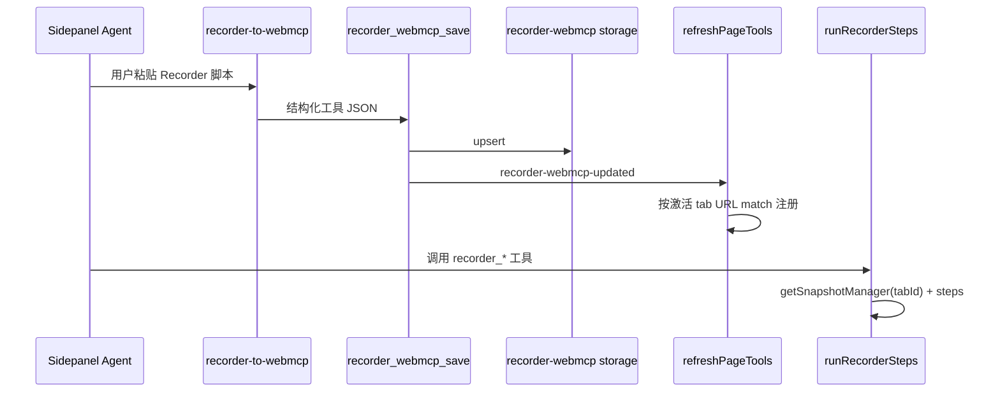

# Spec：design.md — Recorder WebMCP（扩展侧）

## 方案概述

新增独立模块 `recorder-webmcp/`：以结构化工具（元信息 + `inputSchema` + `steps`）存入 `@wxt-dev/storage`；Options 提供在线编辑；Sidepanel 在 `refreshPageTools` 同周期按**当前激活 tab URL** `@match` 过滤后 `registerTool`；`execute` 通过现有 `getSnapshotManager(tabId)` 取得 `Page`，用 puppeteer-core Locator/API 执行步骤。转化由 Skill 指导 Agent 调用落盘工具 `recorder_webmcp_save`。

## 涉及模块 / 文件

| 路径 | 变更 |
|---|---|
| `packages/next-wxt/recorder-webmcp/*` | 新增核心模块 |
| `packages/next-wxt/entrypoints/options/RecorderWebmcpTab.vue` | 新增 Options Tab |
| `packages/next-wxt/entrypoints/options/Options.vue` | 挂载 Tab |
| `packages/next-wxt/entrypoints/sidepanel/recorderWebmcpTools.ts` | 侧栏注册/刷新薄适配 |
| `packages/next-wxt/entrypoints/sidepanel/mcpServer.ts` | 在 refresh 流程中同步 Recorder 工具 |
| `packages/next-wxt/skills/recorder-to-webmcp/SKILL.md` | 转化 Skill |
| `packages/next-wxt/test/recorder-webmcp/*.test.ts` | 单测 |
| `docs/ai-extension/next-wxt.md` | 用户文档 |

## 核心数据结构 / 类型定义

```typescript
export const RECORDER_WEBMCP_KEY = 'local:recorder-webmcp-tools'

/** 参数引用：执行时从工具 args 取值 */
export type ParamRef = { $param: string }

export type RecorderStep =
  | { op: 'setViewport'; width: number; height: number }
  | { op: 'goto'; url: string | ParamRef; timeout?: number }
  | {
      op: 'click'
      selectors: string[]
      offset?: { x: number; y: number }
      timeout?: number
    }
  | { op: 'hover'; selectors: string[]; timeout?: number }
  | { op: 'scroll'; selectors?: string[]; direction?: 'up' | 'down'; timeout?: number }
  | {
      op: 'type' | 'fill'
      selectors: string[]
      text: string | ParamRef
      timeout?: number
    }

export interface RecorderWebmcpTool {
  id: string
  /** Agent 调用名，建议 recorder_ 前缀 */
  name: string
  title: string
  description: string
  matches: string[]
  enabled: boolean
  inputSchema: Record<string, unknown>
  steps: RecorderStep[]
  /** 原始 Recorder 源码备份（可选） */
  sourceBackup?: string
  updatedAt: number
}

export type RecorderWebmcpStore = Record<string, RecorderWebmcpTool>
```

参数解析：步骤字段若为 `{ $param: 'q' }`，则取 `args.q`；普通 string/number 原样使用。

## 依赖变更

- 无新 npm 依赖（复用已有 `puppeteer-core`、`@wxt-dev/storage`）
- `@match` 复用 `user-mcp-scripts/match` 的纯函数（不依赖其 storage）

## API / 行为变更

| 符号或行为 | 变更类型 | 说明 |
|---|---|---|
| `get/set/list/upsert/removeRecorderWebmcpTool*` | 新增 | storage CRUD |
| `resolveMatchingRecorderTools(store, url)` | 新增 | enabled + match |
| `resolveStepValue(value, args)` | 新增 | ParamRef 解析 |
| `runRecorderSteps(page, steps, args)` | 新增 | puppeteer 执行 |
| `recorder_webmcp_save` | 新增 | 侧栏常驻落盘工具（不按 match 隐藏） |
| Options「Recorder 自动化」Tab | 新增 | 在线管理 |
| `refreshPageTools` | 修改 | 同步注册/卸载 match 命中的 Recorder 工具 |

## 数据流 / 时序



## 风险与兼容

- debugger 互斥：经 `getSnapshotManager` 复用连接池，执行后不强制 disconnect（与现有 snapshot 策略一致）
- 不改变页面 MAIN world / user-mcp-scripts 行为
- `Locator.race`：runtime 对 `selectors[]` 顺序尝试，语义贴近 race
- 宽泛 `@match` 会导致多站暴露同名工具：UI/Skill 提示收窄 match

## 备选方案（已否决）

- MAIN world + DOM 兼容层：与「直接用 puppeteer-core」冲突
- 混入 `user-mcp-scripts`：违背独立模块约束
