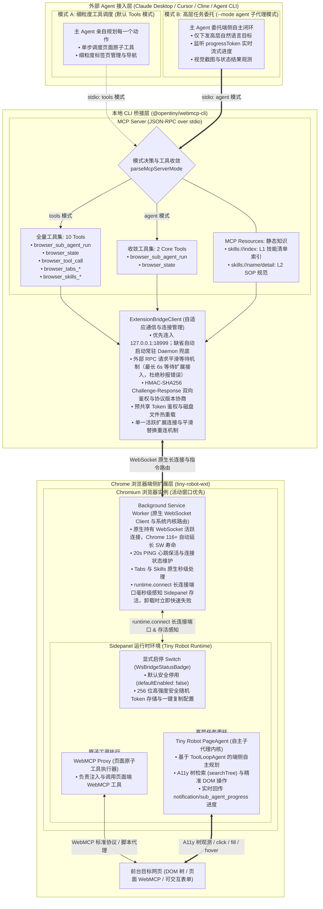
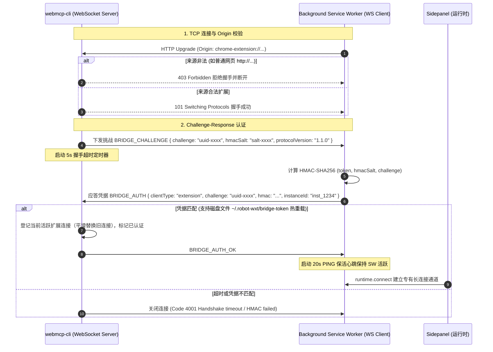
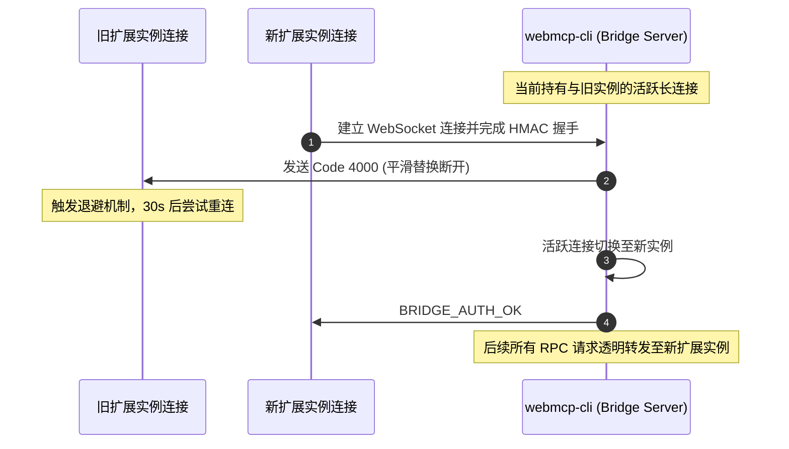
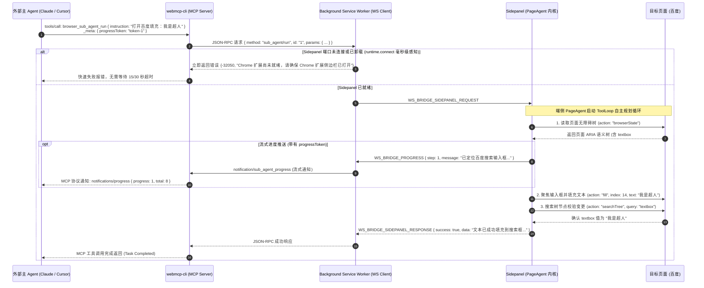

# Tiny Robot Chrome 扩展对接第三方 Agent 架构设计与实现方案

## 一、 背景与核心挑战

为了使第三方 AI Agent（如 Claude Desktop、Cursor、Cline、OpenAI Operator、本地终端 Agent 等）能够直接控制并协同浏览器的自动化操作，Tiny Robot 引入了基于标准 **MCP（Model Context Protocol）** 与 **WebSocket 桥接** 的双模融合架构。

在 Chrome Extension Manifest V3（MV3）环境下对接外部 Agent，面临以下四个核心架构挑战：

1. **MV3 Service Worker 生命周期限制**：Chrome MV3 下 Background 变为 Service Worker，若无持续事件流或网络通信，最长 30 秒即被浏览器强制挂起销毁。
2. **本地回环端口安全边界**：外部进程与扩展通信需经由本地回环端口（`127.0.0.1:18999`）。若无严格鉴权，恶意网页脚本可能通过跨域 WebSocket（CSWSH）侵入该端口，造成浏览器提权控制。
3. **多浏览器实例与焦点竞争**：开发者常同时运行多个 Chromium 实例（如日常主力 Chrome 窗口与开发测试环境 `wxt dev` 独立 Profile 实例）。当多个实例同时加载扩展时，需精确感知用户正在操作的浏览器窗口，避免指令错发或焦点抢占。
4. **脚本注入安全风险**：传统的任意 `execute_script` 具有极高注入风险。系统需将能力约束在标准化、受控的 WebMCP 工具及端侧自主规划子代理（Sub-Agent）闭环内。

---

## 二、 整体架构拓扑图

系统分为三层：**外部 Agent 接入层**、**本地中间件 CLI 桥接层**、以及 **Chrome 浏览器端侧扩展层**，支持**默认多工具模式（Tools 模式）**与**子 Agent 委托模式（Sub-Agent 模式）**灵活切换：



---

## 三、 核心机制实现详解

### 1. Background 原生 WebSocket Client 与保活

- **架构进化**：系统不再依赖过渡性的 Offscreen Document 跳板，由 Background Service Worker 原生运行 [`BackgroundWsBridgeClient`](../../packages/robot-wxt/src/plugins/built-in/ws-bridge/ws-client.ts)。利用 Chrome 116+ 原生特性，活跃的 WebSocket 连接会自动延长 Service Worker 生命周期，配合每 20 秒一次轻量 PING 心跳，彻底突破 MV3 30 秒休眠限制。
- **Sidepanel 存活毫秒级感知与未就绪拦截**：
  Sidepanel 挂载时通过 `browser.runtime.connect({ name: 'ws-bridge-sidepanel' })` 建立专有长连接通道。Background 监听 `port.onDisconnect`，在侧边栏关闭/卸载瞬间毫秒级感知，并立即调用 `failPendingSidepanelRequests` 快速失败未决请求，消除 15 秒超时盲区。
- **可拔插与显式启停保护**：
  `ws-bridge` 作为内置插件登记于 `builtInPluginManifests`，配置 `toggleable: true` 且默认停用（`defaultEnabled: false`）。用户在侧边栏手动开启前，扩展绝不占用本地端口，也不发起外部网络探测，彻底杜绝未授权连接风险。

### 2. 三重安全防线与免配置安全互信

- **第一道防线（Origin 严格检查）**：
  在 WebSocket 升级（HTTP Upgrade）阶段，服务端读取请求头 `Origin`。凡是来自普通网页的连接（`http://*` 或 `https://*`）一律返回 403 强行阻断；仅允许 `chrome-extension://*`、`moz-extension://*` 以及本地无 Origin 的 Node 进程接入。
- **第二道防线（HMAC-SHA256 双向挑战认证与时序安全比对）**：
  连接建立后，服务端下发 36 位随机 UUID（`challenge`）及随机十六进制盐值 `hmacSalt`。双端基于共享凭据计算 HMAC-SHA256 签名，服务端使用 `crypto.timingSafeEqual` 进行恒定时间验签比对，防止时序侧信道攻击（code 4001）。
- **Token 安全持久化与热重载**：
  - **磁盘热重载**：服务端验签时支持从 `~/.robot-wxt/bridge-token` 实时重载最新 Token，无需重启服务即可立即生效。
  - **本地随机安全凭据**：扩展端首次启用桥接服务时自动生成 32 字节高强度随机 Token 并持久化存储，用户可在侧边栏查看、复制或重新生成。本地桥接服务对未提供有效 Token 的客户端强行阻断。
- **第三道防线（协议版本协商）**：
  认证报文中双端均携带 `protocolVersion`（当前 `1.1.0`）。Major 版本不一致时服务端主动关闭连接（code 4002），扩展侧同理检测并打印警告，杜绝新旧版本静默不兼容。

### 3. CLI / MCP 智能拉起与请求平滑缓冲等待

- **后台常驻服务自动拉起**：
  CLI 执行任意命令或 MCP Server 启动时，自动调用 `ensureBridgeDaemon`。若 18999 端口未运行，自动以守护进程拉起常驻服务，无需用户在终端手动执行额外启动命令。
- **请求平滑等待机制**：
  当外部请求到达本地桥接服务端时，若 Chrome 扩展因退避重试尚未连接，Daemon 自动挂起请求并平滑等待最多 6 秒。一旦扩展完成握手，立即唤醒并恢复请求执行，彻底解决关闭服务后重新执行命令因 0ms 检查引发的误报错。

### 4. 逻辑 targetTab 语义与无干扰浏览

- `browser/tabs` 的 `switch` 操作默认仅维护后台的 `logicalTargetTabId`，**不强行切换**用户正在前台浏览的可见活动标签，避免破坏用户的工作流，并规避 Edge 侧边栏重新挂载导致的状态重置。
- 仅在显式传入 `activateVisible: true` 时才将标签页带到前台。

---

## 四、 消息传递时序图

### 时序图 1：安全连接建立与 Challenge-Response 握手阶段



---

### 时序图 2：新扩展实例连入与旧连接平滑替换重连



---

### 时序图 3：子代理端侧自主执行与流式进度回传（以打开百度输入框填充为例）



---

## 五、 协议报文样例

### 1. 握手与认证报文

- **服务端下发挑战**（新增 `hmacSalt`）：
  ```json
  {
    "type": "BRIDGE_CHALLENGE",
    "challenge": "a1b2c3d4-5678-90ab-cdef-1234567890ab",
    "hmacSalt": "f3a8e2c1d90b4567ae21fc83",
    "protocolVersion": "1.1.0"
  }
  ```
- **扩展端应答凭据**（新增 `hmac` HMAC-SHA256 签名）：
  ```json
  {
    "type": "BRIDGE_AUTH",
    "clientType": "extension",
    "challenge": "a1b2c3d4-5678-90ab-cdef-1234567890ab",
    "hmac": "8f3a9b2e4c7d1e5f...<HMAC-SHA256 hex>",
    "extensionId": "dejlnpapaimfodnoegpifcedblfbndle",
    "instanceId": "3f628c68-2b81-42cb-b46f-c1f0d3b6fcf0",
    "protocolVersion": "1.1.0"
  }
  ```

### 2. 工具调用请求与响应（JSON-RPC 2.0）

- **请求报文（委托子代理任务）**：
  ```json
  {
    "jsonrpc": "2.0",
    "id": "1",
    "method": "sub_agent/run",
    "params": {
      "instruction": "打开百度填充：我是超人",
      "tabId": 1318349110,
      "maxSteps": 8,
      "progressToken": "token-xyz"
    }
  }
  ```
- **过程进度推送报文（Server -> Client 流式通知）**：
  ```json
  {
    "jsonrpc": "2.0",
    "method": "notification/sub_agent_progress",
    "params": {
      "requestId": "1",
      "progressToken": "token-xyz",
      "step": 1,
      "total": 8,
      "message": "正在获取页面状态并定位输入框..."
    }
  }
  ```
- **成功响应报文**：
  ```json
  {
    "jsonrpc": "2.0",
    "id": "1",
    "result": {
      "success": true,
      "status": "completed",
      "data": "文本\"我是超人\"已成功填充到百度搜索框（textbox #14 的值为\"我是超人\"）。",
      "stepsUsed": 4,
      "maxSteps": 8
    }
  }
  ```

---

## 六、 支持的标准化能力与模式收敛一览

| 类别 | MCP 方法 / 工具名 | 功能说明 | 默认 Tools 模式 | 子 Agent 模式 | 依赖组件 |
| :--- | :--- | :--- | :---: | :---: | :--- |
| **子代理委托** | `browser_sub_agent_run` | 将高层长流程任务委托给扩展内 Tiny Robot 子代理端侧自主规划执行，支持 MCP progressToken 流式通知 | ✅ 暴露 | ✅ 暴露 | Sidepanel PageAgent |
| **页面状态** | `browser_state` | 快速采集当前标签页 URL、标题、所有打开页签及注入的 WebMCP 工具列表 | ✅ 暴露 | ✅ 暴露 | Background (3s 降级保护) |
| **原子工具调用** | `browser_tool_call` | 执行网页通过 WebMCP 标准暴露的受控原子工具（如 click、fill 等） | ✅ 暴露 | ❌（收敛） | Sidepanel 运行时 |
| **标签页管理** | `browser_tabs_*` | 细粒度控制标签页：`open`、`close`、`switch`、`back`、`forward` | ✅ 暴露 | ❌（收敛） | Background 原生极速处理 |
| **技能清单索引** | `browser_skills_list` | 检索扩展中已维护的所有 Skills 技能简短清单（极低 Token） | ✅ 暴露 | ❌（收敛） | Background 原生 |
| **技能详情读取** | `browser_skills_read` | 按需获取特定技能的完整 SOP 执行指令与规范契约 | ✅ 暴露 | ❌（收敛） | Background 原生 |
| **MCP Resource** | `skills://index` | 静态只读资源：技能清单索引（连接即可读，极低 Token 消耗） | ✅ 保留 | ✅ 保留 | Background 缓存 |
| **MCP Resource** | `skills://{name}/detail` | 静态只读资源：特定技能的完整 SOP 规则与执行指南 | ✅ 保留 | ✅ 保留 | Background 缓存 |

---

## 七、 实操验证总结

本方案已在真实 Chrome 环境与自动化测试中得到全量验证：

1. **双模式自适应切换**：支持默认的 11 工具全控制模式，以及专为减少大模型上下文开销打造的 3 核心工具子 Agent 模式（`--mode agent`）。
2. **多实例无缝切换**：在日常 Chrome 与 WXT Dev 浏览器之间点击切换窗口，CLI 请求均 100% 精准路由至当前处于激活状态的浏览器窗口。
3. **端到端自动化完成**：成功通过标准 MCP Stdio Client 调度子代理自主执行“打开百度填充：我是超人”，端侧自主完成 A11y 树提取、输入框定位、文本填充与结果验证闭环。
4. **安全与稳定性**：非法 Origin 拦截率 100%；未认证消息丢弃率 100%；Sidepanel 未打开时秒级（0ms）报错返回；全量单元测试（21 项 CLI 测试 + 405 项扩展测试）全部绿灯。
