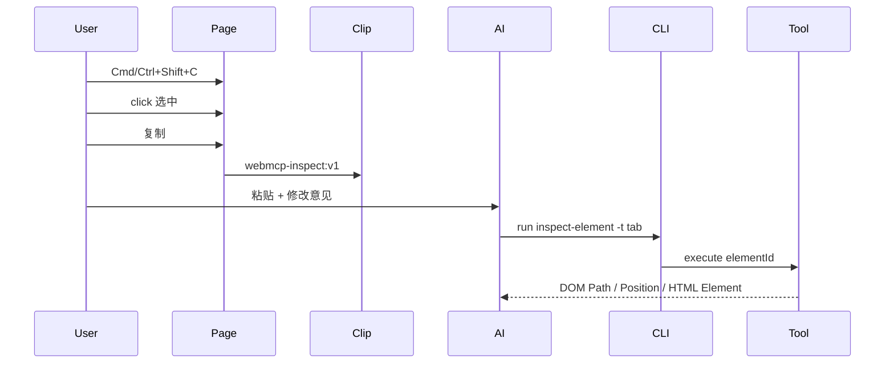

# Design：元素检视（Cursor 式）

## 方案概述

在 webmcp-cli 注入 bundle 中增加独立检视模块（不改 `page-agent-tool` a11y/`index` 协议）：

1. 页面侧：常驻控制浮钮（标识受控 + 切换检视）、overlay 选元素、分配 `elementId`、复制 inspect ref；快捷键为次要入口
2. CLI 侧：注入后写入 `window.__webmcpcli_tabid`
3. 工具侧：注册 `inspect-element`，按 `elementId` 返回 Cursor 文本元数据

## 涉及模块 / 文件

- `packages/webmcp-cli/src/inject/element-inspect/*`（新建）
- `packages/webmcp-cli/src/inject/page-init.ts`
- `packages/webmcp-cli/src/browser.ts`
- `packages/webmcp-cli/test/element-inspect*.test.ts`
- `packages/webmcp-cli-skill/SKILL.md`
- `docs/webmcp-cli/webmcp-cli.md` / `webmcp-cli-skill.md`

## 核心数据结构 / 类型定义

```typescript
/** 剪贴板引用 */
// webmcp-inspect:v1 tab=<TAB_ID> el=<ELEMENT_ID>

interface InspectRef {
  version: 1
  tabId: string
  elementId: string
}

interface ElementMetaText {
  // 拼接为：
  // DOM Path: ...
  // Position: top=Npx, left=Npx, width=Npx, height=Npx
  // HTML Element: <tag ...>...</tag>
  domPath: string
  position: { top: number; left: number; width: number; height: number }
  htmlElement: string
}

declare global {
  interface Window {
    __webmcpcli_tabid?: string
    __webmcpcli_inspect_registry?: Map<string, WeakRef<Element> | Element>
  }
}
```

## 依赖变更

无新 npm 依赖。

## API / 行为变更

| 符号或行为 | 变更类型 | 说明 |
|---|---|---|
| `inspect-element` WebMCP 工具 | 新增 | 输入 `{ elementId }`，返回 Cursor 文本 |
| `window.__webmcpcli_tabid` | 新增 | CLI 注入的 Chrome target UUID |
| `#webmcp-cli-control-fab` 浮钮 | 新增 | 常驻；标识受控；点击切换检视 |
| 快捷键 Cmd/Ctrl+Shift+C | 次要 | 与浮钮等效切换 |
| `state.webmcpTools` | 变更 | 列表中多出 `inspect-element` |

## 数据流 / 时序



## 风险与兼容

- 部分站点可能拦截全局快捷键：可接受；失败时用户无法进入检视
- `navigator.clipboard.writeText` 在非安全上下文可能失败：降级提示
- 导航清空 JS 上下文后需重新注入；旧 elementId 失效

## 备选方案

- 扩展 `page-agent-tool` action：与 a11y index 纠缠，否决
- 剪贴板直接塞全文元数据：体积大且易过期，否决
